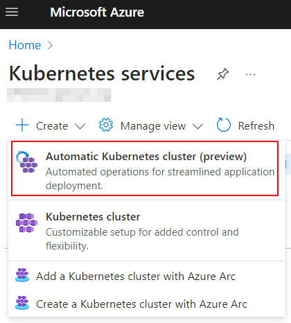
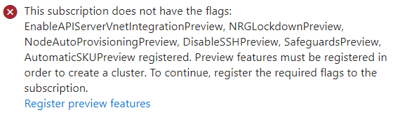
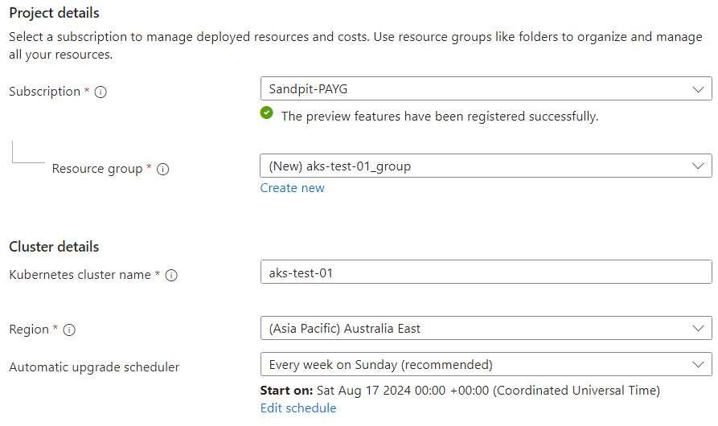

# AKS Automatic – First Impressions
Kubernetes is a complex beast and even more so are cloud-specific offerings such as Azure’s Kubernetes Service (AKS). Microsoft has realised this and has released “AKS Automatic”. The offering is currently in preview.

## What is AKS Automatic?
AKS Automatic allow administrators to rapidly provision an AKS cluster that has default configuration aimed towards being “production ready” and secure. Moniotirng and observability tools are automatically deployed as part of the provisioning. It also has the capability to rapidly onboard applicatins. Microsoft have published a [comprehensive list](https://learn.microsoft.com/en-au/azure/aks/intro-aks-automatic#aks-automatic-and-standard-feature-comparison) comparing AKS Automatic to the standard offering.
<!-- more -->
## Getting Started
AKS Automatic is available as an option when creating a new cluster, as shown below:

In order to successfully provision the cluster, the target subscription needs certain preview features to be registered. If they aren’t, you will see an error message and will be prompted to register them.

It’s also worth noting that the cluster will require 24 DSv2 cores. If you are deploying into a fresh Subscription, you may need to increase this first. The Basics page will ask for a limited set of configuration options – Subscription, Resource Group, a name for the cluster, where it will be located and a schedule for automatic updates.

The next table allows enablement of the logging and monitoring options. These include a Managed Prometheus and Managed Grafana instance. Deployment take about 15 minutes.

## Deploying An App
Once the AKS Automatic cluster is deployed, it’s possible to onboard an application quickly using the Automated Deployments option.

## Closing Thoughts
While AKS Automatic is a good option for getting an AKS cluster up and running quickly, it does present some issues:
* The use of the DSv2 SKUs may not be the most cost effective for your region.  Additionally, when I tested AKS Automatic, this family of SKU was experiencing capacity issues across a number of regions
* It can be expensive to run, especially if you enable all the options.
