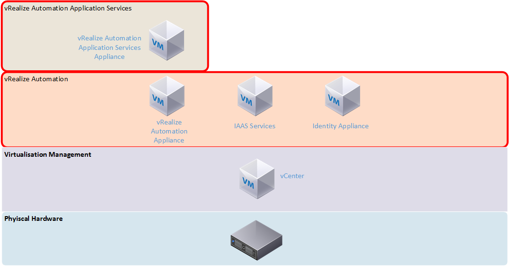
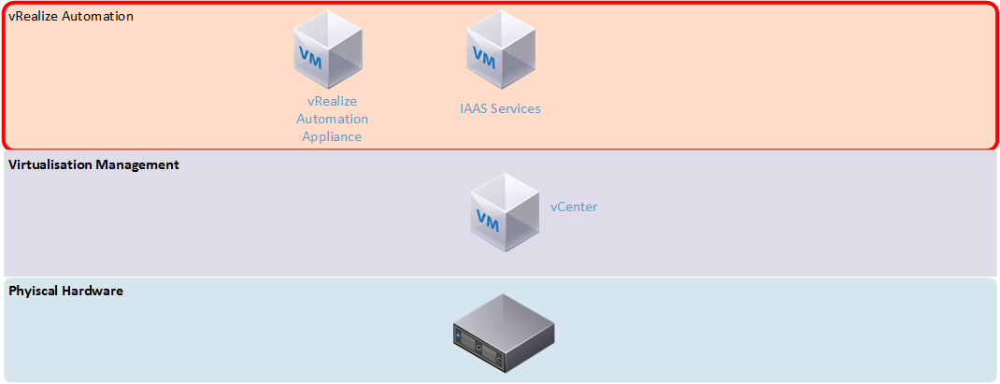
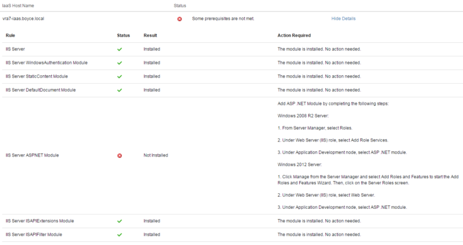
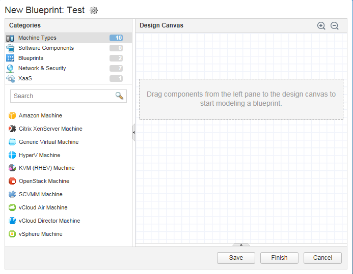
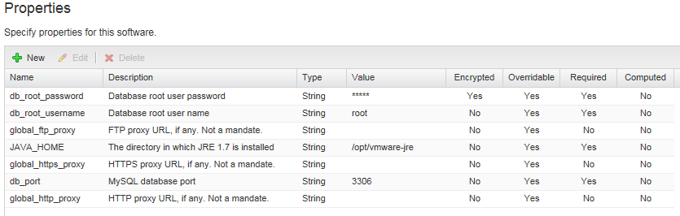
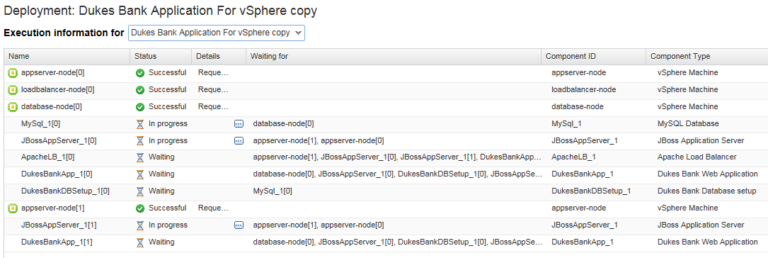
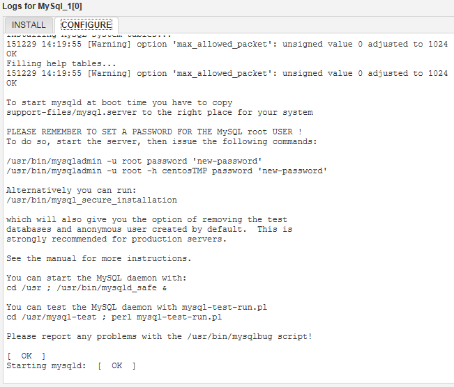

# vRealize Automation 7.0 – First Impressions
vRealize Automation is, as VMware puts it, cloud automation software. It’s the black box where the magic that happens between a customer or consumer of your cloud services and the infrastructure the cloud sits on, providing the services we would normally associate with a cloud service such as self-service, elasticity and multi-tenant support.

In the past, this product was known as vCloud Automation Center, or vCAC. It was rebranded along with a number of other VMware products under the vRealize banner. However, the newly branded vRealize Automation product still retains some references to vCAC.
<!-- more -->
The previous version of vRealize Automation did a good job at providing the “magic” for simple IAAS cloud. It required a lot of effort to set up, including a mix of virtual appliances and Windows servers (as shown in the architecture comparison below). There was also a lot of up front effort in setting it up and having to define what would be for many organisations, unknown processes and workflows. Application Services added complexity that required extra agents to work and didn’t seem very stable. Older versions (especially 5.8) gave the impression that the vCAC product was a number of individual products roughly bolted together, with some integration issues. With the combined version 7 product I was hoping some of these issues would be resolved.

vRealize 6.x Architecture

vRealize 7.0 Architecture

## Setup
Upon deploying the virtual appliance and accessing its web interface, the installation wizard automatically initiates. It presents two deployment types – the minimal deployment has two virtual machines – the appliance and a Windows machine running the Infrastructure as a service (IAAS) function. This means you’re still stuck with deploying and supporting additional Windows servers. The other deployment type is Enterprise, which adds N+1 redundancy to all the components. Assuming full separation of all the roles, you could end up with as many as 8 virtual machines, plus load balancers. For my first impression I selected the minimal deployment, which the wizard said is suited for development or proof of concept environments.

The IAAS server needs a management agent installed, which links it to the vRealize appliance early in the installation wizard. This allows the pre-requisite checker to run on all the Windows machines involved. In the event that you missed anything, a detailed report lists all the items that aren’t compliant and how to fix them. The rest of the wizard features the option to validate a step before proceeding as well as a final overall validation towards the end of the wizard. I found this validation process very good in the detail it provided for fixing items that were not compliant.

Following the validation, the wizard suggests taking snapshots of the vRealize appliance and any related servers before the installation starts. This is an interesting feature, because it suggests the installation can fail in a way where you can’t simply try again on the same systems.

## Further Configuration
The configuration takes place within the vRealize administration interface and very similar to how version 6.x was, with steps such as configuring the system (creating additional tenants and other system-wide settings), configuring tenant settings (branding, notifications, user/group roles) and configuring resources (adding endpoints such as your vSphere environment or supported public cloud, and creating reservations on those endpoints).

One of the areas that has received a lot of development since version 6 is the options for authentication. Active Directory authentication is more robust and you are able to synchronise users and groups either from a single domain or from a multi-domain environment. There is also now support for two-form authentication such as RSA SecurID and smart card support. Given the scope of access that an administrator may have on a vRealize Automation system, these extra levels of authentication are a good addition.

Security can be further tightened with access policies which can allow you to define network ranges and then what allowed authentication depending on the device. An example of this is you may define a more rigid requirement for access outside your corporate network. In this scenario, the access policy workflow would be something like this:

* Define your corporate LAN as a network range, and then set the authentication method to just password if the device used is a web browser
* Define an “outside” network range and require another authentication method is required such as SecurID.

It’s also worth mentioning just how broad the endpoint support is in this version of vRealize Automation. The full list of end points now includes AWS, OpenStack, vCloud Air, vCloud Director, Hyper-V, KVM, vSphere and NetApp ONTAP.

## Blueprints
Blueprints are now designed and authored in a new graphical interface. The details to configure the virtual machine for a blueprint are very similar to those which existed in the 6.x interface, with options such as selecting the machine prefix, the type of blueprint and the action performed (ie. Clone an existing virtual machine or create a new one), what resources to assign the machine and so on.

The new Blueprint Design unifies the design of pure Infrastructure as a Service and the application delivery-based designs in vRealize Automation Application Services (vRAAS) into a single interface. A positive aspect of the separation in the older versions was that vRAAS had a pre-defined set of components such as MySQL and .NET installers, and example deployments. These don’t seem to be present in the new merged vRA 7, but there is an example blueprint that can be imported. Unfortunately, the documentation to do this refers to using wget to download the blueprint onto the appliance, yet wget isn’t installed by default.

Another section that works hand in hand with the blueprints is Software Components. The functionality of this section is stuff that used to exist in vRAAS, and it’s where you can define all your various software components such as databases, web applications and scripts. Properties can be defined for the component, which generally take the form of information you would supply during the installation. In the MySQL component that is populated by the Bank example blueprint, the properties include items such as the database root username, password and port.

These properties can then be referenced in the Actions for the component. The four available actions are Install, Configure, Start and Uninstall, and can be defined as Bash, cmd or Powershell scripts. There’s a reasonable amount of flexibility in how these scripts can run. Take the example of how to get source or install files. The MySQL component from the bank demo will use an install script that will use yum or apt-get to install MySQL, essentially installing it from the internet. In contrast, most of the other components used by the bank demo (such as the JBoss installer and database scripts) will download from the vRealize virtual appliance.

The last area relating to blueprints is “XAAS Blueprints”. These blueprints are workflows that can be created and published to the service catalog. These blueprints are for generic activities, such as creating a user, which can be automated and easily applied to a range of scenarios. A form designer allows you to create custom forms to take input that the XAAS blueprint requires. Once defined, they can be published to the service catalog for use.

## Service Catalog
The Service Catalog works very similar to vRA 6.x, with the defining of Services (groupings of catalog items), catalog items and entitlements (who can access an item). Requesting an item works a little differently now with some input required, depending on how the blueprint is structured. For a single VM, this takes the form of submitting a reason for the deployment and being able to tweak settings of the VM. For more complicated deployments such as the bank demo, there is more to confirm.

Once the request has been submitted, the progress can be followed. The progress is shown in a table view, which isn’t as visually impressive as the flowchart view that vRAAS used.

During certain steps, you can see the resulting log output. This is very useful in being able to troubleshoot what went wrong without having to trawl through logs on the virtual machines directly.

## Cost Management
One disappointing change in vRealize Automation 7 is that the basic costings system has been removed. In 6.x, there was a basic costing system for certain cloud environments. In version 7, this functionality has been fully removed, requiring the use of vRealize Business for any sort of cost modelling.

## Identity/User Management
While the security options in vRealize are quite broad, identity management is tied solely to Active Directory. There are two options presented for this – for single domain environments, AD over LDAP can be used. For more complex Active Directory environment, integrated authentication is used. The process for setting up Active Directory authentication is more complicated than previous versions, and in my case, the initial step of creating the link to Active Directory seemed to take a very long time. The steps in all are:

* Create a link to Active Directory – this is where you can opt to use LDAP or Integrated Authentication. If LDAP is used, you need information such as the Distinguished Name of the account used to connect and the location of Active Directory to search for user objects. If using Integrated, you just need to supply a username and password.
* Confirm the domains you wish to be associated with the Active Directory connection. If you used Integrated Authentication and have a multi-domain environment, you might get more than one listed for this.
* Confirm the attribute name mappings.
* Select the groups you want to synchronise (and any other individual users).

In some respects, this approach is better than version 6.x, which worked on specifying a location in Active Directory to synchronise user and group objects from. For many organisations, this might mean having to synchronise from the root of their Active Directory to get adequate coverage, but also result in a very wasteful exercise. The 7.0 model is much more targeted. However, it’s worth noting that because the Distinguished Name of groups and users is used in 7.0, it would mean that moving these objects in Active Directory would almost certainly break things.

One thing I also noticed during my testing was any operation relating to Active Directory seemed to be incredibly slow. I couldn’t see any performance conditions such as high CPU utilisation on the vRealize appliance or my domain controller, so it may have been a quirk or something with my configuration.

## Extending vRealize Automation
vRealize Automation’s functionality can be extended and broadened via the use of vRealize Orchestrator, which is VMware’s task automation product. Fortunately, an instance of Orchestrator is included with the vRealize Appliance. Using this embedded installation seems to remove a lot of the configuration required, as it defaults a lot of settings to use the vRealize Automation settings.

Orchestrator has two separate interfaces – a slick HTML 5 administrative back end for a lot of the nuts and bolts settings that you might have to configure in a stand-alone installation. The majority of activity happens in the Orchestrator Client, a java app.

There is a large number of included items in the Workflow Library, including manipulating computer accounts in Active Directory, performing database operations and administrating vRealize Automation itself. Workflows have version history so they can be easily iterated upon. Lastly there are some sample Workflows for HTTP-REST operations.

This kind of functionality suggests that the functionality of vRealize Automation could be extended to a very high degree internally (adding new tasks) and externally (interface with other tools or exposing features to other tools via API).

## Beyond IAAS
The out of the box experience with the previous versions of vRealize Automation was just provisioning infrastructure (ie. Servers). The addition of Application Services on top enabled a broader range of deployment options, such as being able to give your developers a full configured and usable 3-tier application stack.

While the administrative functionality of Application Services, as I’ve previously mentioned, has been rolled into the core administrative interfaces of vRealize Automation 7 as Software Components, the process of using it in practice is still as painful as prior versions. There is still a need to install a guest agent and a software bootstrap agent to leveraging Software Components. Both agents require installation where there is no wizard, the correct options must be specified as part of the command line.

Given how much of an improvement there was in the initial deployment and setup of vRealize 7, I had hoped there would be improvement in this area as well, perhaps to the point of having a single unified and easy to install agent.

## Final Thoughts
The new version 7 of the product is a good improvement on the previous versions, with all the pieces feeling more of a cohesive system. However once you start getting into depth with it, some of the bug bears from previous versions are still there.

Good
* Broad endpoint support
* Application Services now built in
* Simpler architecture

Bad
* Software provisioning still needs 2 separate agent installs
* Basic cost modelling has been removed
