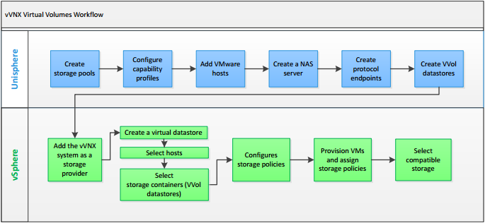
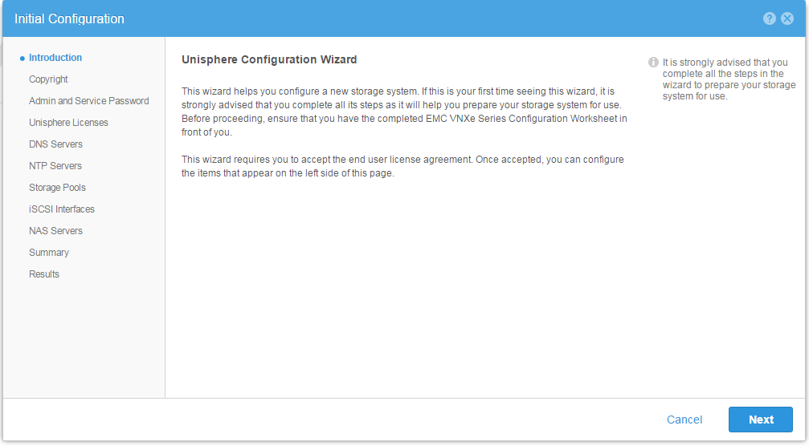
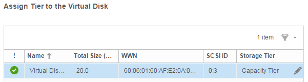
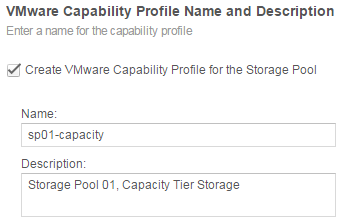
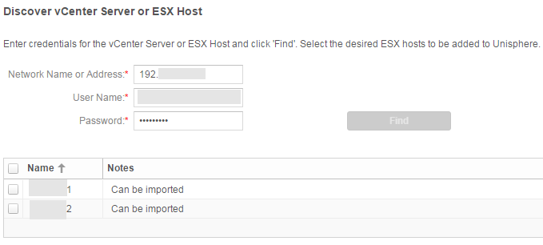
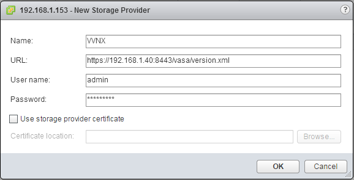
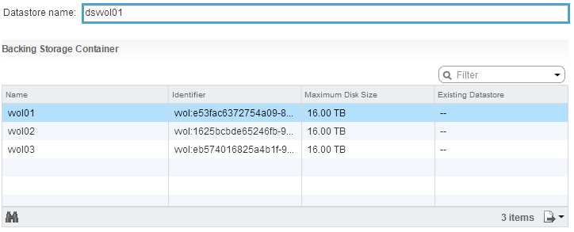
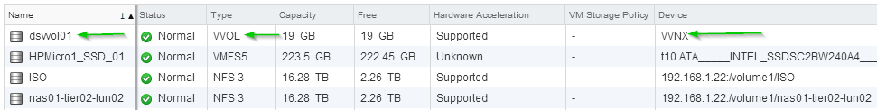
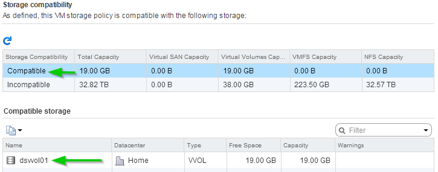

# Want hands on with Virtual Volumes? EMC has a Virtual Appliance for that

Virtual Volumes (VVols) is a new method of managing storage introduced in VMware vSphere 6.0.  Unlike many of the new features in vSphere 6.0, VVols requires not just vSphere 6.0 to work, but a storage device that supports the technology.  Fortunately, EMC have produced a virtual appliance that emulates a storage device with VVol support, so you can get some practical exposure to Virtual Volumes without needing a shiny new storage array.  Download and documetation can be found at http://www.emc.com/products-solutions/trial-software-download/vvols.htm  The process for getting Virtual Volumes completely working is rather long, as the flow chart from EMC’s documentation below shows:

I’ll run through the steps in getting the Appliance and Virtual Volumes working on a vSphere installation.
<!-- more -->
## Provisioning the Appliance
As a Virtual Appliance, it’s easy to get up and running on your vSphere environment.  One cavet worth mentioning is the Appliance has a 12GB memory reservation.  It will not work correctly if you try to change this reservation.  This means your environment must be able to support such a reservation.  In my case, this reservation setting prevented the Appliance from starting on a HP Gen8 Microserver with 16GB of RAM.  So this reservation might be a problem for home lab environment or smaller test labs at work.

## Adding Storage
The virtual disks provisioned with the appliance are used only by the system, so to create Storage Pools and other storage related operations later on, you will need to add extra virtual disks.  The disks must be at least 10GB and can be added via the vSphere interface.

## Accessing UniSphere
Once the Appliance is powered on, you can access Unisphere using the management IP you configured.  The Configuration Wizard will appear, as it’s the first time you’ve logged in.

Run through the wizard.  During the wizard you can install a license file.  This can be acquired from the appliance page I linked at the start and only requires an EMC account (don’t need a customer support agreement or the like).

## Creating a Storage Pool
The wizard used to create a Storage Pool during the Configuration Wizard and after are the same, so the process is easy.  The Storage Pool Wizard will detect any unassigned storage you’ve assigned to the Appliance and list it.  One of the nice things about the storage it lists is it shows the SCSI ID of the disks, which matches the SCSI ID of the virtual disks you added.  This can be helpful if you added a number of disks of the same size.

There are three default tiers – Extreme Performance, Performance and Capacity.  To properly use VVols, a Capability Profile has to be created during the Storage Pool creation.

If you did create a Capability Profile, you then specify constraints.  In the case of my first pool using capacity storage, a number of default settings were included such as Bronze Service Level.  You can also add your own extra tags (maybe things like the media type).  The constraints and tags associated with your Capability Profile are leveraged later on when you create Storage Policies on the VMware side.

## Creating Virtual Volumes
After the Storage Pools have been configured and defined, you can move on to creating Virtual Volumes.  Under Storage -> VMware, click on the Add icon to start the wizard.  The first page of the wizard asks for the Datastore type to create.  Since you want to create a Virtual Volume, select the third option (VVOL).  The wizard is very short, with just a name and the capability profile to be used.

## Creating a Protocol Endpoint
The Protocol Endpoint is the middle man between the Virtual Volumes and the ESXi hosts.  At least one needs to be created.  To create the endpoint requires a chain of actions – create/configure a NAS Server, configure hosts and then finally the endpoint.  To configure the NAS Server, go to Storage > File > NAS Servers and click the Add icon.  The wizard will start.  Under Storage > VMware > Protocol Endpoints, click on the Add icon.  Run through the wizard.  For protocol, select NFS.

Next go to Access > VMware > vCenters and click Add.  Enter the details of your vCenter server and click Find.  If successful, it will list all the hosts managed by your vCenter and if they can be imported or not.

Select the hosts you want to import and click Next.  Finish the wizard.

Lastly, go to Storage > VMware > Protocol Endpoints.  Click the Add icon.  You will be able to select the NAS server you just created as well as the hosts that were added.

At this point, the Unisphere part of the Workflow is complete.  The next steps involve vSphere itself.

##Adding a Storage Provider
In the vSphere web interface, select the vCenter server and go to Manage > Storage Providers.  Click the Add icon.  This is where the details of the Appliance can be added.  For the URL, enter https://<IP or Hostname>:8443/vasa/version.xml where <IP or Hostname> is the IP address or hostname of the management IP on the appliance.  Assuming all goes well, you will be prompted about the certificate on the appliance (since it’s a self-signed one).  Click Yes to trust the host.

## Adding the VVOL Datastore
Start the New Datastore Wizard.  On the Type page, select the third option, VVOL, and click Next.  Because the Storage Provider was added, all the Virtual Volumes provisioned inside Unisphere are visible (listed under Backing Storage Container).  Select the item to use and enter a Datastore Name, and click Next.

Finish off the Wizard as you normally would when adding a datastore.  If all goes well, you will see a new VVOL datastore, as shown below.

## Configuring Storage Policies
In my demo with the appliance, I created 3 Storage Pools which were each linked to the three default Capability Profiles – SP01 as capacity, SP02 as Performance and SP03 as Extreme Performance.  SP01 now exists as the VVOL-based Datastore dsvvol01.  To fully utilise the Capability Profile abilities, Storage Policies are needed.

Navigate to the VM Storage Policies area in vSphere.  Click the Create New VM Storage Policy button.  The Wizard will start.  Enter a name for the Policy and click Next.  A short explanation of Rule Sets is shown, click Next.  Because the EMC Appliance has already been added as a Storage Provider, it will be present in the drop-down.  Select EMC.VNX.VVOL.  There are three general types of rules available:

* serviceLevel – Lists a simple service level system of Platinum, Gold, Silver, Bronze and Basic.
* usageTag – Appears based on media type (SATA, SSD, SAS, Optimized)
* storageProprerties – The most complicated of all, as it contains 4 sub-categories: driveType (the various Tiers), fastCache, raidType, and tieringPolicy.

With the policy I created for the screenshot below, the policy was set to only allow Capacity Tier storage.  As such, only dsvvol01 (which resides on SP01, a Capacity Tier Storage Pool) is listed as compatible.

## Further Work and Why Bother With Virtual Volumes
In the first pass I did, I created three Storage Pools (SP01-03), which each had their own Datastore on the EMC Appliance side (vvol01-03), resulting in three individual Virtual Volume-based datastores in vSphere (dsvvol01-03).  This one to one model is very similar to how we do things today, where as VMware administrators we might request a LUN of fast, medium and slow storage and present this as individual datastores.

One of the main benefits of Virtual Volumes is to move away from this model to a model based around what capabilities you require.  As such, its possible to provision the same three storage pools (SP11-13) and have them all be in the same VVOL Datastore on the Appliace and present as one Datastore in vCenter.

This allows the storage administrator to provision storage based on capability requirements (either singular or multiple).  As an example, the storage administrator might define a standardised capability set for developers that includes settings for database servers to reside on “Silver” grade storage (for better performance) and “Bronze” for web servers.

This also allows the consumer of the storage to apply the capabilities they need.  Taking the example above, the developers might need better performance out of their web server.  They would simply apply a policy for higher performing storage to their web server and it would be migrated behind the scenes.

The Virtual Volume model offloads a lot of operations to the storage device.  In the past, moving a Virtual Machine from one storage area to another or other storage related operations involved spraying traffic over network links.  With Virtual Volumes, vSphere issues high level commands and it’s up to the storage device to manage it.

The last benefit is that the storage management can be even more granular than per-Virtual Machine.  The new model restructures a Virtual Machine’s components into a number of separate volumes which can each be managed individually.  These include one for configuration and logs, one for each disk the Virtual Machine has, one for swap and so on.  This is very beneficial for Virtual Machines where you may want better performance for selected disks.

In all, Virtual Volumes allows the VMware administrator to focus more on the core aspects of their role, while allowing the same for the storage administrator.
