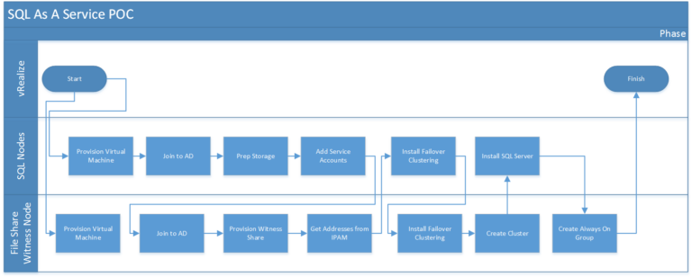
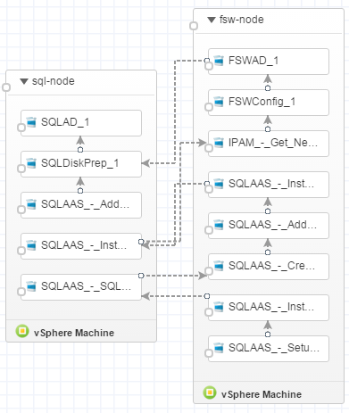

# SQL As A Service Proof of Concept with SQL 2012 and vRealize Automation
Standing up a redundant/highly available database infrastructure can be one of the more complicated pieces of work.  Doing it by hand is a long process with any points where errors could happen.  It was with this in mind that I decided to use this as my first “project” with vRealize Automation.

## A Brief History of SQL Server High Availability
When discussing redundancy or high availability (HA) for databases, there’s two distinct outcomes – firstly to ensure the continued delivery of the service in the event of infrastructure failure (the actual HA part) and secondly to ensure the data is kept in an orderly fashion (data integrity, no loss of data, etc).  Where these two activities happen depend on the technology used.

In older versions of SQL Server, these outcomes were achieved using SQL Clustering.  In SQL Clustering, the HA function was achieved at the server level by having 2 or more servers, while data integrity was maintained by the database residing on shared storage.
<!-- more -->
The use of shared storage on some virtualization platforms presents issues with this approach, with a number of limitations to restrict the benefits of SQL Clustering.

By comparison, newer HA technologies from Microsoft that do not have to use shared storage have almost none of these issues.  With AlwaysOn Availability Groups, each SQL server has a “local” copy of the database.

## Boundaries and Details of the Design
I set a number of boundaries on the design of this project.

* Use a basic Windows 2012 template – while it is possible to create a template with a stub install of SQL on it, that would mean more inventory to manage.
* Activities of the design should be confined to standard blueprints and software components in vRealize Automation (thus excluding the use of vRealize Orchestrator).
* Two SQL server nodes, one File Share Witness Node
* Basic storage design (OS disk and SQL disk) for SQL nodes
* The database and agent services would run under their own service accounts.

## Workflow of the Deployment
The workflow is as shown in the diagram below.

In the vRealize Automation Blueprint Designer, it looks like this:

## Challenges
The largest challenge in this activity was that of security scopes.  vRealize Automation executes workflows on systems by the use of an software agent.  On Windows systems, this agent runs under the context of a local user account that has full local administrative rights on that individual system.  This works well until you need to perform activities outside the scope of that individual system, such as actions on Active Directory.  To get around this I used Powershell Remoting, allowing commands to be run under the context of an account with the required access.

The creation of  an AlwaysOn Availability Group also requires two IP addresses – one for the Windows Failover Cluster object and one for the Listener Object.  There are probably a dozen different ways of achieving this – in my case I used Windows 2012’s IP Address Management (IPAM) to query and reserve IP addresses via Powershell.

## Does It Actually Work?
In testing I performed, the AlwaysOn Availability Group works as expected.  When a client connects to Group Listener, the connection can be seen on the primary node of the Group.  If that node is taken offline, the client is disconnected – this is expected behaviour.  However, the client can initiate a reconnection to the Group Listener immediately, with this new connection appearing on what Secondary Node (which has now been promoted to Primary as part of the failover process).

The Failover Cluster Manager console and the Availability Groups Dashboard both respond to these events as expected.  Once the offline node is brought back online, it re-establishes connections and the Cluster is back in a healthy state, with any required sychronisation between nodes happening automatically.
