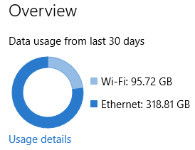
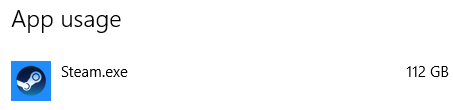
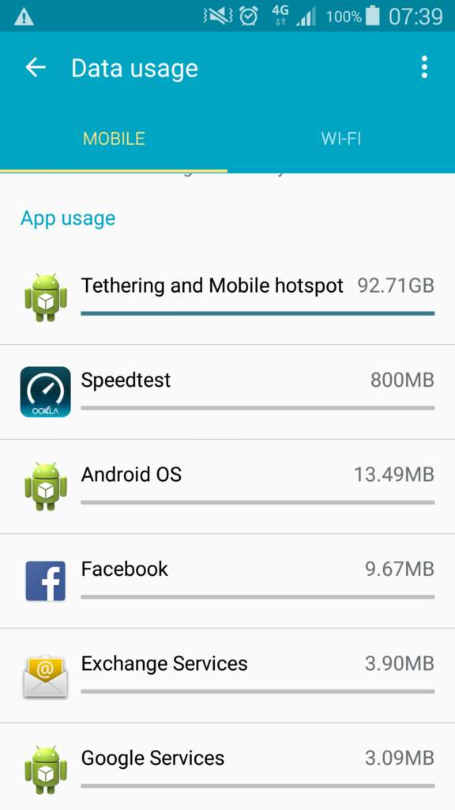

# Results from Telstra’s Free Data Day
Telstra had another free data day on Sunday 3rd April and this time I decided to take advantage of it since my phone has been capable of giving back speed test results of 90Mbits/sec compared to 12 on my ADSL.

## Prep & Setup
Unfortunately I made the assumption that my wifi adapter would work again since the Windows 10 upgrade I performed on my PC.  I went to bed early and set the alarm so I would wake up around 3am.  Due to issues with getting the adapter working, I lost about an hour and started around 4:30am.  The primary aim was to download a number of games on Steam that I hadn’t downloaded yet.
<!-- more -->
## In Action
At the start, I was getting very good transfer rates, around 70-80Mbits/sec.  Around 9am, the speed started to drop off.  I’m assuming this is due to people waking up and taking advantage of the free data too.

At midday it had slowed to a crawl and was actually slower than my ADSL.  By the afternoon, I had switched back to my ADSL, but kept running regular speed tests on my phone to see if it improved.

Later about 10pm, the speeds had improved so I switched back over and kept downloading until midnight.

## Results
Data Usage from Windows is as below:

Details are below.

And results from the phone:

