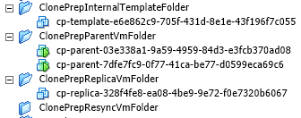
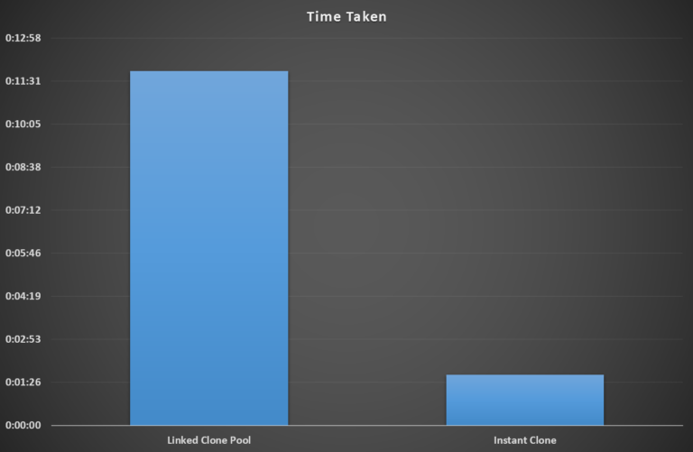

# VMware Horizon 7 – First Impressions
VMware Horizon is a Virtual Desktop Infrastructure (VDI) product which initially allowed provisioning of Virtual Desktops off a base image in an easily to manage fashion.  Over time, VMware have added extra functionally, such as the ability to add Remote Desktop Services (RDS) servers.

Version 7 has added a number of interesting features and improvements.  The one mentioned first in the release notes is Instant Clones.  This is a technology I’ve been following for a while, ever since I read about it.  Originally known as VMFork, it’s a technology to allow very rapid, almost instant, provisioning of Virtual Machines.  Duncan Epping wrote a good [overview of VMFork/Instant Clone](http://www.yellow-bricks.com/2014/10/07/project-fargo-aka-vmfork-what-is-it/) back in 2014.  Support for Virtual Volumes and Linux desktops are some of the other features that have been added.
<!-- more -->
My background in the context of this first impression is I have used 5.3 of Horizon, mostly in the provisioning of standard Windows 7 desktops in providing resources for training and testing.  With that in mind, I’ll be looking primarily at the installation/configuration process for version 7, getting a couple of pools running and how Instant Clone works compared to Linked-Clone.

## Installation
The installation process for View 7 is largely similar to earlier versions.  The Connection Server installation has some new options, such as IPv6 support for some roles and an enrolment server role which is used for “True SSO”.  The Composer component installs with minimal configuration

## First Time Configuration
The First Time Configuration workflow is very similar to previous versions – enter a valid license key, add the vCenter server and so on.  When adding the vCenter server, there is an additional option for the number of concurrent Instant Clone operations.

## Preparing Gold Images
The process for setting up gold images for pools is very familiar.  There’s a few new options when installing the Horizon Agent.  The most important one is the option to support Instant Clone.  This is performed by selecting the Instant Clone Agent, however this means you can’t use the same image for a regular pool.

## Creating Pools
When creating a new Automated Desktop Floating Pool, the option appears to utilise Instant Clones.  When configuring a pool using standard linked clones, there are a few extra options such as selecting VMware Blast as the default display protocol.  There is also some support for using Virtual Volumes (VVOL) but there’s a number of caveats that restrict its usefulness.  Lastly, there’s an interesting option to over-ride the Transparent Page Sharing scope.  This was a feature in earlier versions of ESXi which allowed more efficient use of memory by sharing pages between virtual machines, but at a point in time VMware deemed it a security risk and disabled it.

## Working with Instant Clone Pools
As mentioned above, you cannot have the regular Horizon Agent and Instant Clone Agent installed at the same time, which means an Instant Clone Pool needs its own base image.  Part if the process in creating the pool is the creation of a number of folders and virtual machines, as shown below.

This is part of the internal workings of Instant Clone and “normal”.  Instant Clone Pools have a number of restrictions such as no 3D rendering, lack of sysprep support and only floating user assignment.  These restrictions perhaps make them unsuitable for specific user scenarios, but their rapid provisioning makes them well suited for rapid ramp up in demand on a similar user base, such as user training.

## Linked-Clone Pool vs Instant Clone Pool Performance
In my testing I was somewhat limited by my infrastructure, so I tested by expanding each pool by 10 systems (from 1 to 11).  The graph below shows the difference between the two provisioning times:

In the case of my test, the provisioning was 7 times faster with Instant Clone.  This is a significant difference.

## Final Thoughts
Like a lot of the recent versions of products I’ve been looking at lately, this is more of an evolution rather than revolution.  In its own way, this is a good thing because it means the product is in a stable and mature form.

The performance of Instant Clones was pleasantly surprising given the infrastructure I was testing on isn’t anything particularly great (a Synology NAS running NAS disks).

The setup and administration is still very consistent with the past versions I’ve used with only a bit of extra awareness and learning that an administrator will have to take on board.  Overall, a pretty good update for this product.
