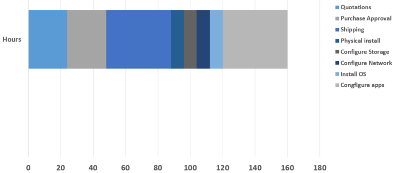

# VMware NSX – First Impressions
One of the first “killer applications” on the PC platform was Lotus 1-2-3, a spread sheeting program that greatly improved the productivity of the people using it and making a clear case for buying PCs.  More recently, we’ve seen this sort of thing happening in IT infrastructure, with virtualisation, automation, cloud and “as a service”.  VMware’s NSX product is the latest in a line of products from VMware in this sort of area.

If we go back to the “good old days” of getting a server up and running, it could take weeks.  The diagram below shows the amount of effort involved.

While some of these numbers may have been more or less depending on circumstances, in many cases it could’ve taken over 150 business hours to get a server ready for use.  Or almost a full month.

With the introduction of virtualisation, a number of these tasks were removed or diminished due to the hardware provisioning process being decoupled from the server provisioning process.  With this, plus better automation tools that have appeared in recent years, the common timeline today may look like this:

<!-- more -->
The only element of this which hasn’t changed is configuring the network because, in many organisations, the processes and technologies used to configure and maintain a network hasn’t changed much and in many cases, extra complexity has been introduced which increases the burden of administration.

NSX tries to address this issue – of providing network provisioning that can keep up with where compute provisioning is today.  The second issue NSX tries to address is around security.  In many organisations, the emphasis is on securing the edge of the network.  This leaves a corporate network with a robust hard shell but a soft inside.  In a large environment, effectively securing each item can become extremely expensive and/or technically challenging.  Because of the nature of virtualisation, NSX is able to have a good chance at addressing this issue.

## Installation & Configuration
Running through the first few stages of configuring NSX is fairly basic, although to do it properly would require some amount of planning.  The first hint of the underlying complexity of NSX comes when creating a Logical Router.  Up until this point, all the entities configured exist inside the NSX controller appliance or in vSphere/vCenter configurations.  The Logical Router is its own virtual appliance.  The wizard to add the Router has a lot of settings that are very similar to setting up a virtual appliance via OVA/OVF import, such as passwords and where it lives in the environment.

By combining Logical Routers, Switches and Edge Gateways in NSX, you can create a structure very similar to a physical network.

## Security
The real power in NSX comes from its security system.  You can define Security Polices which apply to a Security Group.  The power in this arrangement comes from the fact that the membership of a Security Group is defined dynamically, using a set of criteria.  Most examples of using NSX out on the web use the criteria of Virtual Machine name (ie. All Virtual Machines names containing “web”).  Other options include the name of the Operating System, the Computer Name, Security Tag or Entity.  You can also define objects to always include or exclude.

This model allows relative ease in creating polices and applying them.  One broad reaching scenario outlined in the NSX documentation is creating a policy that locks down any machine with a detected virus on it (by the anti-virus software applying an “infected” security tag, which tend causes the network quarantine policy to apply).

Once you’ve defined Security Groups and Policies and related them, the groups can be viewed in the Canvas, which gives a high level visual view of how many Policies, rules and other settings are applied and to which Virtual machines.

In the screenshot above, I’ve defined 2 firewall rules in a General Web Servers policy which allows HTTP and HTTPS traffic.

The architecture of NSX is such that the Firewall component actually lives on the ESXi hosts, meaning traffic is inspected on egress and ingress on the ESXi host.  Other functionality includes the ability to prevent network traffic spoofing via IP and MAC address validation.

## Integration
VMware’s promotional material make a lot of noise about integration with NSX.  Firstly there seems to be decent integration with their vRealize Automation product.  There is also a REST API and Powershell commands available.  Third party support comes in a range of vendors, including Symantec and Palo Alto.  This level of integration and support is good because it allows scenarios like the one described earlier with an anti-virus outbreak, where the anti-virus management system is able to flag infected virtual machines.

## Final Thoughts
I think NSX is at a point where it’s a pretty mature product.  As I wrote earlier in this piece, getting it setup is pretty easy, it just requires good planning beforehand to get the most out of it.  Some of the more exotic features like fenced networking allow some really interesting design options.  Any organisation with a network of reasonable complexity should be looking at this product or something similar as one of their next options for improving IT outcomes.
