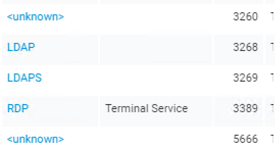
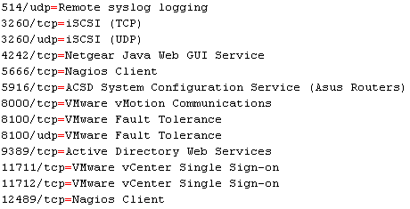

# Adding extra service mappings to Nexpose
Nexpose does have good coverage of services in the “well known” range of ports (0-1024).  An environment with a lot of propriety systems will cause Nexpose to some services as unknown or even misidentifying them.  The screenshot below is a good example of this.

The example is from a Domain Controller.  Nexpose identifies the port 3389 service correctly as RDP.  Ports 3269/32769 are used by the Global Catalog service, so labelling them as LDAP/LDAPS isn’t strictly accurate.  For port 3260 and 5666 it gives up.  Depending on your needs, you may want to get these labels a bit more accurate.  This can be achieved by using a custom service names file (you can alter the default one, but it’s probably best to leave that in its default state).

The default file, default-services.properties, is located in the `<install location>/plugins/java/1/NetworkScanners/1` folder.  The format is basic, with each line as `<port #>/<tcp or udp>=<Service Name>`.  Some of the custom ports I added are shown below:

Once the properties file is in a state you’re happy with, place it in the same folder as the default one and either create a new or edit an existing scan template and put the file name into the field on the Service Discovery section.  Load up the page of an asset to test and queue a scan on it with the scan template.  The reported services should update with the new values.
