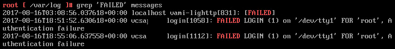
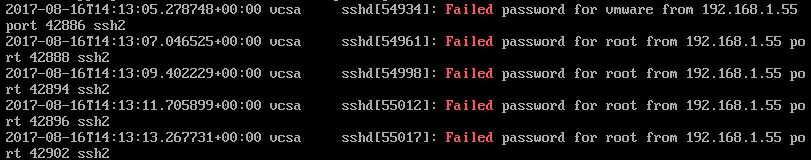

# VCSA 6.5 Root Account Password – Reset and Cause Investigation
One of the more frustrating experiences one can experience with VMware’s vCenter Server Appliance (VCSA) is having the root account locked out or forgetting the password for it.  I recently experienced this after I rebuilt the VCSA in my home lab from scratch.

How to Reset the VCSA Root Password
VMware have a short process on how to reset the password for the root account, detailed in KB2147144.  THe process is:

1. Backup the VCSA (via snapshot or other means)
2. Reboot the VCSA
3. During the boot process, when the photon splash screen appears press the e key to get into the boot menu
4. In the text box that appears, go to the line starting with “linux”.  Go to the end of the line (which is right after the text “consoleblank=0”) and enter the text `rw init=/bin/bash`  This will cause the boot process to jump right into the bash shell without needing credentials
5. Press F10 to continue booting
6. At the command prompt, run the `passwd` command to reset the password
7. Unmount the file system by running `umount /`
8. Reboot the VCSA using `reboot -f`
9. Following reboot, confirm the new password works
10. If you took a snapshot in step 1 remove it
 
<!-- more -->
## Cause Investigation
After resetting the password and restarting, I still couldn’t login.  One thing I noticed was there had already been 20 login failures.  In my situation, the VCSA was working one evening and the following morning the login issues happened.  Something had to be causing these issues.  Using the password reset process to get to the bash shell again, I looked around in some logs.  First I tried checking the /var/log/messages log.

Unfortunately, using ‘FAILED’ only showed 2 login attempts on the console which were caused by myself after the lockout happened.  Failed SSH login attempts are logged under a text string that uses ‘Failed”.  The second search attempt used ‘Failed’ and yielded better results.

The log had numerous entries for 192.168.1.55 trying to login using root and other accounts.  The system on 192.168.1.55 was the trial of Nexpose.  Even though I didn’t have credentials set in Nexpose to logon to the VCSA, it still was trying to logon using root and was causing the failures.  This hadn’t been an issue prior to the VCSA rebuild.

I excluded the VCSA from the scanning that Nexpose performs and did the password reset process again.  I was now able to login successfully.
