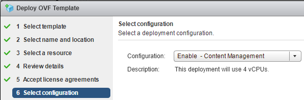
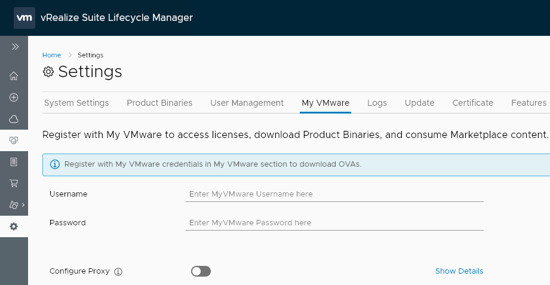
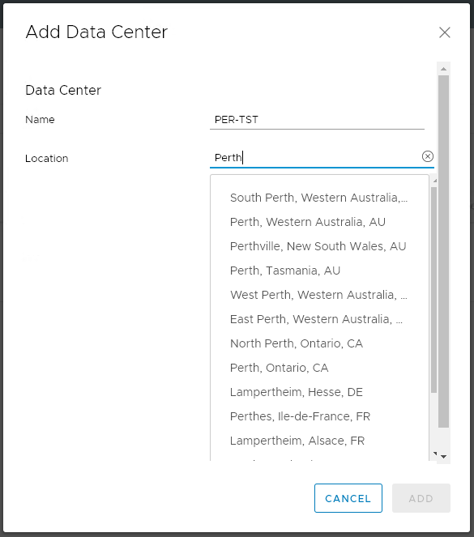
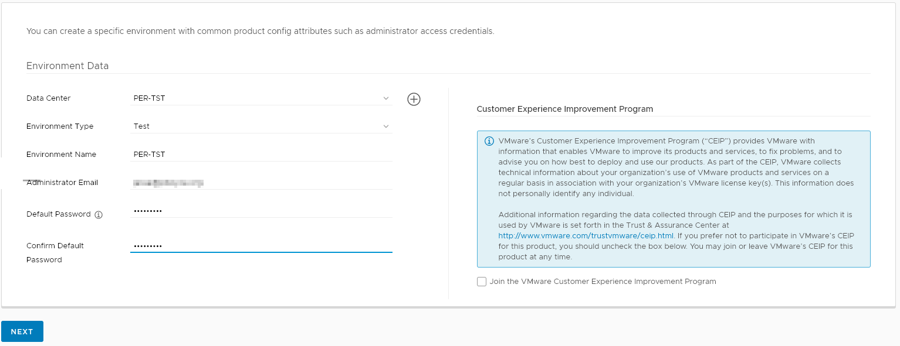
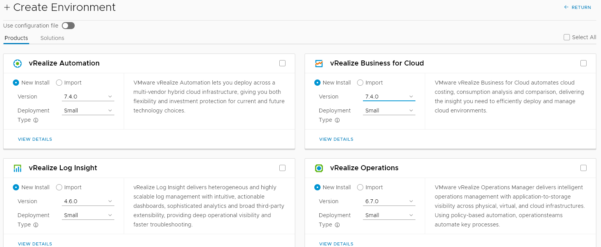
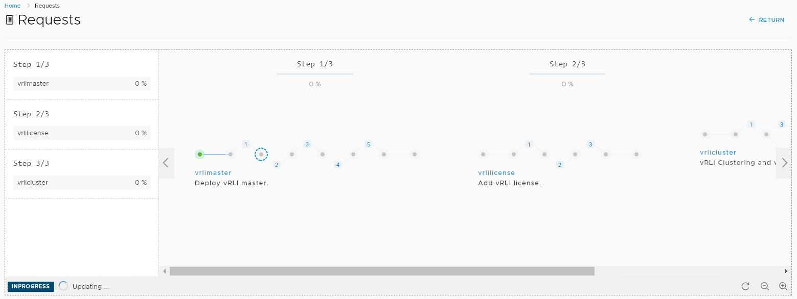
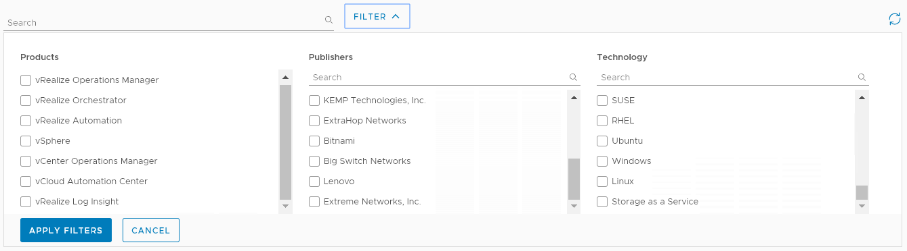
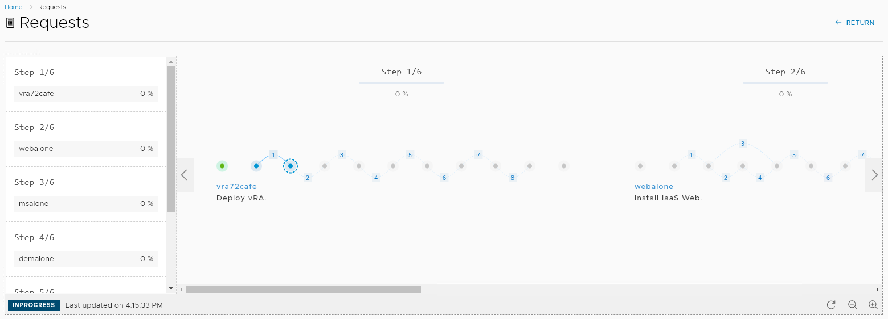

# VMware vRealize Suite Lifecycle Manager 1.2 – First Impressions

When VMware created the vRealize brand, they grouped together some of their most complex products under one banner. vRealize Automation (vRA) required the deployment and configuration of two components – a virtual appliance and a Windows server. The Windows server had a long list of prerequisites. In terms of operational management, using products like vRA meant ongoing work on scripts, workflows and other artifacts. The logical response to this is to create a non-production instance to protect your production instance. Moving updates to production could be achieved manually or via VMware’s Codestream product, but both approaches left a lot to be desired. vRealize Suite Life Cycle Manager (vRSLCM or just LCM) is a new approach to this set of problems.

## Getting LCM Running
LCM comes supplied as a “Virtual Application” where a few configuration options are required to provision it. One of the LCM-specific settings is whether you want to enable the vaguely named “Content Management”. Enabling this will cause the appliance to use 4 processors instead of 2. Once the appliance is deployed and started, the rest of the configuration happens via the web interface.

<!-- more -->
## Configuration Options
Many of the technical settings are hidden in the System Settings area. One important item in this area is adding product binaries, as one of the main functions of LCM is deploying other vRealize products. Another important area is the “My VMware” section where you can put in your VMware credentials to integrate licensing and product downloads.

In terms of getting things to a point of deploying products, VMware requires you to setup some structure first. LCM uses a “Data Center” as it’s highest level container, which you can then associate vCenter servers with and Environments. Adding a Data Center requires just a name and location, while adding a vCenter Server is a matter of selecting the Data Center you want to associate with it and entering the vCenter Server’s details.

Creating an Environment is where settings become more detailed, including specifying an Environment Type.

## Deploying Products
Once an Environment is created, the interfaces for deploying Products (individual vRealize products) or Solutions (combinations of products) becomes available. Each Product option can have its version and deployment type specified.

Picking a product to deploy initiates a long, multi-step wizard. It’s during this wizard you’re most likely to hit the first snag in getting a product deployed, as the wizards have validation checks that rely on you performing prerequisite work first. This can be especially annoying when attempting to deploy vRA, as LCM assumes the Windows-based IAAS server component is already staged and ready. One nice feature is at the end of the wizard you can download a JSON-based configuration file, as the deployment process supports using a preexisting configuration file. Once the wizard is finished and the deployment starts, it appears under the Request section is an updating progression graphic.

When the Request is finished, the product can be managed, including getting logs, exporting the configuration or even performing upgrades to newer versions.

## Marketplace
This is a section in LCM that has a range of virtual appliances that you can easily deploy to extend the functionality of VMware’s products. Items can be filtered by target product, the vendor or what technology it relates to.

Where the Marketplace becomes particularly useful is if your environment has a production and non-production vRA instances. One of the Marketplace items is a Gitlab appliance, which LCM can use for migrating changes between vRA instances.

## Content Management
This is the area where LCM gets interesting if, like me, you’re having to deal with transferring artifacts between a non-production vRA instance and a production one. The Content Management function of LCM is essentially a more mature and capable form of Codesteam and uses Gitlab. What this helps achieve is more visibility on what was changed over time, avoid the “stepping on each others toes” problem of trying to edit the same thing at the same time, as well as allowing easy rollback.

## REST API
Like many of VMware’s products, LCM has a REST API that allows operations to be performed via automation tools. This functionality can be leveraged as part of a larger workflow relating to deploying one of the products that LCM supports. For example, the larger workflow could include earlier staging steps required before LCM’s activities or actions after LCM’s part to further configure what was deployed.

## Final Thoughts
Life cycle Manager certain seems to fill a gap if the environment you’re working in has many of the VMware products that it supports and you need a more robust and mature way to manage them. I’ll be looking at trying to prototype a concept deployment via LCM in the near future.

