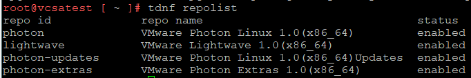
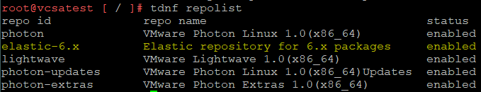
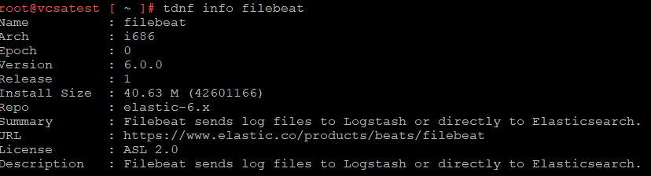
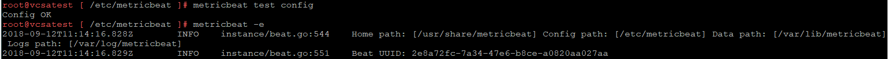
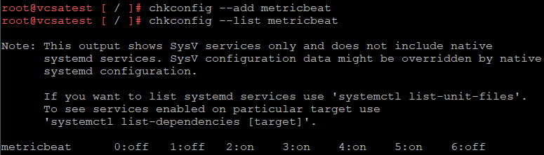

# Installing ElasticStack Beats on vCenter 6.7
I recently deployed a vCenter appliance to 6.7 after a power outage corrupted the 6.5 instance.  A followup task for the virtual appliance was getting the ElasticStack Beats (MetricBeat, Filebeat) installed again.  In this post, I will go through the process of installing the Beats and some of the minor issues I ran into.
<!-- more -->
vCenter 6.7 Package Management
VMware’s vCenter 6.7 virtual appliance is based upon the Photon OS.  Photon uses a custom package manager called tdnf (Tiny Dandified Yum).  Like Yum, it has repositories.



tdnf appears to use the same format for repositories as yum in terms of location and content.  Based on this, I attempted to install
Filebeat first using the repo-based approach as I found it did a better job of handling file permissions.

## Adding the ElasticStack Repository
Adding the repository requires a few deviations from what’s in ElasticStack’s [documentation](https://www.elastic.co/guide/en/beats/filebeat/current/setup-repositories.html).  Firstly, it appears tdnf doesn’t support a HTTP URL for the gpgkey value.  The default repositories use file URLs.  So the first variation is downloading the gpgkey file.

When creating the .repo file, the gpgkey path needs to reflect where the file was downloaded to.  For the sake of consistency, I put it in the same directory as the other repositories.
```
[elastic-6.x]
name=Elastic repository for 6.x packages
baseurl=https://artifacts.elastic.co/packages/6.x/yum
gpgcheck=1
gpgkey=file:///etc/pki/rpm-gpg/GPG-KEY-elasticsearch
enabled=1
autorefresh=1
type=rpm-md
```

After doing these steps, the tdnf repolist command output shows a new entry.



Just to confirm that tdnf would use the new repository correctly, I ran commands that would return information about the FileBeat package.



With the correct gpgkey value, the install can proceed.  An issue with this that I ran into was just specifying the beat package name will cause the 32-bit version to be installed.  This version will fail to run.  This can be avoided by explicitly installing the 64-bit version, using the command: `tdnf install metricbeat.x86_64` (Thanks to Paul in the comments suggesting this).

## Configuring The Beats
Following the installation, the configuration files can be updated for each beat.  In my case, I already had a [configuration file](https://github.com/jpboyce/elasticstack/blob/83ec82ed2d1a2d5aadc99de73dd815c18fc85d49/metricbeat/vCenter-metricbeat.yml) for MetricBeat.  As a sanity check, I do a test on the configuration and an initial run via command line, outputting to the console



Upon viewing data in Kibana, it’s possible to confirm that the MetricBeat information is flowing through correctly.  Since the Beat is working, the last step can be performed, which is to configure it to run automatically.



The same steps can be repeated for FileBeat.  In my case I was primarily using just MetricBeat to collect statistical data from the vCenter appliance.
