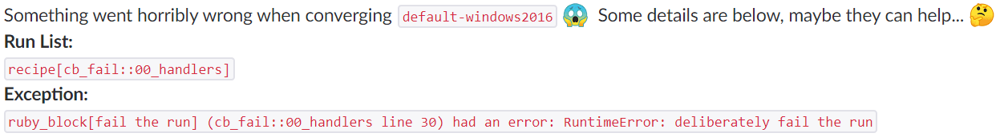

# Improving the vRA Customer Experience – Send Chef errors to Slack
One of the issues that can be amplified by automation is logging.  Some logs have an ephemeral nature, having a short lifespan due to various factors.  This can be especially painful if the logs relate to failures and contain information that could assist in fixing the problem.

This was the issue I was seeing when vRealize Automation (vRA) requests would fail when Chef attempted to apply settings.  If Chef failed critically, vRA would be made aware of it and fail the entire request.  Of course, vRA would then delete the virtual machine and the local Chef logs.  In many cases, there was a gap of only a minute or two between the Chef failure and the vRA cleanup tasks.
<!-- more -->
The approach I wanted to take was somehow getting those logs or at least the error message off the affected virtual machine and put that data somewhere else.  It could be an email, it could be a shared folder.  I eventually decided upon sending it to a Slack channel by triggering a vRealize Orchestrator (vRO) workflow.  Some of the reasoning behind this included:

* There was already a precedent in the organisation for having critical errors be fed into Slack
* There was already existing generic workflows in vRealize Orchestrator (vRO) for creating Slack messages
* vRO is an internal system, accessible by the network zones likely to have deployed virtual machines.  This meant being able to reach the vRO REST API from these virtual machines had a high chance of working.  Going directly to Slack would require a lot of firewall rule pain

The existing workflows were generic enough that all I needed to specify was the target (a Slack Channel or user) and the message.  The final piece was how to trigger all this on the virtual machine experiencing the failure.

## Chef Handlers
Chef allows “Handlers” to be executed when the Chef Client experiences a certain scenario.  One of these scenarios is when an exception happens.  At a high level, I wanted the Handler to be triggered on an exception, collect the exception details and pass those details onto the vRO workflow via REST API.

## Handler Code Detail
Credit has to go to Eike Waldt (AKA [yeoldegrove](https://github.com/yeoldegrove)) and his [HTTPAPI Handler code](https://github.com/b1-systems/chef-handler-httpapi).  The main changes I had to do from his base was some formatting hoop jumping because of how vRO likes to receive JSON.  First I define the error message to sent:
```
@api_error_message = "Something went horribly wrong when converging `#{node.name}` :scream:  Some details are below, maybe they can help... :thinking_face: \\n*Run List:*\\n`#{formatted_run_list}`\\n*Exception:*\\n`#{run_status.exception}`"
```
Eike’s original code also included the backtrace but I found this makes the slack message almost unreadable and too long.  In a divergence, I use the handler by calling it directly in a recipe using the chef_handler resource.
``` ruby
chef_handler 'ErrorsToSlackModule::ErrorsToSlack' do
  source "#{node['chef_handler']['handler_path']}/errors-to-slack.rb"
  supports start: false, report: false, exception: true
  action :enable
end
```

When the cookbook hits the failure, it will hit the vRO REST API to execute the workflow.  The default is a slack message with some relevant info about the error.



## Effort vs Reward
When I did my first pass at this code, I spent 1 or 2 days on it.  I figured that if I couldn’t get it working after that point, I’d shelve it.  However if I managed to get it working it would have some good benefit in relation to the time taken.  Given the scenario I think it turned out well.
