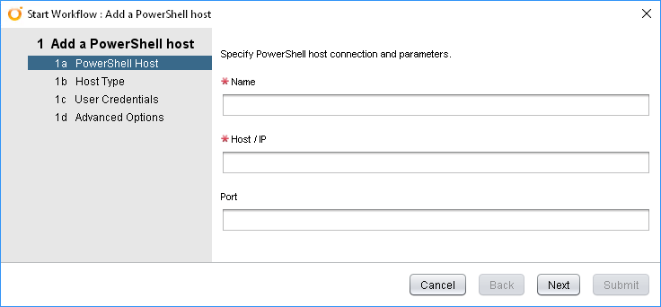
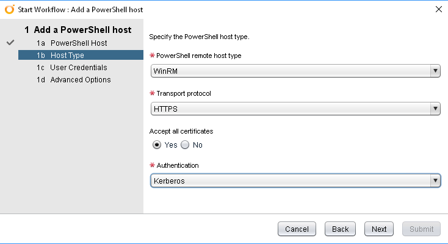
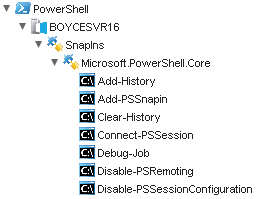

PowerShell Hosts are one of the types of endpoint available in vRealize Orchestrator’s Inventory. By having a PowerShell Host, you can leverage the breadth of PowerShell functionality from within your vRealize Orchestrator workflows. In this article, I’ll run through adding a PowerShell Host as well as some considerations from a technical and security point of view.

Adding A PowerShell Host
vRealize Orchestrator has a built-in Workflow for adding a Host under Library > PowerShell > Configuration. Run the “Add a PowerShell host” Workflow to start it. The opening interface is below:



<!-- more -->
Before getting int running the Workflow itself, there are some items you may need to organise in relation to the Host. These items include:

* On the PowerShell Host, WinRM needs to be configured and enabled
* The path between the vRealize Orchestrator appliance and the PowerShell Host and relevant ports must be clear. You can use either HTTP on port 5985 or HTTP on port 5986
* A username and password with appropriate rights on the target system to execute the PowerShell commands
* Which form of Authentication you want to use – Basic or Kerberos. Which you pick may be influenced by your environment and thus, influences how WinRM has to be configured. It should be noted that using Kerberos will require some additional configuration of the krb5.conf file on the vRealize Orchestrator appliance to support this.

Once these items are completed, you should be able to execute the Workflow to completion without any issues. The first screen, as shown above doesn’t require too much in terms of information – just a name, the Host’s hostname or IP and the port you’ll be using. On the next page of the Workflow, called Host Type, you’ll be presented with some options that may need changing depending on what you defined in the points I mentioned above. In my case, I want to use a relatively secure setup, so I’ve set the Workflow to use HTTPS as the protocol and Kerberos authentication.



The third page of the Workflow is about the User Credentials. It’s worth noting that if you select Kerberos Authentication, the Username has to be entered in UPN format (user@domain.com), not in the older style (DOMAIN\user). The last page, Advanced Options, has just one option that can be set. This option is the Shell Code Page. Once you’re happy with everything, you can hit Submit.

Once the PowerShell host has been added, you can view it in the Inventory. One nice feature is it will enumerate the SnapIns available, and then the commands available.



## Security Considerations
When setting up a PowerShelll Host for production use, or if to just perform a “better” setup in a lab environment, some security considerations come into play. One of the first is that of allowed Logon Type. The Logon Type used for the PowerShell Host activities are type 3 or Network. Some organisations block this kind of Logon Type for accounts that are local accounts.

The next consideration is the level of access on the PowerShell Host itself. When I was adding the Host in vRealize Orchestrator, it would continually fail until I added the account I was using as a local administrator. This is an undesirable outcome especially when there appears to be security groups that should grant the required access. It appears that the account used has to be in the Local Administrators group when adding the host and during subsequent script executions.

While PowerShell does have the ability to limit what cmdlets can be run, this is implemented based on a profile specified during a PowerShell Remoting session (based on the information I had at hand) and can’t be enforced on a particular user. So based on this, it seems this sort of enforcement can be done.

As a tangent from Security, one thing that should be considered is turning on PowerShell transcript logging. Doing this creates log files whenever a PowerShell script is run and can supply useful information about that particular transaction. An example of a transcript is below:
```
**********************
Windows PowerShell transcript start
Start time: 20181218211509
Username: BOYCE\svc_vROPOSH
RunAs User: BOYCE\svc_vROPOSH
Machine: BOYCESVR16 (Microsoft Windows NT 6.3.9600.0)
Host Application: powershell -File -
Process ID: 5312
PSVersion: 5.1.14409.1018
PSEdition: Desktop
PSCompatibleVersions: 1.0, 2.0, 3.0, 4.0, 5.0, 5.1.14409.1018
BuildVersion: 10.0.14409.1018
CLRVersion: 4.0.30319.36470
WSManStackVersion: 3.0
PSRemotingProtocolVersion: 2.3
SerializationVersion: 1.1.0.1
**********************
```

## Final Thoughts
From what you’ve seen, it’s relatively easy to add a PowerShell Host for vRealize Orchestrator to use. Once it’s in place, it can be leveraged to run PowerShell scripts for a wide range of activities, with inputs and outputs feeding into other workflow items.
