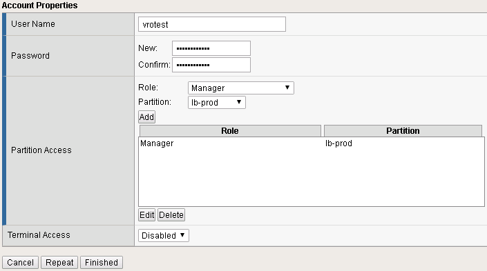
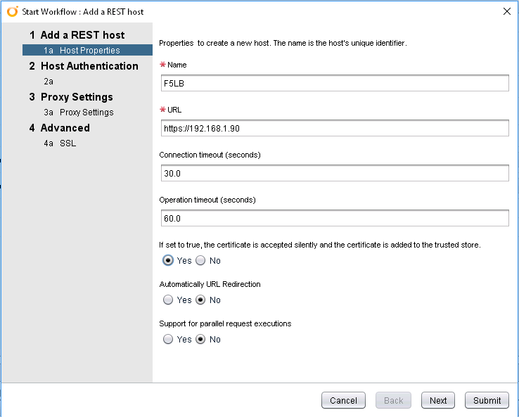
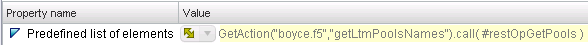
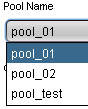

# Managing F5 Load Balancers with vRealize Orchestrator

F5 Load Balancers (LB) have been a common feature across a number of environments I’ve worked at. While administration of these devices is generally performed via the web interface, F5s also have a REST API that allows the same management tasks to be performed. This opens the possibility of using VMware’s vRealize Orchestrator (vRO) to manage F5 Load Balancers via the same REST API.
<!-- more -->
Getting Started
The first thing to undertake is getting the pieces required to use the API in place. The first step in this would be to create an account on the F5 appliance that has appropriate rights for the tasks to be performed. The specifics of this will vary from environment to environment (such as partition configuration), but to manage pools and pool members, a combination of the Application Editor and Manager role permissions are required. In the screenshot below, I’m adding a user called vrorest with the Manager role in the lb-prod partition.



After this, a REST Host object needs to be created in vRealize Orchestrator. This can be done using the “Add a REST Host” workflow.



For Host Authentication, set the Type to Basic and then enter the details of the user account and complete the rest of the wizard. If all goes well, a new item will appear in the Inventory.


I prefer to reference REST Operations in vRO, so next I would add some common operations to this host. These include getting load balancer pools and pool members, as well as setting pool member details. The table below has some of these.

|Name	|Method	|URL Template	|Notes|
|---|---|---|---|
|Get Pool	|GET	|/mgmt/tm/ltm/pool/{poolName}	|Can be used to return all pools or a specific pool|
Get Node	|GET	|/mgmt/tm/ltm/node/{nodeName}	|Can be used to return all nodes or a specific node|
Get Pool Members	|GET	|/mgmt/tm/ltm/pool/~{partitionName}~{poolName}/members	| |
|Set Pool Member	|PUT	|/mgmt/tm/ltm/pool/~{partitionName}~{poolName}/members/~{partitionName}~{memberName}:{memberPort}	| |

Most of these “Get” items can be used to populate drop-downs and other user interface elements in Workflows via the use of Actions.

## Example Action – Get Pool Names
Actions can be used to bind values to a user interface element. In this example, I want to be able to get just the names of the F5 pools so that a drop-down can be populated. To do this, I would use some code like that below:

``` javascript
/*
This script assumes an Input called restOperation of the type REST:RESTOperation and has a return type of Array/String 
*/

// Init variables
var inputs = [""];
var content = "";
var poolList = new Array;

// Create request
var request = restOperation.createRequest(inputs,content);

// Get response
var response = request.execute();

// Parse JSON
var jsonObject = JSON.parse(response.contentAsString);
var jsonItems = jsonObject.items

// Iterate - extracting the name value and pushing it into the poolList array
for each (var x in jsonItems) {
	System.log(x.name);
	poolList.push(x.name);
}

// return populated poolList array
return poolList;
```
To attach the outputted list of Pool Names to an input on a Workflow, I added the Property of “Predefined list of elements” and called the Action, as shown below:



When the Workflow is executed, the Action is called to populate the values, as shown in the image below.



## Example Workflow – Set Pool Member State
The code below is a snippet of a workflow that sets the state of a Pool Member based on inputs from the Workflow form. The first part of the snippet constructs the payload required to set the state based on what the user selected. Following that, the appropriate REST Operation is executed and the response returned.

``` javascript
/*
This snippet expects the following inputs:
- memberName (string)
- memberPort (number)
- poolName (string)
- restOperation (REST:RESTOperation)
- state (string)
restOperation will be a RESTOperation object that uses the URL for setting a Pool Member's state
*/

// Construct payload based on the state value
switch(state) {
	case "enable":
		//
		payload = '{"state": "user-up", "session": "user-enabled"}';
		break;
	case "disable":
		//
		payload = '{"state": "user-up", "session": "user-disabled"}';
		break;
	case "forceoffline":
		//
		payload = '{"state": "user-down", "session": "user-disabled"}';
		break;
	default:
		// throw an error
		throw "An invalid value (" + state + ") was submitted for the input parameter state";
	}
System.log("Payload value has been set to: " + payload);

// Set inputs for the REST call
var inputs = [poolName,memberName,memberPort];

// Create request
var request = restOperation.createRequest(inputs,payload);

// Execute request
var response = request.execute();

// Parse and output response
var jsonObject = JSON.parse(response.contentAsString);
System.log(response.contentAsString);
```

## Further Reading & Resources
The two resources below were my starting point for doing these workflows. The material on the F5 Automation Labs has a bunch of Postman collections that cover a range of operations on F5 devices, allowing you to experiment with them.

* F5 Automation Labs – https://github.com/f5devcentral/f5-automation-labs
* iControl REST User Guide – https://devcentral.f5.com/d/icontrol-rest-user-guide
