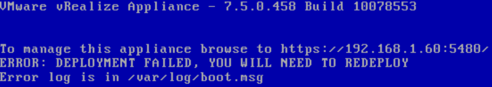
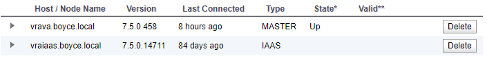

# vRealize Automation – Dealing with a disconnected/orphaned IAAS Server

Following the installation of a replacement UPS I made a horrible discovery – there was problems with my vRealize Automation setup. The first sign of what was to come was when I reviewed the console of the vRealize Automation (vRA) Virtual Applications.



Anyone who has had to setup vRealize Automation would probably know the sinking feeling I started feeling. Having to setup vRA again from scratch was not something I really wanted to do….
<!-- more -->
## Start the troubleshooting
I started having a look at what might be wrong. The Virtual Appliance administrative interface pointed out a very glaring issue – my IAAS server hadn’t been connected for 84 days.



Given that I’ve only been working in Orchestrator on my home lab lately, it seems easy to have missed this kind of thing happening. When viewing the services on the IAAS server, some of the vRA related ones were started. As I tried to start them, one of them started to throw up an error.

The “VMware vCloud Automation Center Service” service wouldn’t start, complaining about an issue with its side-by-side configuration (error code 14001). This is an issue that seems somewhat common where the Config file for the service gets chewed up for one reason or another. There is even a VMware Knowledge Base article ([54736](https://kb.vmware.com/kb/54736)) that references this issue and how to fix it.

After applying the steps in the article, the next issue appeared, where the service would stop with a very generic error. The log files for the service itself didn’t seem to have anyhting. Fortunately the Windows Event Log did have something useful.

```
Log Name:      Application 
Source:        ManagementAgentService 
Date:          6/04/2019 6:51:22 PM 
Event ID:      0 
Task Category: None 
Level:         Error 
Keywords:      Classic 
User:          N/A 
Computer:      vraiaas.boyce.local 
Description: Service cannot be started. System.Configuration.ConfigurationErrorsException: Required attribute 'id' not found. (C:\Program Files (x86)\VMware\vCAC\Management Agent\VMware.IaaS.Management.Agent.exe.Config line 6)
On this error, I found another VMware Knowledge Base article – IaaS Management Agent does not start in vRA 7.1 ([2146550](https://kb.vmware.com/articleview?docid=2146550)). While doing the steps in the first article did create a fresh Config file for the service, it appears it was missing some key settings, such as the id attribute. I added this and tried again.
```

Again the service failed to start, but the error message had changed slightly, now complaining about a missing “managementEndpoints” attriubte. In a [VMware forum thread](https://communities.vmware.com/thread/519977) where someone was experiencing the id attribute issue, they had helpfully posted their Config file which included the managementEndpoints section. So I attempted to add the same block into my own Config file. I took the certificate thumbprint from the vRA web interface, hoping it would be the correct one. After some formatting silliness, the service finally started.

```
<?xml version="1.0" encoding="utf-8"?>
<configuration>
    <configSections>
        <section name="agentConfiguration" type="VMware.IaaS.Management.Agent.Configuration.ManagementAgentConfigurationSection, VMware.IaaS.Management.Agent, Version=7.5.0.0, Culture=neutral, PublicKeyToken=b6e51ea3eb1deebc" allowLocation="true" allowDefinition="Everywhere" allowExeDefinition="MachineToApplication" overrideModeDefault="Allow" restartOnExternalChanges="true" requirePermission="true" />
    </configSections>
    <agentConfiguration machineUuid="<MACHINE UUID>" id="<ID FROM KB 2146550 COMMAND>"
        pollingInterval="00:00:05">
		<managementEndpoints>
			<endpoint address="https://vravra.boyce.local:5480/" thumbprint="‎<CERTICATE THUMBPRINT>"/>
		</managementEndpoints>
</agentConfiguration>
</configuration>
```

The last issue was logging – the Config file was missing the settings for logging, causing it to spray errors into the Windows event log. There’s two items that cause this. It seems that again, when the Config file was recreated, it was missing the pieces needed to enable logging – firstly a block in <configSections> defining a section for the logging configuration and the actual logging configuration settings.

Now the service was starting and logging to log files correctly. Unfortunately, those logs were full of errors.

```
System.Runtime.Remoting.RemotingException: Soap Parse error, xsd:type 'xsd:hexBinary' invalid ‎2221495FF9177CAB46D1209F5D2BE2B4D5E8AC3C
```

These errors seemed to happy whenever the service was trying to execute a number of routine tasks. Some of these involve accessing some REST API endpoints on the main Appliance. I was able to manually verify these were responding using Postman. At this point I was stuck for further options, so I exported my vRO workflows and decided to simply rebuild my vRA/vRO Setup

## Rebuilding and New Problems
I spun up a new Windows 2012 R2 Virtual Machine to act as my IAAS server and installed all the prerequisite items. Everything seemed to be going ok until I got to the prerequisite checker in the vRealize Automation’s Virtual Appliance setup, where it refused to validate that Java was there correctly. As a note, I had installed the latest Java at the time, which was Java Version 8 Update 211. After a bit of digging around, I found a [post on Reddit](https://www.reddit.com/r/vmware/comments/b9ptn0/upgrading_vra_with_vrlcm_and_java_versions/) where someone experienced issues with VMware’s Lifecycle Manager refusing to upgrade their vRA appliance when update 201 of Java was installed. When they dropped it down to 191, it worked. Using this premise, I managed to get 191 installed using Chocolatey and the prerequisite check passed.

I did a bit of digging around on the vRA appliance after all this to try to figure out what exactly is done to perform this check and why it might fail. Unfortunately some of these things seem to be obscured by VMware and the best I could do is find some PowerShell snippets in a DLL. Based on what those snippets do, the script should execute without errors even with an update 200 or higher version of Java. Interestingly, the same script snippet includes code that attempts to remediate by installing Java (presumably using source files from the vRA appliance itself)

A final issue I ran into after rebuilding was the same “DEPLOYMENT HAS FAILED” error appearing again, even though everything seemed to go okay and the system appeared to be working correctly. Upon reviewing the log file referenced in the error, I found an entry about ElasticSearch failing to start, although when I manually checked its status, it was working. After a bit of digging around, I found a KB article that seems to cover this scenario – [Initial OVF deployment of vRA 7.5 fails with error: Deployment failed, you will need to redeploy (59333)](https://kb.vmware.com/kb/59333) There was also a forum thread that suggested this issue will be resolved in 7.6

## Lessons Learned
Out of all these issues come a few things that I’ll probably look at implementing in my lab setup (and would almost certain implement in any production instance I manager in future):

* Services on the IAAS System – Since the operation of these is key and them being in a failed fashion is a good sign that things are broken, I’ll be looking at adding monitoring items for them in my monitoring system
* VMware.IaaS.Management.Agent.exe.Config File – This is at least the second time I’ve seen this file get mangled for some reason. So at a minimum, I would look at making regular backups of it and potentially have more scrutiny of it like checking file size/content
* vRA Node Status – The vRA Node Status display in the vRA Appliance is a good avenue for seeing if there’s been any drift between the main appliance and the IAAS nodes. It may be possible to leverage the Health Check feature via REST API for this
* IAAS Event Logs – There’s a number of items that the IAAS server logs in the Event Log and this can be clues to the positive or negative state of the system
* Java Versions – As shown in my experience and that of the person trying to do the vRA Upgrade via Lifecycle Manager, there seems to be an issue with how the version of Java is detected if its over update 200. As a point of reference, there appears to be an update 181 zip file of Java on the vRA appliance itself, so it might be worth while grabbing that and putting it somewhere safe
