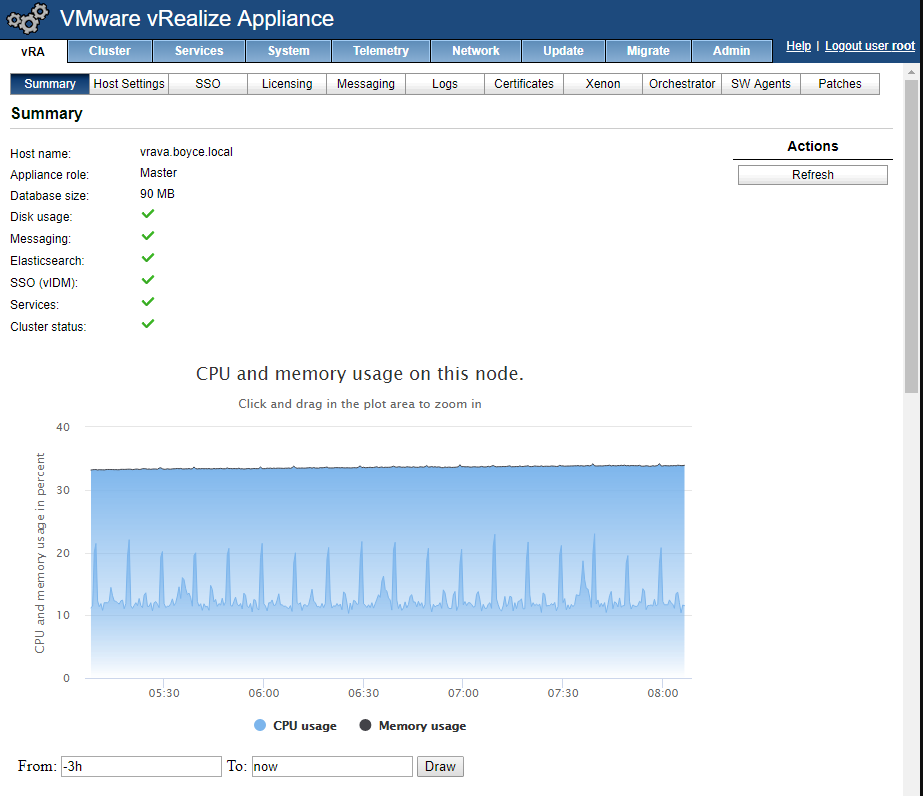
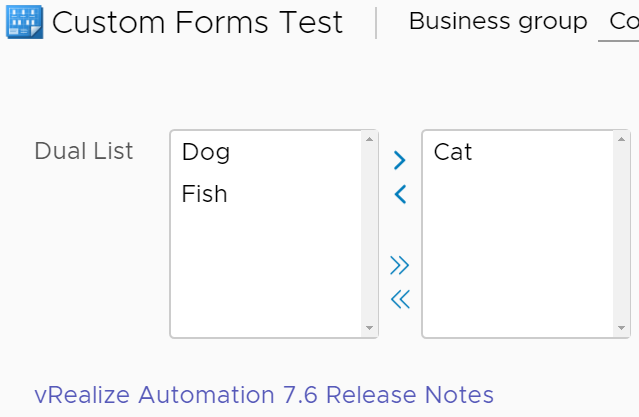
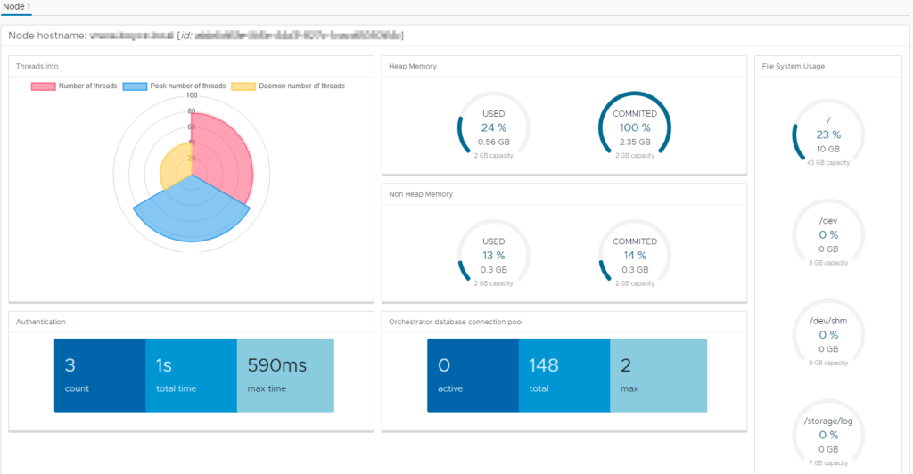
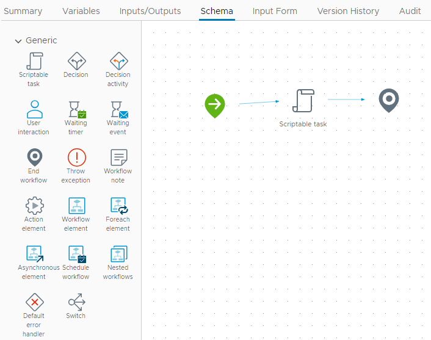

# VMware vRealize Automation 7.6 – What’s New
VMware released an update for vRealize Automation (vRA) at the start of this month. This was a slight increment from 7.5 to 7.6. At a high level, two key areas of change are NSX integration and the vRealize Orchestrator (vRO) user experience. The Release Notes goes into a bit more detail and I’ll be using those more detailed items as a guide for the content in this post. I will be skipping over the new NSX pieces as I don’t have those available to me.
<!-- more -->
## Virtual Appliance Changes
The first change that you will most likely see is the new Summary page. The page has a high level view of vRealize Automation’s status, plus a graph of memory consumption and CPU load.

Clicking in the From and To boxes allows you to set the time range for the graph. The Virtual Appliance also now has a SNMP service, which can be leveraged to perform monitoring. At the time of writing, I haven’t been able to find any documentation on enabling it or how to use it.

## Custom Forms Enhancements
Custom Forms were VMware’s attempt to bring a richer user experience to Blueprints. In vRA 7.6, some new UI elements have been added – Dual List, Multi Value Picker and Link. The Dual List element is one that a lot of people will likely get value from.

## vRealize Orchestrator
Historically, people developing on vRealize Orchestrator have used a Java-based client. This presented a range of issues. In 7.5, there was a hint of what was to come with VMware starting to apply their Clarity UI to parts of vRA. In 7.6, we’re seeing this extend further into Orchestrator itself. One nice addition is a System dashboard that presents a lot of useful metric data.

Perhaps the biggest real change is the ability to now edit Workflows and Actions directly within this web interface. This removes the need to use the Java client. The view when editing a Workflow is very similar to that of the Java client.

The Input Form tab takes the role of the Presentation tab that was present in the Java client. It has a look and feel that’s very similar to the Custom Forms in vRA with the same UI Elements available. It is interesting to note that the Release Notes mention that input parameter constraints created via this new UI won’t automatically transfer through to vRA when published as an XAAS blueprint. This was a behaviour that previously happened with the Java client (and still continues to work for workflows created/edited in the Java client).

The Version History tab presents a “diff” interface very similar to Github and similar systems, where you can see what code changes happened between versions. Lastly, the Audit tab gives a bit more governance oversight into the things happening to Orchestrator items, with a history of edits, executions and other activities. I’ll have to spend a bit of time digging more into the new web UI for Orchestrator, but so far it seems at feature parity with the Java client and is a great move forward. Lastly, when editing a script, we now benefit from autocomplete.

## API Changes
There doesn’t seem to be a lot of change in this area. In the 7.6 API list, there is an item to interact with Orchestrator, however I can’t remember if this is simply a documentation change or whether that API has been added.

## Summing Up
On the vRA side of things, there’s been a few tweaks. On the Orchestrator side, it’s a radical change with the new HTML5 user interface, one that I’m sure a lot of vRO developers should be pleased with.
