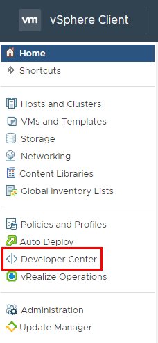
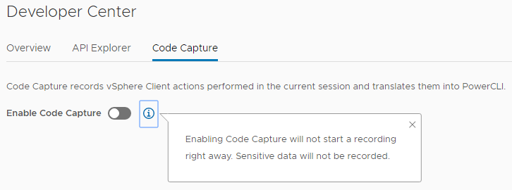

# vCenter 6.7 Update 2 – Code Capture
One of the very cool new features that came with the latest vCenter update is Code Capture. This feature allows you to “record” actions in the HTML 5 web client. When the “recording” is ended, Code Capture will generate PowerCLI.NET code. For those who used Exchange 2007, you may remember a similar feature in the GUI management console. At the end of each wizard, there was a summary of PowerShell code that would perform the same task you just finished.

Code Capture has been around for a while as part of the [HTML 5 Client Web Fling](https://labs.vmware.com/flings/vsphere-html5-web-client). However, at the time, it was not appropriate for production use. With the feature being included in 6.7 Update 2, it now is appropriate for use.
<!-- more -->
## Getting Started
The Code Capture feature is under the new Developer Center menu option that’s presented on the left-side menu on the Home screen.



In the Developer Center is three tabs: Overview, API Explore and Code Capture. In the Code Capture tab is a simple on/off switch and a little info bubble



Once you turn on Code capture, some new UI elements will appear under the on/off switch to do things like start recording. A record button also appears on the top menu bar between the Help icon and the logged in user’s name.


The placement of this button means you can easily start and stop recording activities no matter what part of the vCenter client you are.

## Example 1 – Create a VM from Template
One of the more common activities performed by VMware administrators is creating a new Virtual Machine. Usually this is performed by cloning off an existing template. To “Code Capture” this actiivty, we would perform it exactly as we could but with the use of the new recording icon to bookend it. When I finish performing a clone like this with Code Capture on, I get a bunch of generated code. In this case, it generates about 1,200 lines of code. Due to its length, I’ve put it into a gist available at https://gist.github.com/jpboyce/fca8aaacf248034510f11fdc3fee117a

## Example 2 – Creating a New User
Sometimes we need to add a new user account to vCenter. This is an scenario that shows what Code Capture will not touch. When I created a new user and added the account to a group, Code Capture recorded no useful code. It would seem Code Capture considers this sort of activity part of the “sensitive data” mentioned in the info box earlier.

## Example 3 – Editing the VM
Since manipulating accounts yields no results, I decided to perform a common modification task to the VM created in Example 1. I changed the number of CPUs from 2 to 4. Like the output from Example 1, the captured code is verbose, with a line count of 106.
``` powershell
#----------------- Start of code capture -----------------

#---------------EnvironmentBrowser---------------
$_this = Get-View -Id 'VirtualMachine-vm-121'
$_this.EnvironmentBrowser

#---------------Config---------------
$_this = Get-View -Id 'VirtualMachine-vm-121'
$_this.Config

#---------------QueryConfigOptionEx---------------
$spec = New-Object VMware.Vim.EnvironmentBrowserConfigOptionQuerySpec
$spec.GuestId = New-Object String[] (1)
$spec.GuestId[0] = 'windows9Server64Guest'
$_this = Get-View -Id 'EnvironmentBrowser-envbrowser-121'
$_this.QueryConfigOptionEx($spec)

#---------------DatastoreBrowser---------------
$_this = Get-View -Id 'EnvironmentBrowser-envbrowser-121'
$_this.DatastoreBrowser

#---------------QueryTargetCapabilities---------------
$_this = Get-View -Id 'EnvironmentBrowser-envbrowser-121'
$_this.QueryTargetCapabilities($null)

#---------------QueryConfigOptionDescriptor---------------
$_this = Get-View -Id 'EnvironmentBrowser-envbrowser-121'
$_this.QueryConfigOptionDescriptor()

#---------------ListKmipServers---------------
$_this = Get-View -Id 'CryptoManagerKmip-CryptoManager'
$_this.ListKmipServers($null)

#---------------ReconfigVM_Task---------------
$spec = New-Object VMware.Vim.VirtualMachineConfigSpec
$spec.CpuAllocation = New-Object VMware.Vim.ResourceAllocationInfo
$spec.CpuAllocation.Shares = New-Object VMware.Vim.SharesInfo
$spec.CpuAllocation.Shares.Shares = 4000
$spec.CpuAllocation.Shares.Level = 'normal'
$spec.NumCPUs = 4
$spec.DeviceChange = New-Object VMware.Vim.VirtualDeviceConfigSpec[] (0)
$spec.CpuFeatureMask = New-Object VMware.Vim.VirtualMachineCpuIdInfoSpec[] (0)
$_this = Get-View -Id 'VirtualMachine-vm-121'
$_this.ReconfigVM_Task($spec)

#---------------EnvironmentBrowser---------------
$_this = Get-View -Id 'VirtualMachine-vm-121'
$_this.EnvironmentBrowser

#---------------EnvironmentBrowser---------------
$_this = Get-View -Id 'VirtualMachine-vm-121'
$_this.EnvironmentBrowser

#---------------Config---------------
$_this = Get-View -Id 'VirtualMachine-vm-121'
$_this.Config

#---------------QueryConfigOptionEx---------------
$spec = New-Object VMware.Vim.EnvironmentBrowserConfigOptionQuerySpec
$spec.GuestId = New-Object String[] (1)
$spec.GuestId[0] = 'windows9Server64Guest'
$_this = Get-View -Id 'EnvironmentBrowser-envbrowser-121'
$_this.QueryConfigOptionEx($spec)

#---------------DatastoreBrowser---------------
$_this = Get-View -Id 'EnvironmentBrowser-envbrowser-121'
$_this.DatastoreBrowser

#---------------QueryTargetCapabilities---------------
$_this = Get-View -Id 'EnvironmentBrowser-envbrowser-121'
$_this.QueryTargetCapabilities($null)

#---------------QueryConfigOptionDescriptor---------------
$_this = Get-View -Id 'EnvironmentBrowser-envbrowser-121'
$_this.QueryConfigOptionDescriptor()

#---------------ListKmipServers---------------
$_this = Get-View -Id 'CryptoManagerKmip-CryptoManager'
$_this.ListKmipServers($null)

#---------------ReconfigVM_Task---------------
$spec = New-Object VMware.Vim.VirtualMachineConfigSpec
$spec.CpuAllocation = New-Object VMware.Vim.ResourceAllocationInfo
$spec.CpuAllocation.Shares = New-Object VMware.Vim.SharesInfo
$spec.CpuAllocation.Shares.Shares = 4000
$spec.CpuAllocation.Shares.Level = 'normal'
$spec.NumCPUs = 4
$spec.DeviceChange = New-Object VMware.Vim.VirtualDeviceConfigSpec[] (0)
$spec.CpuFeatureMask = New-Object VMware.Vim.VirtualMachineCpuIdInfoSpec[] (0)
$_this = Get-View -Id 'VirtualMachine-vm-121'
$_this.ReconfigVM_Task($spec)

#---------------EnvironmentBrowser---------------
$_this = Get-View -Id 'VirtualMachine-vm-121'
$_this.EnvironmentBrowser

#---------------Config---------------
$_this = Get-View -Id 'VirtualMachine-vm-121'
$_this.Config

#---------------Config---------------
$_this = Get-View -Id 'VirtualMachine-vm-121'
$_this.Config


#----------------- End of code capture -----------------
```
## Example 4 – Deleting the VM
Deleting the VM created in Example one generates some very brief code:
``` powershell
#----------------- Start of code capture -----------------
#---------------Destroy_Task---------------
$_this = Get-View -Id 'VirtualMachine-vm-121'
$_this.Destroy_Task()
#----------------- End of code capture -----------------
```
## Closing Thoughts
Code Capture is an interest concept. The implementation of it doesn’t exactly match what I had in mind (which was for something very much like the code generation in Exchange 2007). As noted in the examples, the verboseness of the generated code can vary by a large degree. However, the structure of the code is in such a way where the references to Virtual Machines and other objects is abstracted by the use of their IDs, meaning code should be more transferable.

It’s also worth noting that the HTML 5 Fling that spawned Code Capture is still being developed, with features being ported over to the main vCenter release. One newer feature of note is the ability to general scripts in other languages, specifically Python and vRealize Orchestator’s JavaScript. Over time I’m sure it’ll gain more features and maturity.
