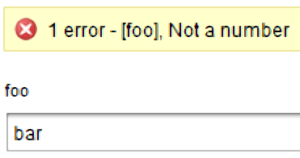

# Thoughts on User Experience and Automation
The title suggests an odd combination of topics. I believe there still is an aspect of User Experience in IT Automation. With Automation, a task that was previously performed by a person is being done with a script or the like. This is really one half of the scenario, as we are also replacing the interface our customer was using and putting a new one in place. In some cases, this new interface can be worse than what was in place before.

I’ve collected a number of observations and thoughts about this User Experience aspect and I’ll go through some of them in this article. The examples I present will be relating to PowerShell and vRealize Orchestrator since those are tools I use frequently. But they could probably apply to any language/technology scenario involving automation.

## Using The Appropriate Input Channel
This is a “sin” I see often with some people when they first get into PowerShell. I suspect this sin occurs because they were thinking in the context of their script being executed interactively by the user. This leads them to use the cmdlet Read-Host to get input from the user. In a way, Read-Host is seductive in its use. It allows you to assign the user’s input to a variable. The prompt the user sees can also be customised.

The problem with this approach is the script will wait for the user’s input. This makes it unsuitable for scenarios where the script would be programmatically executed. In the case of PowerShell specifically, using Read-Host instead of Parameters seems counter-intuitive to the Pipeline model that PowerShell uses, where objects can be easily passed from one command to another. Lastly, Read-Host has no validation of any sort, so performing validation of the input would require extra code. Which leads into the next item…

## Using Input Validation
Input Validation can help serve two goals. Firstly providing immediate feedback to the consumer of your automation that something bad was entered. Secondly protecting your automation against undesirable inputs. A bad example the first goal: a coworker who was trying to update details on some Virtual Machines, which involved inputting a project code. He had entered a value that the system didn’t like, but only informed him after he had submitted the request. This created a poor user experience because he didn’t get immediate feedback. The result was he had to fill in and submit the form again.

In the story about the co-worker the form was the front-end of a workflow in vRealize Orchestrator. Assuming the project code was always going to be a number, this issue could’ve been fixed by setting the data type of the input to “number”. A better approach would’ve been to use data binding and bind a list of valid project codes to the input.

PowerShell has a good range of options for validating input as well, including regular expressions.

## Expose Complexity When Required
I consider the wizard for creating an EC2 instance in AWS to be a good benchmark for this. It’s possible to only select the “What” of the instance (what it does). After this, the consumer can immediately select “Review and Launch” from the instance type screen. If they want more control over the details, then they can take a different path. However, taking the “express path” requires very little input or technical knowledge to provision the instance.

A bad example of this: a provisioning workflow prompted for about 15 pieces of information, including which data center the server would live in, which storage, what network zone and so on. In this case, an overwhelming amount of complexity was being exposed by default. It required the consumer of this workflow to have intimate knowledge of the organisation’s infrastructure. This immediately restricts the potential scope of consumers for this workflow, and thus reduces the benefits it would realise.

A middle ground example was a private cloud system I supported, that used similar technology to the bad example above. Consumers could provision a virtual machine with a few abstract pieces of information (what is the server’s role/job? Is it a dev, test or prod system?). However, under certain conditions, like the server’s home being production, more complexity was exposed. The consumer was prompted for things like backup settings. In this case, more complexity was exposed in a way that was appropriate.

## Closing Thoughts
There are many more problematic user experience scenarios outside the ones I’ve mentioned. These issues can be negated with some consideration on what is presented to them. This results in a positive experience of those consumers. A positive experience means they’re likely to use it more often and that’s a good outcome.
