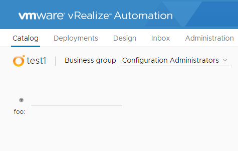
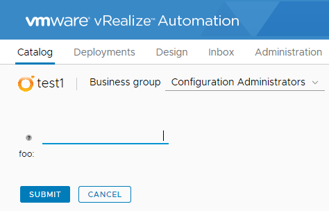
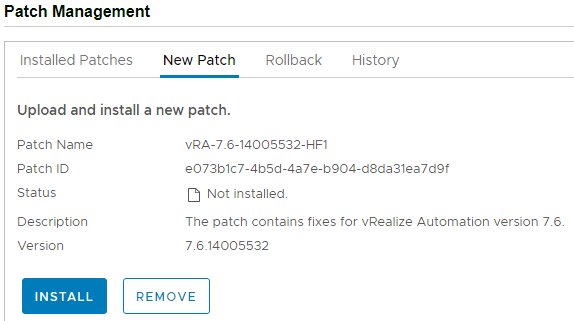
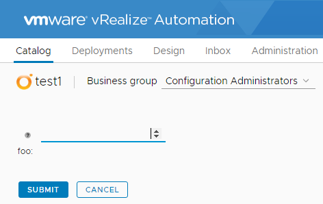

# Cumulative Update for vRealize Automation 7.6

!!! warning "UPDATE"

    Since I wrote this post, VMware have taken down this update because it causes issues with multi-tab XAAS forms. Specifically, it appears that each tab of a XAAS form will submit a request. One of these requests is “real” and will process properly, while the others will error out. As of 24th October, the hotfix is still offline. The issue with Chrome not rendering buttons was resolved in Chrome 76.

Earlier this month, VMware released the first Cumulative Update for vRealize Automation 7.6. The knowledge base article for it is available at https://kb.vmware.com/s/article/70911 The patch file is about 1.1GB.

The first resolved issue in the article is most likely the one that people are experiencing and the easiest to see – “Deployment forms are missing the Submit, Next and Cancel buttons” when viewed in Chrome 75. Below is a comparison of how the form is rendered in Chrome 75 versus Microsoft Edge.

|Chrome 75 rendering	|Microsoft Edge Rendering|
|---|---|
| | |

This issue by itself is a big showstopper if an organisation uses this functionality. I suspect this update will be a “must have” for them.
<!-- more -->
## Update Prerequisites
The prerequisites for this update are standard for this product. The main areas of focus are ensuring there’s enough storage on the Virtual Appliance and IAAS nodes, and that DNS resolution will work correctly.

## Installation
The Virtual Appliance admin interface provides the option to upload the update patch file to the appliance. Once the file is uploaded, the appliance will so some validation and then display a summary with options to install or remove.

When the Install button is clicked, we are prompted to confirm that all the prerequisite steps have been completed. Once this prompt is ticked, the Install button is active.

For my home lab setup, the installation took about 10 minutes. At this point the UI changed to indicate it was finished. However, it appears there’s some service restarting and other pieces happening after this point. The administration UI stopped showing errors after an additional 10 minutes.

## Finishing Up
After applying the hotfix, I cleared my browser’s cache as per the article’s instructions and tried the form I used as a test again. This time, the buttons did render correctly in Chrome, as shown below.

