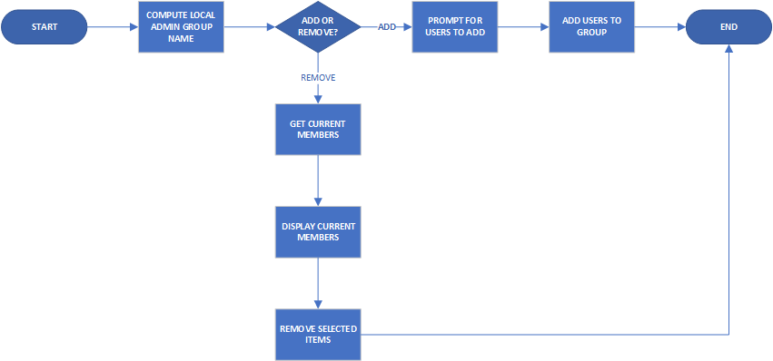
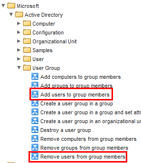
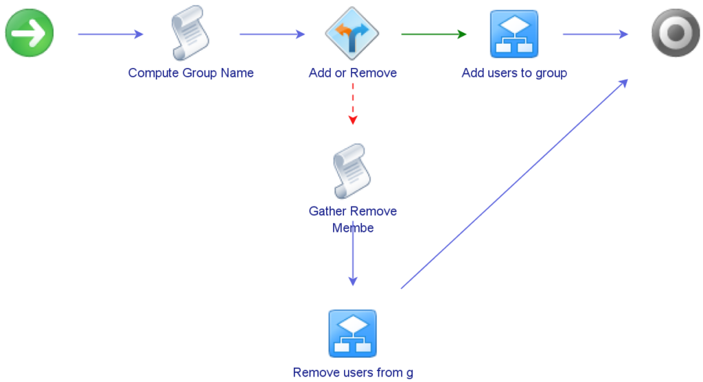
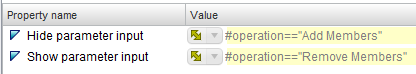
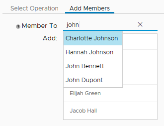
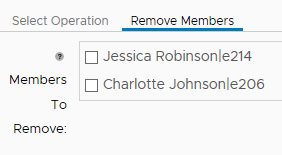

# Managing Local Admins via vRealize Automation

One of the major benefits of vRealize Automation (vRA) is the ability to add and extend the “Actions” available. These Actions enable self-service by the customer. One scenario I wanted to try was allowing someone to manage local administrators on a virtual machine they had provisioned.

## Creating The Workflow
The starting point with this is creating a Workflow in vRealize Orchestrator (vRO). Managing local administrators would mean being able to add and remove members, so if I wanted it as a single workflow, there would be some sort of branching logic, such as the flowchart below:

<!-- more -->

In this scenario, the Local Admin access is controlled by an Active Directory group that has a standardised naming format that includes the VM’s name. Since the group is in Active Directory, this presented a couple of options on how to perform the tasks related to it. vRO has native methods and objects relating to Active Directory. vRO can also execute scripts via PowerShell Hosts, and the functionality in PowerShell for managing Active Directory is quite mature now. I did end up using the native coding due to issues with using PowerShell.

For Inputs at the workflow level, the first item that’s needed is the Virtual Machine object. This Input isn’t represented when run as an Action in vRA because of the association that vRA does with the Workflow and the VM object. Other Inputs were the operation being performed and arrays for members to be added or removed.

Since I ended up using the built-in methods for manipulating the group membership, I used two built in Workflows to do the heavy lifting. For adding members, I used the “Add users to group members” Workflow, while for removing members I used the “Remove users from group members” Workflow. These are just two of a good range of built-in Workflows available for managing users, groups and other objects in Active Directory.

When the main pieces are assembled into the Workflow, it ends up looking very similar to the abstracted flowchart from earlier.

## Controlling The User Experience
I wanted there to be a certain user experience when using this Action. While it’s possible to expose native “picker” UI elements to the user, I didn’t find that desirable as it would mean showing the entire Active Directory structure. The consumer of this Action may not know where the people they want to add are in Active Directory. There was also the issue of how to present the two choices.

For the choice of operation, I used the first page of the Workflow presentation, with an option presented. Then I created a page for each operation option, with controls to show or hide them depending on the option. The controls for the Remove Member page are shown below:

For the Add Member page, I wanted a UI that didn’t expose the complexities of Active Directory, allow a simple search by name and allow multiple users to be entered. By using the “Select value as…List” property, I was able to get this effect. The result was an interface where the user can enter free text to search for users and add multiple entries to the list.

For the Remove Members page, I wanted the current members to be shown and the ability to select some or all to remove. By using an Action on the input item to populate the values, I was able to get this effect.

Since most of the UI controls were enacted in the vRO Workflow, these flowed through to how they are presented in vRA and require no change. The only thing I did change was the Operation selection – by default this will render as a drop-down and I changed it to radio buttons.

## Lessons Learned
Earlier I mentioned the two possible paths of how to achieve the technical aspects of this Workflow – using the native AD methods in vRO or using PowerShell via a PowerShell host. Initially I tried the PowerShell approach but ran into issues, specifically getting errors about not being able to find the domain controller. I suspect this was most likely a “double-hop” scenario that many PowerShell users run into when using PowerShell remoting.

The other major learning was to leverage what’s already available, in this case, the existing AD workflows. This helped accelerate the creation of the Action.
