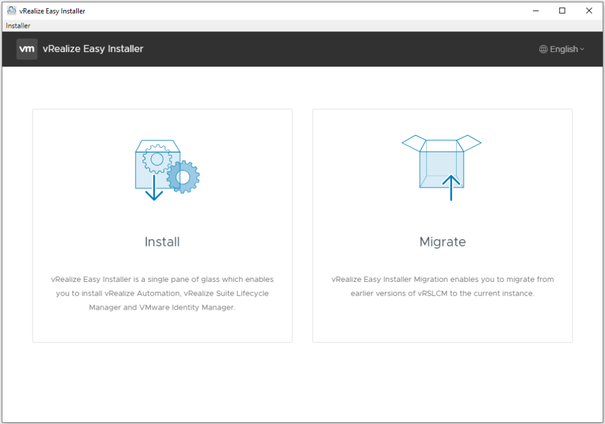
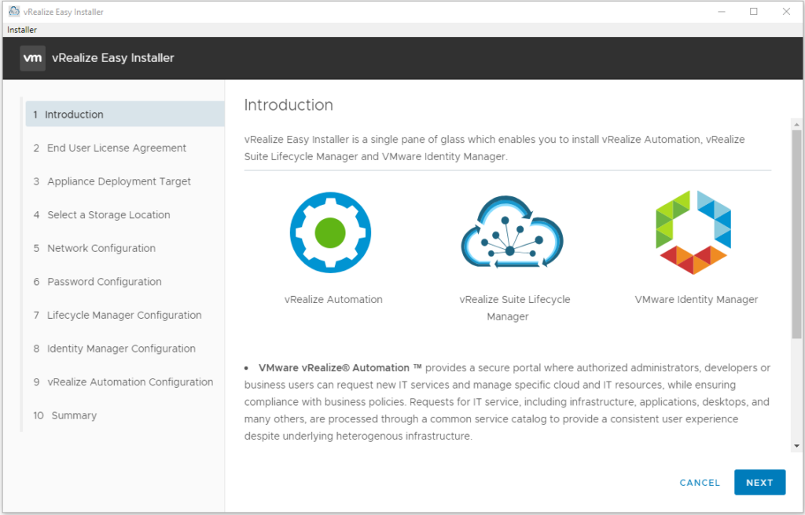
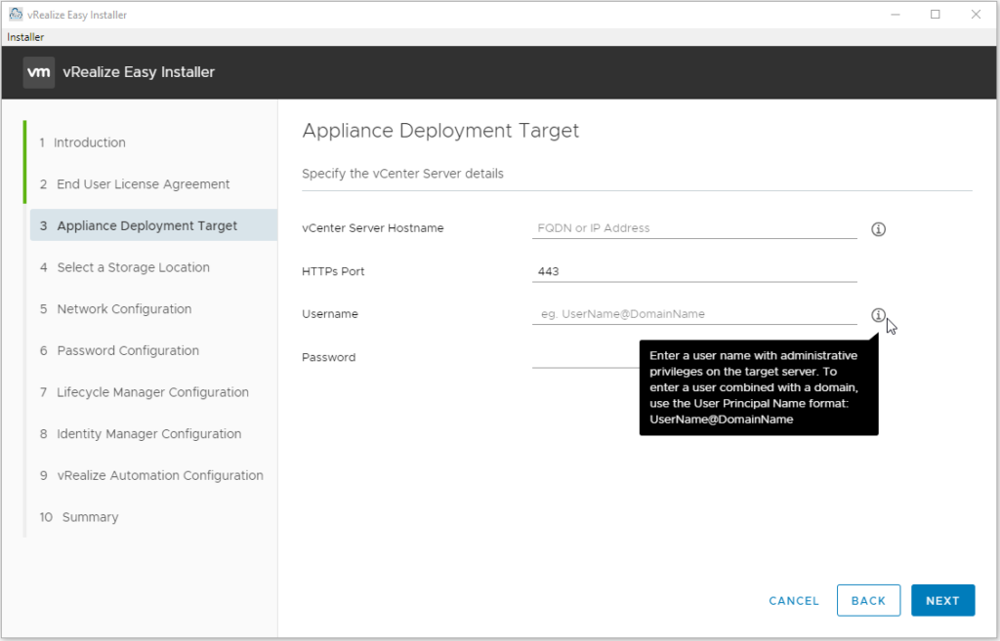
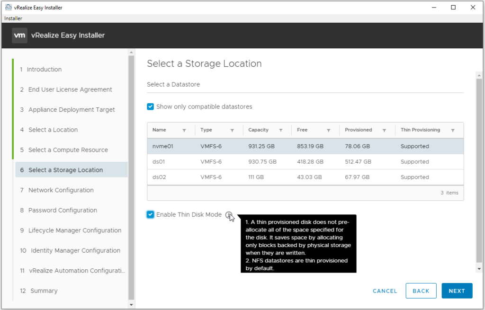
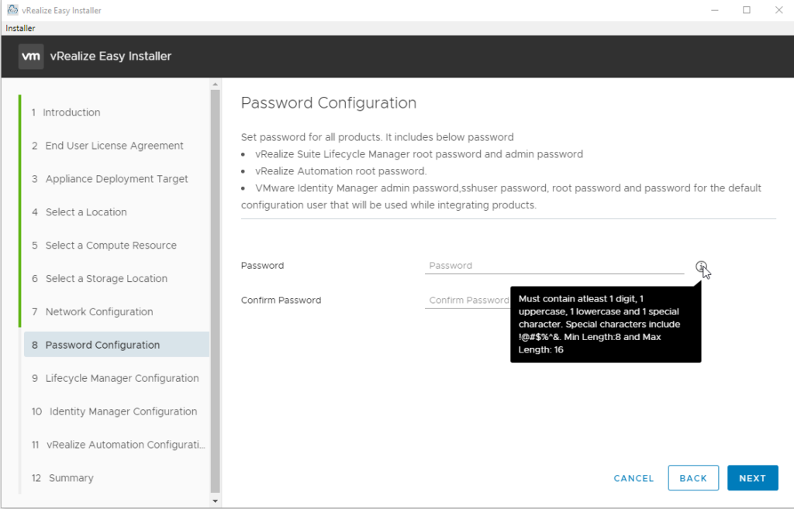
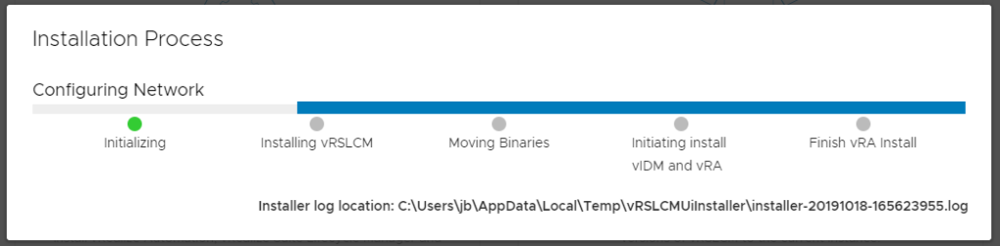
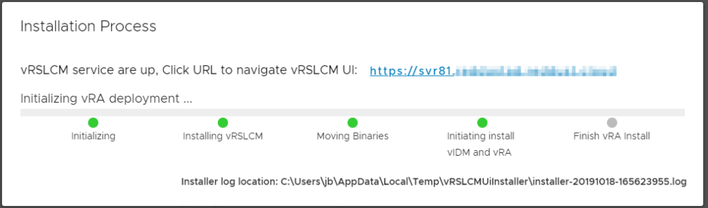
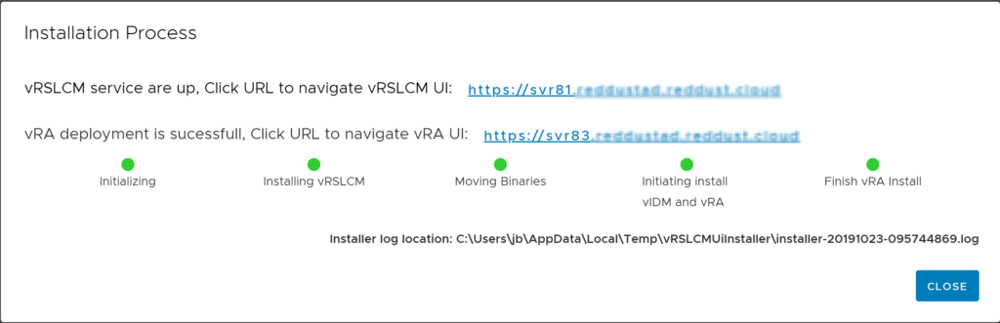

# vRealize Automation 8 First Impressions – Installation
vRealize Automation 7 has been travelling along for a while now. While it’s now at a level of maturity, it’s always been a complicated application, even just in terms of infrastructure (with the need for Windows-based “IAAS” servers). [vRealize Automation 8](https://blogs.vmware.com/management/2019/08/vrealize-automation-8-whats-new-overview.html) would appear to represent a tipping point for a lot of things VMware has been working on in the background across multiple products and technologies.

The deployment architecture in vRA 8 represents a significant shift from prior versions. The installer deploys three virtual machines. These VMs will consume a total resource set of 12 vCPU, 44GB of RAM and about 246GB of disk space.
<!-- more -->
The vRealize Automation 8 (vRA 8) installer appears to be a unified installer, including Lifecycle Manager and Identity Manager. This means the download comes in at about 9.6GB. It uses a guided GUI-based installer dubbed “vRealize Easy Installer”. It has a look that is very similar to the installer used in recent vCenter releases.

The Introduction page gives a little explanation of what the Easy Installer is, and some text about the 3 products it can install.

The Appliance Deployment Target page asks for some standard vCenter Server details, such as hostname, username and password.

The next section prompts for a location, compute resource and storage location to place the deployment items. The Storage Location page has an option to use Thin Provisioning.

The Network Configuration page is standard, with IP assignment type, default gateway, etc. The Password Configuration page will prompt for a password. This password will be set for all the deployed products.

The three pages for the products share common elements, wanting a Virtual Machine name, IP and hostname. For vRA 8, it will also want a license key. It should be noted that there appears to be no validation of the key that is entered. This means the Easy Installer will accept a version 7 key, but later deployment tasks will fail. The Summary page will show all the details selected so far with the option to submit to doing the installation. A progress screen will appear showing the sequence of things.

The first Virtual Machine created is Lifecycle Manager. The VM is configured with 2 vCPU, 6GB of RAM and almost 50GB of disk capacity across 4 drives. Next the binaries for the other products are staged. Following this, the Identity Manager Virtual Machine is created. The Identity Manager VM has the same vCPU and RAM specifications as Lifecycle Manager’s. Around the time the Identity Manager VM is up, the progress UI will display a link to the Lifecycle Manager interface.

The last Virtual Machine is for vRealize Automation and it’s the largest. It has 8 CPUs, 32GB of RAM and about 136GB of storage across 4 disks. When the installer is done, the status will update to include a link to the vRA UI.

At this point the installation is finished and configuration can be performed.

## Closing Thoughts
The new Easy Installer format definitely makes it very easy to install vRealize Automation 8. The ease of use is greatly helped by vRA’s simplified architecture. The only downside is I couldn’t find anything in the directory structure that allowed a command-line based installation for Windows. Overall, the Easy Installer experience was an improvement over that for vRA 7.x
