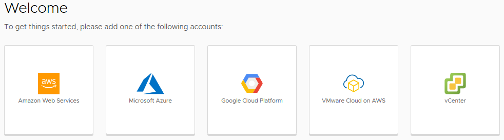
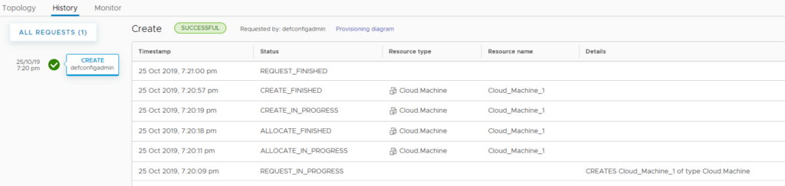

# vRealize Automation 8 First Impressions – Getting Started

## Initial Login and Quickstart
Towards the end of the Easy Install wizard for vRealize Automation 8 (vRA 8), a link is provided for the vRealize Automation 8 UI. Accessing this link will load a landing page that shows a short piece of text and a link to a login button.

<!-- more -->
The logon prompt is very similar to the 7.6 experience and uses the default configuration admin user that was specified in the Easy Installer. A Quickstart wizard is shown when logging in for the first time.

The Quickstart will prompt for a number of items, such as a vCenter server, NSX manager and so forth.

The Basic Configuration section is used to specify resources used to create the first Catalog Service, using an existing template and other items. This step will take a few minutes.

The last section, Policies, cover Lease period (default of 7 days) and the Machine name format. The format defaults to the requester’s name with a numeric sequence. Following the completion of the Quickstart, we are returned to the landing page, which exposes the main areas of use in vRA 8

## Services Overview
vRealize 8 breaks out its interface into a number of Services. These Services are:

* Cloud Assembly – has interfaces for managing infrastructure, creating blueprints and managing deployments. This would be the area that blueprint designers would be accessing most often.
* Service Broker – Acts as the service catalog for your consumers, as well as management of policies (ie. governance)
* Code Stream – Management of continuous integration/continuous deployment (CI/CD)
* Orchestrator – VMware’s automation workflow product, vRealize Orchestrator

## Results of Quickstart
As shown in the screenshot from the Quickstart process, there is mention of a Catalog Service being created and deployed. Accessing the Cloud Assemble service for the first time will show this automatic deployment. The results look something like what is shown below.

## Guided Setup
The Guided Setup is a wizard that helps assist the end-to-end scenario of creating a Cloud Account through to a Project and finally a Deployment. There’s even a nice diagram of it that VMware provide.

The first step of the Guided Setup is picking a Cloud Account to add. If your vRA 8 instance is on an Enterprise license, there will be the public cloud providers as options. If your license is the Advanced one, there is just vCenter and VMware Cloud on AWS. Each of the public cloud options will require the appropriate details for API access. For example, if using AWS this would mean an Access Key ID and Secret Access Key. The specifics of what each public cloud requires is detailed at “[Before you begin with vRealize Automation Cloud Assembly](https://docs.vmware.com/en/vRealize-Automation/8.0/Getting-Started-Cloud-Assembly/GUID-D319E5A5-558E-4E5D-A73E-C3A9412254A5.html)”.

In the case of adding an AWS account, it’s possible to limit provisioning to specific regions as part of adding the Cloud Account, which the selected regions created as a Cloud Zone. Since the creation of a Cloud Zone is automatic when using AWS, the next step in the Guided Setup is creating a Project. Projects could be thought of in the same way as Business Groups in vRA 7 – they are the bridge between users and resources. When creating a Project, users are added as members. Then a Cloud Zone can be associated with the Project. As shown below, the AWS Cloud Zone has been added to a Project.

After the Project has been created, the Guided Setup moves to the creation of Flavor Mappings. Flavor Mappings are effectively “t-shirt sizing”. Since vRA 8 is multi-cloud, these mappings allow you to define universal t-shirt sizes across all platforms. Since I have AWS and vCenter configured, I can create a Flavor Mapping that covers both these platforms.

The next step in the Guided Setup is to create an Image Mapping. Similar in concept to Flavor Mappings, Image Mappings are about being able to reference an abstracted OS image entity, which is resolved to the appropriate item for each platform. Fortunately when adding an entry for AWS, it’s possible to past in just the AMI ID and it will find the item. It’s possible to add “Cloud Configuration” which would appear to be comparable to userdata for AWS.

The last step in the Guided Setup is creating a Blueprint. The Blueprint designer UI in vRA 8 seems to rely more heavily on setting details in the YAML text. Fortunately there’s a decent amount of intellisense-style behaviour with it presenting available options when clicking in areas that need values.

Once the Blueprint has been created, the Guided Setup instructs the user to deploy it. A window appears asking for details, including the Blueprint Version. At this point, there’s only a draft version, but it does give a hint at what’s possible with the new versioning support in vRA 8. When the deployment request is submitted, the Guided Setup switches to the Deployment’s detail screen.

Deployment details
The History tab is laid out in a way that reminds me very much of AWS CloudFormation.

When looking at the machine deployed in AWS, it’s clear that vRA 8 has a lot going on. A bunch of tags are created on the EC2 instance by vRA.

## Closing Thoughts
It seems clear from what I’ve written about here that VMware have realised that vRealize Automation is a completed application. This is even more true in version 8 with the tight integrations with public cloud providers. With things like the Guided Setup, VMware have made it very easy to run through processes that needed to get things up and running. The use of the two new Mapping types removes the need for a lot of “management code” that may have been written in vRO behind the scenes. Overall, it’s much easier to get in and see outputs from deployments.
