# vRealize Automation 8 First Impressions – Cloud Assembly

The Cloud Assembly section of vRealize Automation 8 is the one that vRA Administrators will most likely spend the most time. In vRA 7 terms, it constitutes aspects of the Infrastructure and Adminstration areas, plus the Blueprint Designer.
<!-- more -->
## Infrastructure
The Infrastructure tab contains the bulk of items relating to the configuration of vRA 8. The first item that most vRA administrators will have to head to is Cloud Accounts, under the Connections heading. This is where the account details for various public cloud and VMware offerings are configured. A typical scenario in this area could be vCenter and a couple of public clouds configured here.

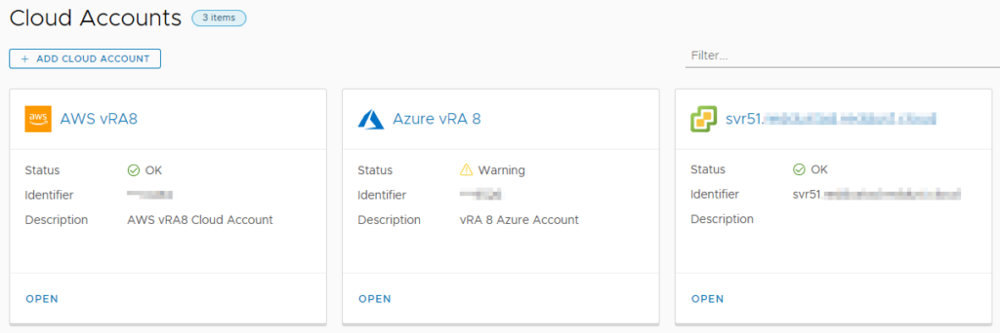

The other item under Connections is Integrations, where a range of VMware and third party integrations can be added. By default, there will already be an entry for the embedded vRealize Orchestrator (vRO) instance.

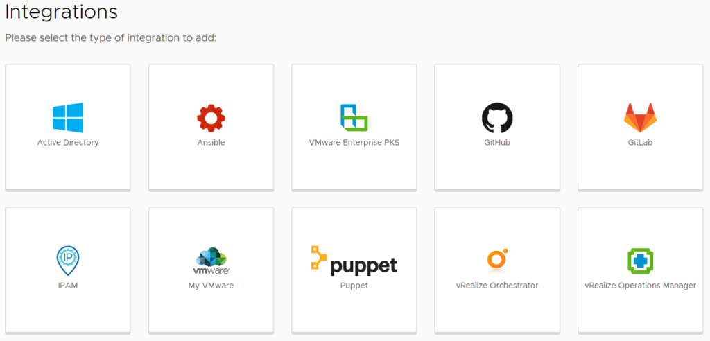

The next section of interest is Configure, which contains the items of Projects, Cloud Zones, Kubernetes Zones, Flavor Mappings, Image Mappings, Network Profiles, Storage Profiles and Tags. Some of these are mentioned during the Guided Setup (as shown in the [Getting Started post](https://blog.jpboyce.org/2019/10/25/vrealize-automation-8-first-impressions-getting-started/)).

Network Profiles allow the creation of objects that control network behaviour and settings. The options that become available when creating a Network Profile depend on the Cloud Account selected. For AWS, the settings include the ability to create on-demand networks or security groups, and the selection of existing networks. Tags can also be applied. For vCenter-based Network Profiles, there are options to add IP ranges. When selecting existing networks to use, discovered items are shown with extra information. For AWS, this can include the CIDR or whether public IPs are enabled.

Storage Profiles control the way storage is provisioned for virtual machines. For vCenter Cloud Accounts, the standard set of settings are exposed, such as Storage policy, thin/thick provisioning, and datastore. For other Cloud Account types, the expected options are exposed.

The Tags item lists all the tags discovered across all the Cloud Accounts. It’s then possible to select one or more tags and see what objects are currently assigned those tags. A good use case for this would be if a cost center tagging system was being used. It would be possible to see what resources a particular cost center is using across all platforms.

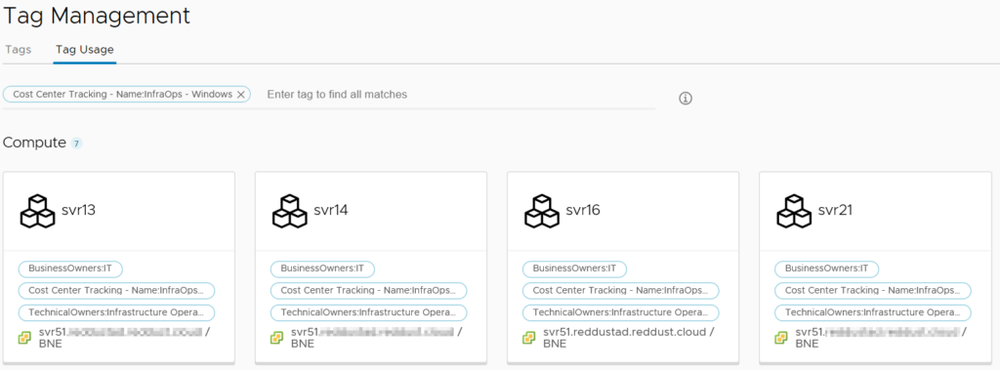

The Resources section sits under Configure and has a by-type breakdown of all resource items that vRealize Automation can see. These items are Compute, Networks, Security, Storage, Machines, Volumes and Kubernetes. Compute lists high level abstractions of the compute capability in each Cloud Account and the administrator can’t do much in here except apply tags.

The Networks item has more content and actions available. It lists all networks discovered across Cloud Accounts. There’s also the ability to manage IP ranges, review individual IP addresses being managed, view load balancers and view “network domains”. These network domains are the top-level network object for each platform type (ie. for AWS, that would be VPCs).

The Security item lists only Security Groups that have been discovered. In the case of my configuration, this meant security groups from AWS. The only action that can be performed in this area is to add or remove tags.

Storage has three tabs – Storage Policies, Datastores/Clusters and Storage Accounts. The first two tabs are vCenter-focused, with Storage Policies listed the discovered policies. Tags can be managed on these policies. Datastores/clusters is has similar functionality, appearing to be mainly for informational and tagging purposes. Storage Accounts lists any defined Azure storage accounts and can be tagged.

The Machines item lists all the machines across Cloud Accounts and includes information like status, IP address, Project, Owner and tags. There’s also the ability to filter the list by a variety of criteria.

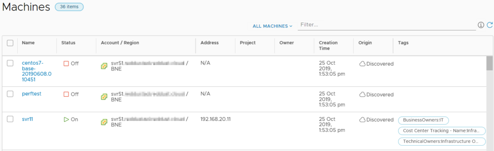

Volumes lists all the “volumes” that have been discovered, which seems to include CD-ROM and floppy disk drives on vCenter VMs. Unfortunately the interface doesn’t list what machine the volume is attached to in the list view. It is possible to find this information by drilling down into the object.

The last area of any real interest under the Infrastructure tab is Onboarding. This area relates to creating “onboarding plans” for machines the vRA has discovered but isn’t managing. A benefit of this onboarding process is that vRA will create a blueprint based on the machines imported.

## Extensibility
The Extensibility tab appears to share a lot of common elements with vRA 7, allowing the use of “Subscriptions” for triggering Orchestrator workflows. The menu items for this tab are shown below.

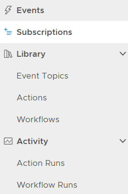

The Workflows item lists the 463 vRealize Orchestrator workflows that come with version 8, but it doesn’t seem to be anything to do in this area except look at them. The Actions item has no items listed, even though Orchestrator has over 400. Creating a new Action loads a code editor where the administrator can opt to write their code. By default, it seems to load the “Custom script” template which exposes the new ability to write python or nodejs code.

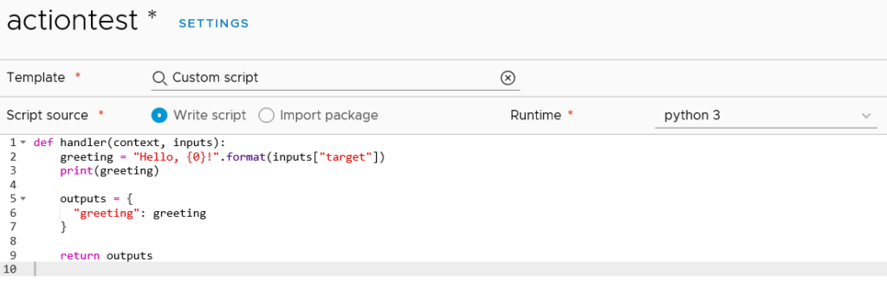

These Python-based scripts are part of the new “Action-based Extensibility” (ABX) that VMware have introduced in vRA 8. They are similar to how one might use vRealize Orchestrator workflows in vRA – to have automated tasks run at specific triggers. There is a [reference](https://docs.vmware.com/en/vRealize-Automation/8.0/Using-and-Managing-Cloud-Assembly/GUID-55847415-5920-47E7-86BD-20CD9EB6BA6B.html) in the documentation on ABX that suggests the code is actually run in the cloud, specifically using AWS Lambda. As such, an AWS subscription is required.

## Marketplace
The Marketplace tab is an extended version of that which appears in Lifecycle Manager (LCM). It has three main areas – Blueprints, Images and Downloads. Images is a like-for-like match to LCM’s Marketplace content, containing virtual appliances from Bitnami and other vendors.

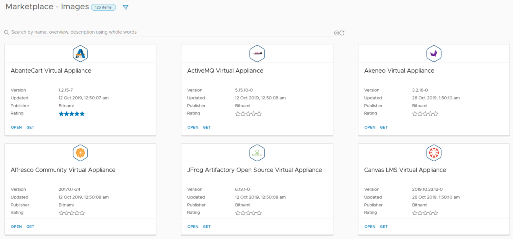

The Blueprints section is the more traditional blueprint items. Some are clearly designed for cloud-based deployments, such as one that uses AWS Redshift. Others are VMware-focused, relying on NSX. At the time of writing, only 18 blueprints are available.

## Blueprints
The Blueprints tab represents a major area of use for infrastructure engineers and developers. This is where blueprints can be created, tested and reviewed. At a high level, the Blueprint Designer in version 8 has a lot of common elements with version 7.

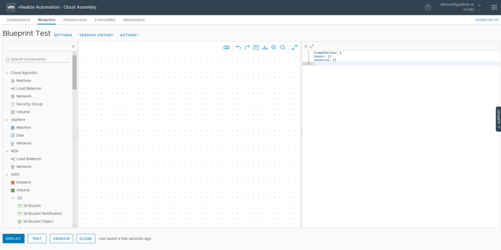

Two major changes are visible in the screenshot above. Firstly, with the Infrastructure-as-Code (IAC) approach in vRA 8, the actual code of the blueprint is shown on the right side. A lot of the detail defining in a blueprint is now performed in this code area, as opposed to GUI elements in version 7. The other major shift is the expanded range of components from cloud services. It’s now possible to have cloud services like AWS’s RDS or Lamba or Azure’s Key Vault directly on the blueprint.

Verison 7 had a nested approach where certain objects could be nested inside of others. This seems to be gone now in version 8, with objects related to each other. A good example of this is the Configuration Management items like Puppet and Ansible. Adding items to the blueprint will generate a skeleton of code on the right side.

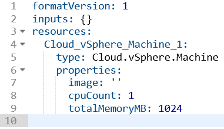

In some cases, a lightbulb will appear which assists in filling out the code. In the case of the vSphere machine, clicking this icon displayed a list of optional parameters that could be added. When using certain blueprint items, the fields that require values will show available options when clicking inside the quotes. For example, when clicking in the image or flavor properties for a Cloud Agnostic VM, Image and Flavor Mapping items will be listed.

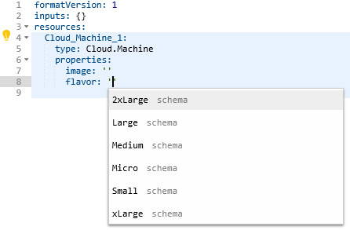

The code view also has real time syntax checking to point out errors. This helps ensure the code is valid and will work when deployed. It’s possible to define a number of inputs for a blueprint, removing the need to hardcode a lot of values. There’s a decent range of controls that can be applied to the inputs to prevent bad values being entered.

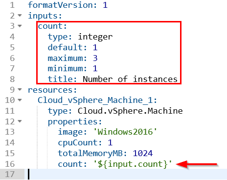

With the Infrastructure as Code focus, blueprints now have built in versioning support. This helps avoid the sort of thing I’ve seen in some organisations where version control is done by copying the blueprint repeatedly with an incrementing number in the name. With this proper versioning capability comes support tools like code diff.

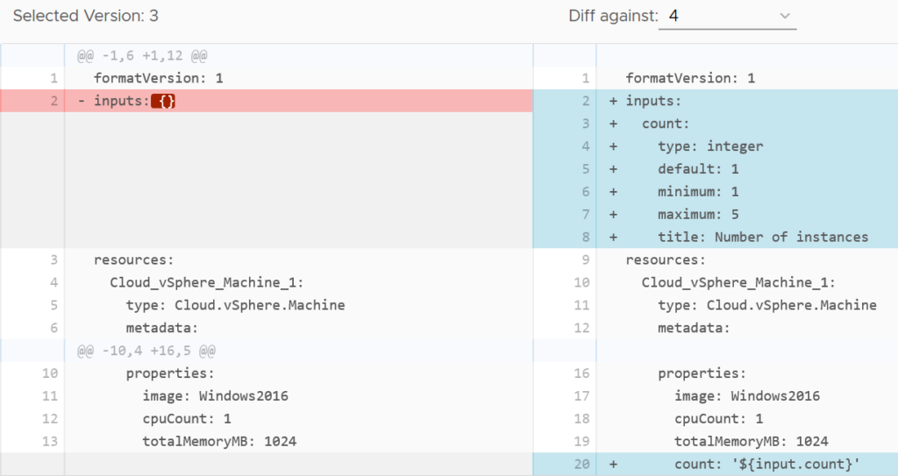

## Closing Thoughts
Now that I’m getting into the actual areas of day-to-day use of vRealize Automation 8, it’s clear that in some areas there’s a lot that’s changed under the hood and for the better. The versioning support is a good acknowledgement that there’s often more than just one vRA administrator in many organisations and it helps avoid that “stepping on each other’s toes” situation. The code-based approach for blueprints may be a change for some. Those who have already come from IAC backgrounds (especially AWS Cloudformation or Terraform) should feel very comfortable with the concepts in the code-based blueprints.
