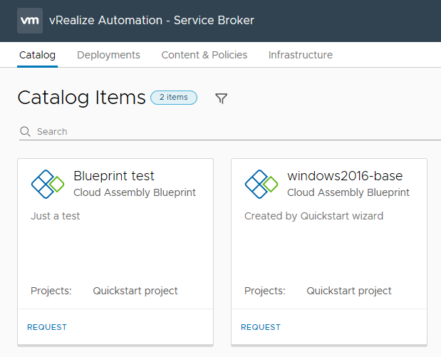
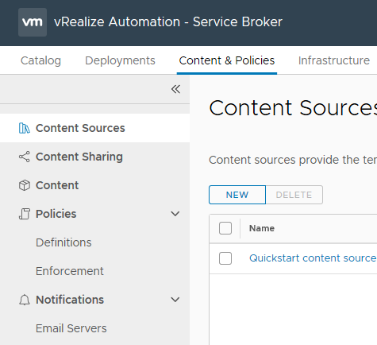
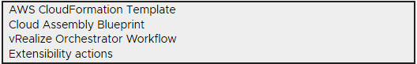
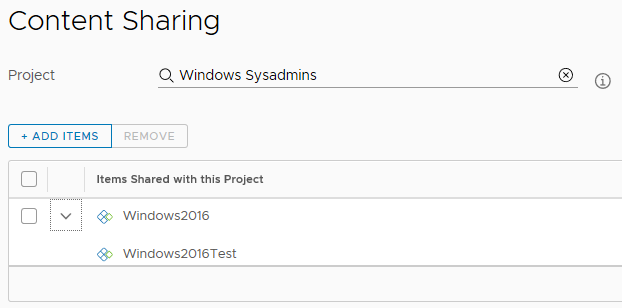
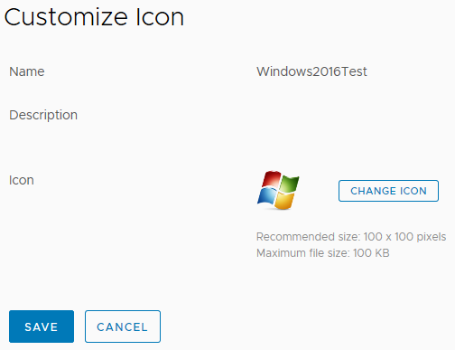
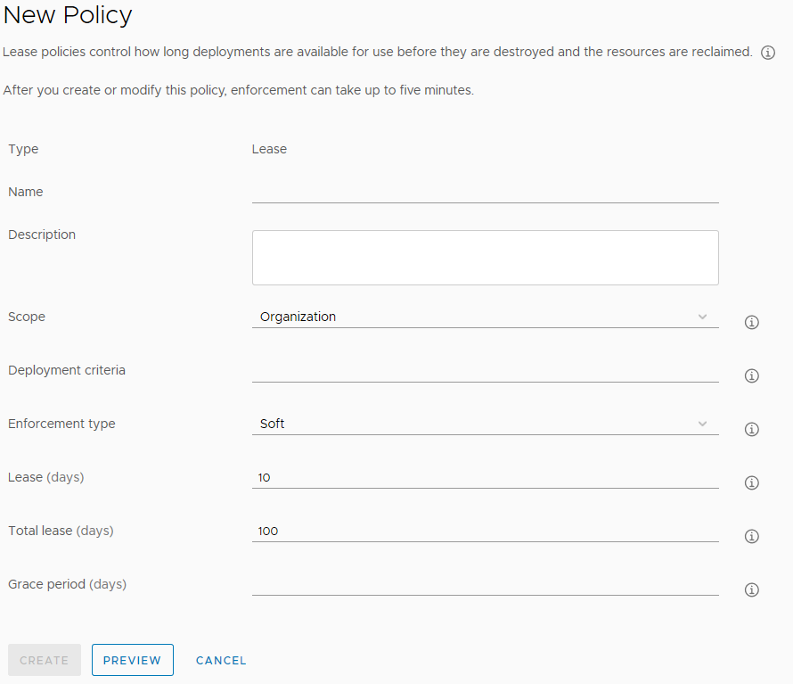
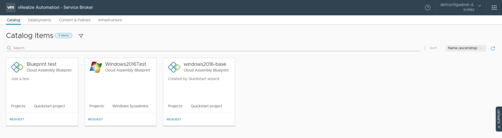
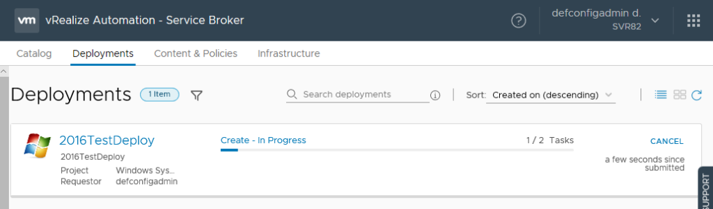
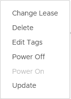
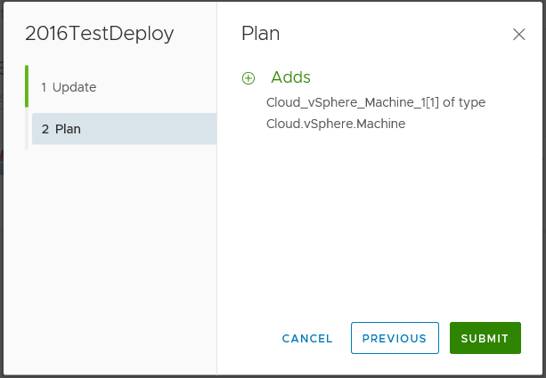

# vRealize Automation 8 First Impressions – Service Broker
The Server Broker section of vRealize Automation 8 contains the items that your consumers will interact with the most – the Catalog, and the Deployments tab where they can review the status of their requests. It also has some administration areas, such as Content & Policies and Infrastructure

<!-- more -->

## Infrastructure
The Infrastructure tab under Server Broker contains an abbreviated set of the options that are available under Cloud Assembly. Specifically, these items are Projects, Cloud Zones, Cloud Accounts and Integrations. All of these items function as like their counterparts in the Infrastructure area of Cloud Assembly.

## Content & Policies
The first 3 items under this are relate to getting content available in the Catalog. The others relate to polices and notifications.

Content Sources allow the defining of sources for blueprints and other items. When adding a new Content Source, a number of items are available.

Each option will slightly alter the rest of the form. For example, selecting the AWS CloudFormation Template option will bring up fields relating to bucket policies. This process of adding Content Sources could be similar to publishing a blueprint in version 7.

Following this importing process, a blueprint can then be shared to other users. This process happens under the Content Sharing menu item. A Project is selected, then the items from that project.

At this point, the shared item is available in the Catalog. The Content menu item lists all the imported blueprints and templates. From here it’s possible to also create a custom icon or form for the item.

The Policies menu item has 2 sub-items – Definitions and Enforcement. The Quickstart process creates a policy item that controls the lease period of systems provisioned in that Project. At the time of writing, there are two policy types that can be defined – Lease Policies for controlling lease periods on provisioned items and Day 2 Actions Policy which controls what Day 2 Actions users can perform.

Lease Policies can be scoped to the Organisation or Projects. The area of effect can be further narrowed using Deployment Criteria. Using the criteria, it’s possible to limit the Policy to a particular blueprint ID. Interestingly, it’s not possible to use tags as part of the Criteria.

The Enforcement menu item shows an audit log of policies that have been applied. Day 2 Action Policies are similar in terms of the request form.

## Catalog
The Catalog look and feel is very similar to the new UI that was introduced in vRealize Automation 7.6, with large tiles for each catalog item.

Submitting a request will direct the UI to the Deployments tab with the deployment progress shown.

## Deployments
The Deployments tab in vRA 8 follows the same design used in 7.6. When a Deployment is finished, it’s possible to see some surface information about the items within, like power state and IP address. The Actions available on a Deployment are relatively standard. The “Update” item appears to replace the “Reconfigure” item in version 7.

Running the Update Action allows the user to change the Deployment based on the input items available. Clicking Next in the wizard for the Update Action will show a “Plan” (very similar to the output of Terraform’s plan command) which lists what will be added, removed or changed.

It’s possible to drill down into the Deployment and select individual deployed items. At this point, the Day 2 Actions of those items are available. The available options change slightly depending on the object. For example, snapshot-related actions (ie. Create Snapshot) are only available if the item is a virtual machine on vSphere or Google Cloud Platform.

## Closing Thoughts
The Service Broker area of vRealize Automation 8 seems very slick and functional. The Policies area is a step back from what was in version 7, where there was quite a lot of control that could be exercised over what needed approvals or not. There’s a hint that the Tagging system may be intended as a replacement for that.
