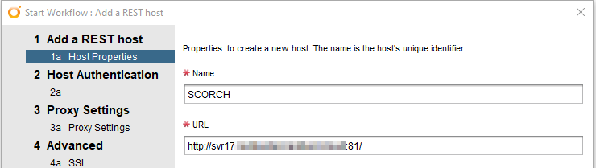
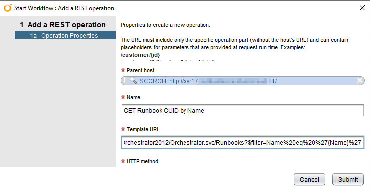
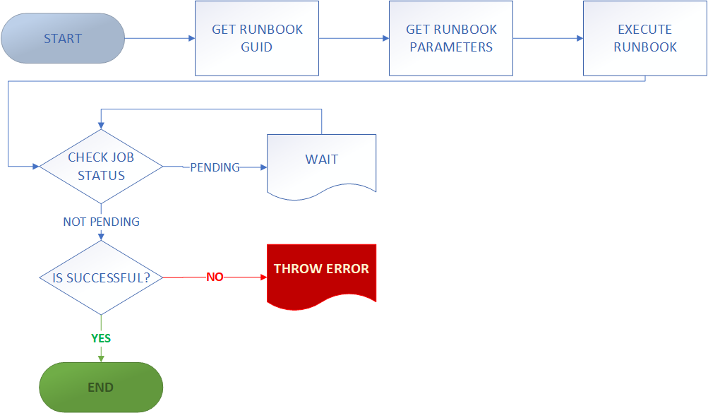
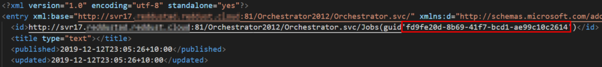
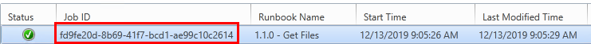
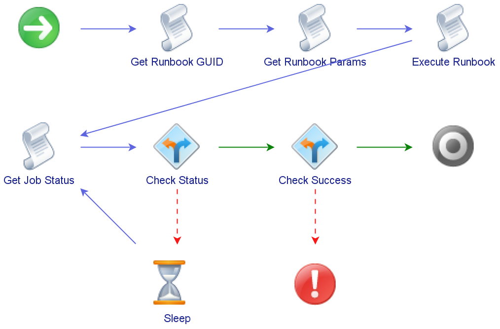

# Calling System Center Orchestrator Runbooks from vRealize Orchestrator
Sometimes you end up having to put in place an implementation that’s pretty crazy to get something (non-production) over the line. This was the case recently where I used vRealize Orchestrator (vRO) to call System Center Orchestrator (SCORCH) Runbooks. That is, using Orchestrator to call Orchestrator…

A lot of the credit for figuring out how to do this goes to Laurie Rhodes and their [blog post](http://www.laurierhodes.info/?q=node/101) about calling SCORCH runbooks via REST using Powershell. It was my starting point for this piece of work and I was able to adapt the core pieces of this for my scenario.

## vRO Configuration
Assuming there’s existing SCORCH and vRO instances, the first task is to add the SCORCH server as a REST host in vRO. This can be achieved by running the “Add a REST Host” workflow that comes with vRO. The “Orchestrator Web Service” runs on port 81, so that will affect the settings for the host.

<!-- more -->
For Host Authentication, I used Kerberos. I didn’t have a lot of time to experiment with this. Kerberos was the first I used and it worked. The accout specified will need appropriate permissions to call SCORCH Runbooks. The rest of the settings in the Add A Host workflow can take defaults appropriate for your environment. Once the workflow has finished there will be a new entry for the SCORCH host.

The next step is to add some REST Operations that will correspond to tasks required. These tasks are finding the GUID for a runbook, executing a runbook and checking its run state. Using the Add A REST Operation workflow achieves this easily.

The reason for this sequence is because the GUID is needed to execute a runbook, but we don’t always necessarily know the GUID and it may not stay the same. With the first step we can definitively get the correct GUID. The details of the REST Operations are in the table below:

|TASK	|METHOD	|URL|
|---|---|---|
|Get Runbook GUID	|GET	|/Orchestrator2012/Orchestrator.svc/Runbooks?$filter=Name%20eq%20%27{Name}%27|
|Get Runbook Parameters	|GET	|/Orchestrator2012/Orchestrator.svc/Runbooks(guid'{Guid})/Parameters|
|Execute Runbook	|POST	|/Orchestrator2012/Orchestrator.svc/Jobs/|
|Get Job Status	|GET	|/Orchestrator2012/Orchestrator.svc/Jobs(guid'{JobGuid}’)|

## Creating the vRO Workflow
The vRO workflow ends up being a sequence of REST Operations being called with certain information being extracted and passed on. In a general flowchart format, the workflow might end up as below:

### Get The Runbook GUID
In the first step, we want to extract the Runbook GUID and make it available for the next step. The code for this first piece of the workflow is somewhat simple – perform the REST Operation and extract out the Runbook GUID.

### Get Runbook Parameters
As part of initial discovery, the next step would be to find out the parameters for the SCORCH Runbook. These are the inputs it expects to be able to execute. For example, it could be something like a computer name. By calling the appropriate REST Operation and passing it the GUID from the first step, it’s possible to find these parameters and their GUIDs. Depending on one’s approach or goals, you could just use this step to discover the parameter GUIDs and hard-code them into the execution payload, or you could programmatically generate the payload for a more general purpose set of code.

### Execute The Runbook
To execute the Runbook, a REST POST operation is performed with an XML-formatted payload. SCORCH expects this payload to be structured a certain way. In his [blog post](http://www.laurierhodes.info/?q=node/101), Laurie Hodes details what this payload looks like normally and variant needed for Powershell. In other examples, the payload is modified to use CDATA. With vRO, it seems this modification is needed and the CDATA option is the cleaner of the two. The payload format is below:

Now we can see why the parameter discovery done earlier is important because firstly the parameter GUID is needed in the payload, but also we may have more than one parameter, while the example above has only one. In cases where there’s more than one parameter, you just need to repeat the `<parameter>` block in the XML and have the appropriate values.

If execution request is successful a status code of 201 is returned as well as XML content with details of the Job that was created. Some of the top of this response is shown below, with the Job GUID highlighted.

This Job GUID will match the value in the SCORCH console and it’s possible to see a matching entry for it there.

### Checking Job Status
The last REST call in this sequence is to get information about the Job. Depending on the nature of the job, it may take some time to run and we want to be able to confirm it completed successfully. The REST call itself is simple, requiring a single input parameter of the Job GUID. We want the status value extracted so it can be examined.

The next steps involve checking the status value and doing behaviours based on it. If the status is “pending”, we wait for a bit, as the Job is still running. If the status is “completed”, then the workflow can end. Any other values should throw an error of some sort as any other status would indicate an error or unexpected outcome.

## Final Workflow Form
The end result of implementing these steps in a vRO Workflow is a Workflow Schema like the one shown below.

Aspects of this could be expanded or tweaked, but as a starting point it’s a good base.

## References/Resources
The following resources were very helpful in figuring out how to get this piece of work completed.

* [Calling Orchestrator Runbooks (& retrieving output) via REST](http://www.laurierhodes.info/?q=node/101) by Laurie Rhodes
* [Orchestrator Web Service, Start a Runbook](https://docs.microsoft.com/en-us/previous-versions/system-center/developer/hh921685(v=msdn.10)?redirectedfrom=MSDN) by Microsoft
* [Starting Runbooks and Stopping Jobs Using the System Center 2012 Orchestrator Web Service](https://techcommunity.microsoft.com/t5/System-Center-Blog/Starting-Runbooks-and-Stopping-Jobs-Using-the-System-Center-2012/ba-p/345024) by the Microsoft System Center Team
