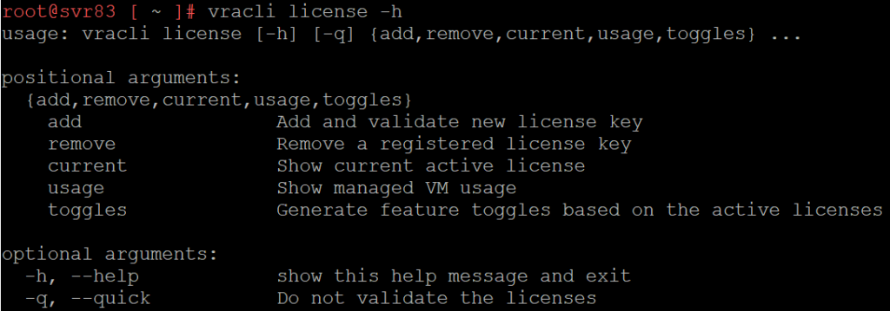
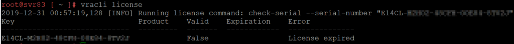
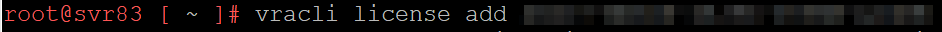
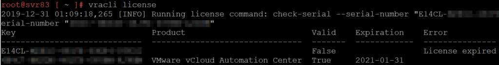

# VMUG vRealize Suite 2019 and vRA 8
VMUG recent added the vRealize Suite 2019 to their [EVALExperience](https://www.vmug.com/membership/vmug-advantage-membership) offering. For those not familiar with it, EVALExperience is part of the paid “Advantage” member in VMUG. This paid membership includes discounts on training and other benefits. This is on top of benefits of free membership.

This new addition means it’s now possible to get a 365-day license for all the components of the vRealize Suite 2019, including vRealize Automation 8. The license is for personal use in a home lab. I had previously tried updating the license on my vRA 8 installation from an Advanced to an Enterprise one, using Lifecycle Manager. It didn’t like that.
<!-- more -->
## Using vracli
One of the major changes in vRA 8 was the removal of the “VAMI” administrative interface for managing the virtual appliance. Some of the administrative tasks performed via this interface in version 7 is available in version 8 via the `vracli` command. License management is one of those tasks. The starting point for all this is running the license command with the help switch to see what options are available. The output from this command is shown below:

Running the license command without the help switch will list details of the license assigned. As shown below, the one in use has expired.

In the case of that happening, vRA itself will display a 402 error when attempting to login via the web interface. The next step would be to add a new key. This is done using the add argument.

A bunch of output is generated that has detail about the license that’s been added. This includes what edition the license is for, limits on how many VMs can be provisioned and the expiration. When running the license command again, there are now two entries – the original expired evaluation license and the new one from VMUG.

For the sake of verification, it’s possible to use the command `vracli license current` which will list the active license key and the features enabled or disabled under the license. This feature information is useful to validate that your license is exposing the right features. Some of the listed feature items explicitly reference public cloud and configuration management, which are features not available under the Advanced license.

Lastly, for the sake of cleaning up, it’s probably a good idea to remove the old key and reboot.
