# vRealize Automation 8.0.1 Update Walkthrough
VMware have released a minor update for vRealize Automation (vRA) 8. This is my experience of attemtping to update the instance running in my home lab.

## Update Preparation
In the [Release Notes for 8.0.1](https://docs.vmware.com/en/vRealize-Automation/8.0.1/rn/vRealize-Automation-801-releasenotes.html) there’s a section for performing an upgrade. A couple of items in this section jump out. Firstly, that the vRA product supports upgrading from vRealize Suite Lifecycle Manager (LCM), with a [link on the process](https://docs.vmware.com/en/VMware-vRealize-Suite-Lifecycle-Manager/8.0.1/com.vmware.vrsuite.lcm.8.0.1.doc/GUID-62A2C4A9-98BF-44A5-9C23-950016A615EA.html). The second is an explicit mention of disk space requirements. Based on this, the first thing I checked was the free space for the two partitions mentioned.

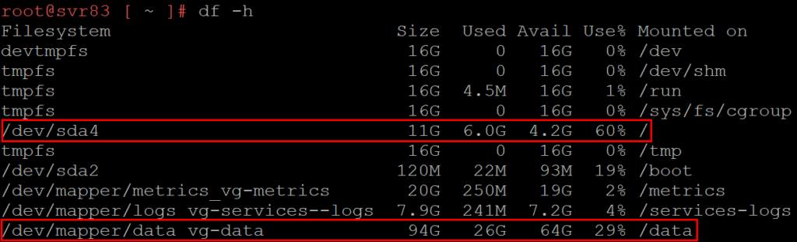
<!-- more -->
As shown, in the case of my vRA 8 system, I had 4.2GB free on the root partition, when I need at least 20GB. The data partition has 64GB free when I need at least 48GB. The Upgrade section includes instructions on how to extend the disks without needing to power off the VM. I performed the process. At the end, I had the figures shown below:

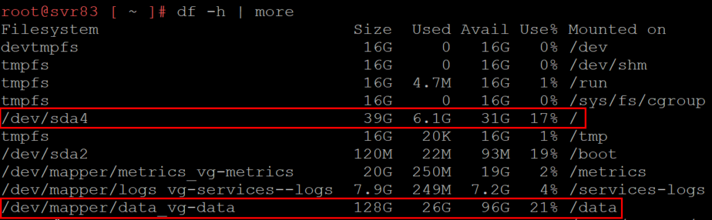

Moving to the documentation about performing the upgrade using LCM, one of the prerequisites is to perform the binary mapping for the upgrade ISO. This is set on the LCM system under Lifecycle Operations > Settings > Binary Mapping > Product Binaries. One issue that seems to come up straight away is LCM 8.0 has no visibility of vRA 8.0.1 in this area. Version 8.0 and earlier versions will appear but not the new patch.

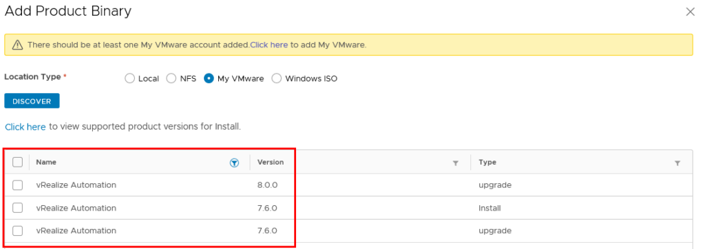

This issue would be because when one clicks on the link about supported product versions, there’s no mention of 8.0.1.

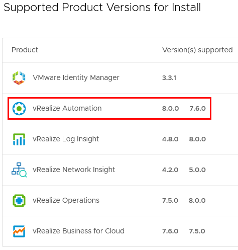
Reviewing supported product versions
The logical step to get past this would be to upgrade the LCM system first. To initiate this, go to Lifecycle Operations > Settings > System Upgrade. Generally I prefer to download the update media first and then use the ISO option but in this case VMware’s website was being uncooperative so I tried the “Check Online” option. After clicking the Check Upgrade button I got confirmation that a new product version was avialable.

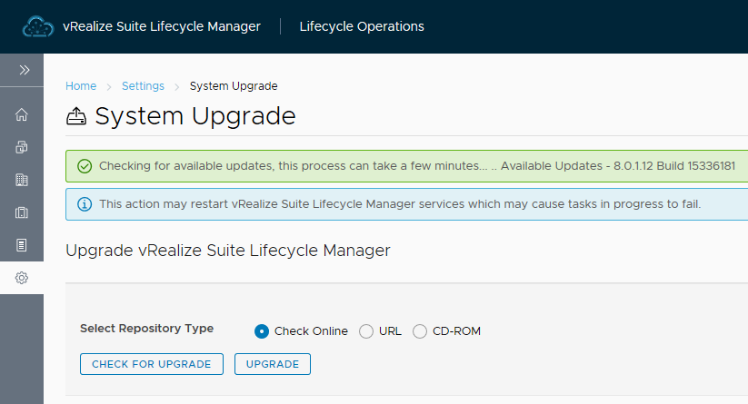
Starting the upgrade of LCM
Upon clicking the Upgrade button, a progress area appeared with the download state of 8 packages. I could also see network traffic being generated by the LCM appliance. The download process took about 30 minutes for me. At this point, the progress area changed to indicate an install was in progress. Once the update is complete, the login screen is shown. After logging in, I was able to confirm that 8.0.1 was a supported version.

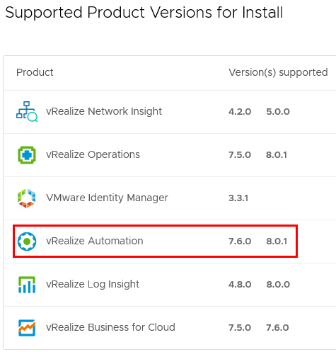
Supported product versions after updating LCM
At this point I was able to get the upgrade binary via the VMWare site and uploaded it to the LCM appliance so it was available locally.

## Executing The Update
At this point, I was now able to go back to the [LCM documentation](https://docs.vmware.com/en/VMware-vRealize-Suite-Lifecycle-Manager/8.0.1/com.vmware.vrsuite.lcm.8.0.1.doc/GUID-62A2C4A9-98BF-44A5-9C23-950016A615EA.html) about updating vRA 8. To initiate the update, go to Manage Environments > View Details and click on the Upgrade button.

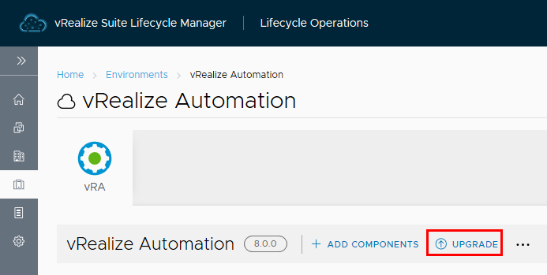

After clicking this, a prompt will appear about performing an inventory sync. If the option to proceed to upgrade is selected, we are then asked for the Repository Type. Since I had already performed a mapping of the update ISO, it’s available.

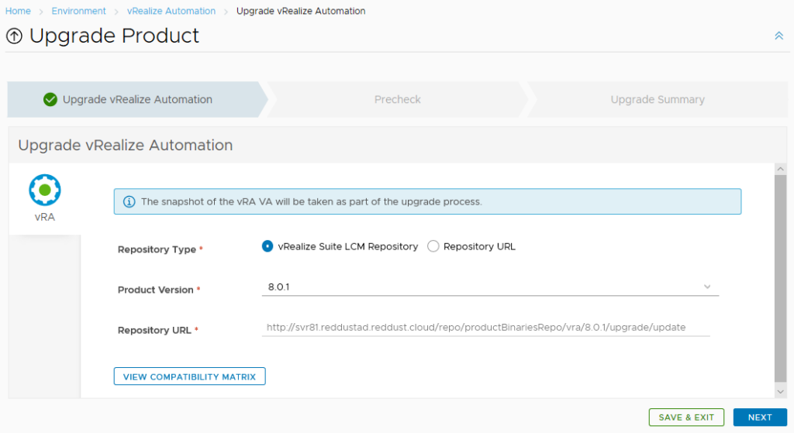

The next section will run some prechecks like whether SSH is enabled. This part didn’t take long and I could then progress to the Upgrade Summary tab. On this tab, the Next button changes to a green Submit.

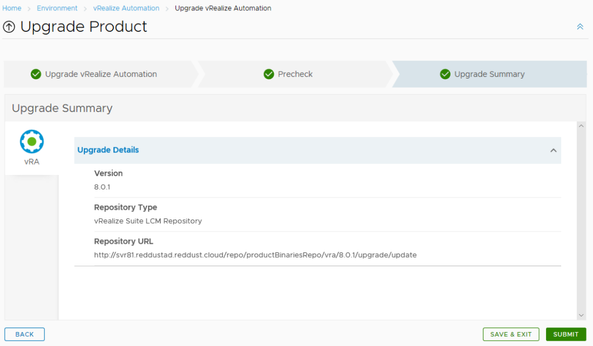

When the Submit button is clicked, a request is created to perform the upgrade. The request workflow diagram shows the rather complicated nature of what will be performed.

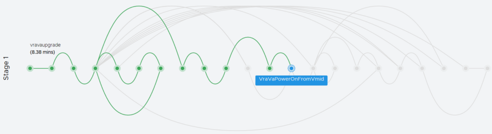

For my update, Stage 1 took a bit over an hour, while Stage 2 (an inventory update) took 533ms. I’ve seen some people have reported their attempts ran for about 5 hours before timing out, so I suspect if an upgrade runs for 2 hours or more, something has gone wrong.

## Verifying The Update
At this point, I was able to go to the vRA 8 landing page and see the build/version details had changed.

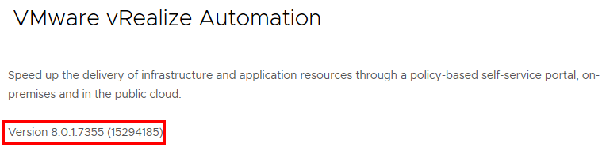

I could also see the new GUI editor interface for blueprints. Unfortunately, [the issue I previously wrote about](https://blog.jpboyce.org/2019/12/08/vra-8-getdiskinfo-error-partition-name-buffer-too-small/), where the open-vm-tools spams a log file, isn’t resolved in this update.
