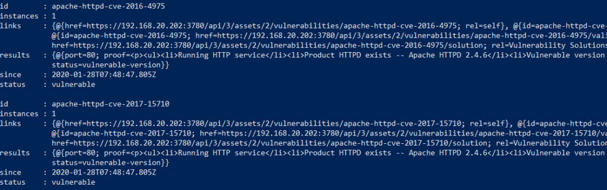

# Automating Vulnerability Scans – Nexpose/Powershell

One of the common things I’ve seen in automation implemented by infrastructure teams is a lack of rigor around testing. That is to say, code that tests the task that is being automated is actually successful. A script could execute to its end without errors, but that doesn’t necessarily mean it actually did what it was supposed to.

This leads into a concern I’ve seen raised by stakeholders, about visibility of what is happening in an automation pipeline. One of the key stakeholders in this sort of security is the IT Security team, who often want visibility of certain outputs (like virtual machines) to determine if those are secure. In a couple of environments I’ve raised the idea of performing automated vulnerability scans on newly provisioned assets, as a way of ensuring what is delivered is at an acceptable level. By automating this task, we place no extra burden on those involved and ensure consistency.
<!-- more -->
## Design
In the example design I’ve used for this scenario, I’ll be using Nexpose as the vulnerability scanner. I’ve used this product in a couple of roles and it has a good REST API to allow the automation tasks required. A reference to the REST API can be found by clicking on the Help icon, then the “API Documentation” item in the Nexpose interface. The automation layer will be done via some basic Powershell scripts. Since Nexpose doesn’t use a token-based approach for authentication, we can easily skip that step and end up with a workflow similar to below:


The specifics of how some of these steps may look depends on one’s environment and needs. In this case, I’m trying to keep it very basic.

Scanning New Asset
To initiate the scan on a new asset, it has to exist in a “Site” in Nexpose that’s already been configured. This is because the REST call needs a site ID. It also needs a properly formatted body that specifies the hosts to be scanned and the ID of the scan template to use. In the code below, the “Full Audit” template is being used.
``` json
# Set the body to be posted
$body = @{
  name       = 'QA scan by API'
  templateId = 'full-audit'
  hosts      = @($scanTarget)
}
```
A simple Invoke-RestMethod is used with the appropriate values. An example of this is available at https://github.com/jpboyce/powershell-library/blob/master/nexpose/start-scan.ps1 The response from the REST call includes the ID of the scan, which is needed for subsequent steps.

## Getting Scan Results
When retrieving scan results, only high level details like the count of vulnerabilities is available. Depending on your needs, you may just use a certain threshold value for this as a pass or fail tollgate. In the [get-scan script](https://github.com/jpboyce/powershell-library/blob/master/nexpose/get-scan.ps1) I’ve written, I’ve included a switch block to allow the output of the specific vulnerability types or just the entire response object.

If more detail is required, then the individual vulnerabilities can be outputted. In an [example script](https://github.com/jpboyce/powershell-library/blob/master/nexpose/get-assetVulnerabilities.ps1) for this, the response object is just outputted. This response has an ID for each vulnerability which has the CVE as part of the name, meaning it could be possible to filter this list to look for specific vulnerabilities. An example of the output is shown below.



## Generating A Scan Report
Nexpose has some rich reporting options, including remediation reports. This could allow some slick outcomes from this automation piece, like generating a report and emailing it to the IT Security Team, or attaching it to the new asset’s entry in the CMDB. Alternatively, if the results of an asset are particularly bad, then generating a remediation report may be a good option.

The values required for generating a report vary between report types. In the [example script](https://github.com/jpboyce/powershell-library/blob/master/nexpose/new-report.ps1) I wrote, a remediation plan report is created and generated. Fortunately, remediation plan reports can accept a scan ID is a filtering option.

## Applying To A Scenario
To see how this would all look, I decided to run this all against a completely un-patched, unsecured Windows 2019 VM and then against the same VM after it’s patched. The table below compares the vulnerability counts:

|Severity  |Un-patched	|Patched |
|---|---|---|
|Critical	|3	|0|
|Severe	|31	|4|
|Moderate	|7	|2|
|Total	|41	|6|

34 of the 41 vulnerabilities on the un-patched system were related to Microsoft CVEs which strongly implies they could be addressed by simply patching the VM. In fact, when generating the remediation report, it listed only 1 Windows update patch to apply. After patching, the VM had 6 vulnerabilities left. Most of these would be items addressed in a standard corporate environment (such as password complexity and history). Based on this, in some circumstances, the total vulnerability count could be use as a pass/fail tollgate.

## Final Thoughts
The things I’ve written about cover a good starting point for automating vulnerability scans. This process could be extended a number of different ways, including automatically isolated non-compliant systems or attempting to remediate them. It does address the initial issue of increasing visibility for stakeholders.
