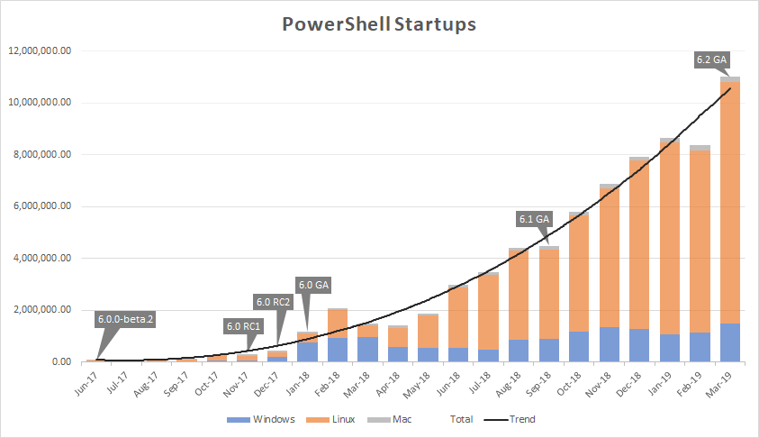
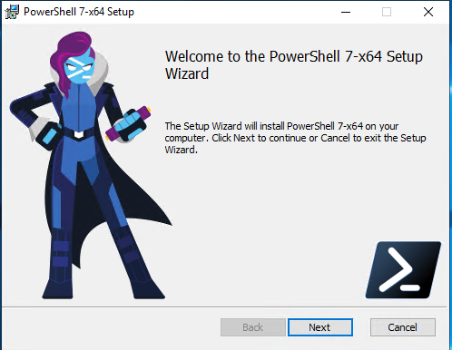
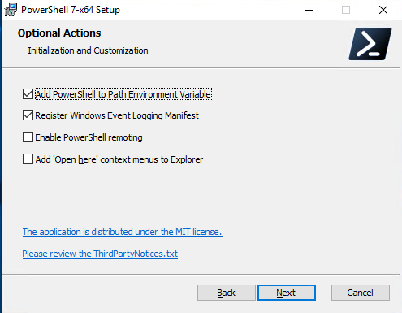

# PowerShell 7.0 – Introduction, History, Installation
Microsoft has finally announced the General Availability (GA) release of PowerShell 7.0. This represents a fairly significant milestone in PowerShell’s history. In this post, I’ll go through some of the history prior to this point, what’s new in this release and how it works in practice.
<!-- more -->
## History
Before 2006, the options for scripting and automation on Windows were limited. There was VBscript, which could interact with some systems like Active Directory. Interfaces to Active Directory, Exchange and other systems weren’t standardised. Doing any sort of automation during that time was difficult. There were some third party tools but they were all proprietry. For those of us around back then, it was a dark time.

PowerShell Version 1.0 was released in 2006. In subsequent releases, more features were added and PowerShell was included with Windows itself. A major feature of PowerShell was modules, which allowed the extending of capability. The Microsoft Exchange team was one of the first to make a module availbale for their product (Exchange 2007). This module was my first true exposure to PowerShell. This development path continued until version 5.1 and contained the hints of divergence that would come. Version 5.1 had two editions – Desktop and Core. Desktop was like prior versions, built on top of the .NET framework. The Core edition was built upon .NET Core (which could run on Linux). At this point, development of this line of PowerShell ceased.

In 2018, PowerShell Core 6.0 was released, for Windows, macOS and Linux. Rather than replacing version 5.1, Core ran side-by-side. For the Windows system administrator, this version of PowerShell represented a step back. Many modules that had been created in the past simply didn’t work on this new Core release. Many commands that relied on the full .NET stack also didn’t work. In a [roadmap](https://devblogs.microsoft.com/powershell/powershell-6-0-roadmap-coreclr-backwards-compatibility-and-more/) posted in 2017, the PowerShell team started an intent to leverage .NET Standard as a method to allow these modules to work.

Verison 6.1 included an effort to address the losses in 6.0, via the Windows Compatibility Pack for .NET Core. By including this Pack, version 6.1 was able to make more than 1,900 cmdlets available in 6.1. While this represents a major step in the right direction, I suspect that version 6.0 broke too many things for Windows system administrators. This is reflected in my own anecdotal experience. Many organisations I’ve worked at still stuck with version 5.1. This is also backed up by Microsoft’s own data about PowerShell, shown in the graph below:



Startups on Linux platforms represent the lion’s share, with growth on Windows remaining very flat. This graph was front and center in a [post](https://devblogs.microsoft.com/powershell/the-next-release-of-powershell-powershell-7/) by the PowerShell team April 2019, which discussed the “next release”. The inability to run v5.1 code and modules on the 6.x was cited as a potential cause behind the lack of option on the Windows platform. The “next release” was to be an effort to creating a “full replacement of Windows PowerShell 5.1”.

## What Does PowerShell 7 Bring To The Table?
Looking at the release notes and features listed, PowerShell 7 brings some nice sounding items to the party. Some that caught my eye were:

* The return of .NET framework APIs (enabled by the shift to .NET Core 3.1, which should ease a lot of module compatibility issues)
* A “proxy module” capability to enable importing of modules that are still incompatible with version 7
* A change in support model, resulting in a longer support lifespan
* Parallel execution with the ForEach-Object cmdlet

There’s also a bunch of general optimisations that I’m hoping will resolve some of PowerShell’s more sluggish aspects.

## Installing PowerShell 7
For Windows systems, there’s a MSI package that runs on Windows 7 SP1, 2008 R2 or later. Like version 6.x, it runs side-by-side with the 5.1 version, but will replace any existing 6.x installation on a system. In terms of deployment flexibility, this is perhaps one of best options as it can be folded into template building, during provisioning with configuration management tools, or exposed via software deployment tools like SCCM. The MSI installer starts with a standard welcome splash screen.



The installer prompts for some standard inputs we would expect, like an installation path. There’s some additional options like adding PowerShell to the path variable and enabling PowerShell Remoting.



After these options, it’s possible to start the installation.

On some distributions and versions of Linux, it’s possible to install PowerShell 7 relatively easily. In the case of CentOS 7, this process involves registering the Microsoft repository and then installing using the yum install command. Alternatively, it can be downloaded as an RPM (for CentOS/RHEL) and installed using that file.
```
# Download RPM File for CentOS 8
wget https://github.com/PowerShell/PowerShell/releases/download/v7.0.0/powershell-7.0.0-1.centos.8.x86_64.rpm

# Install using yum
yum install powershell-7.0.0-1.centos.8.x86_64.rpm
```

## Summary
So far, PowerShell 7 is hitting a lot of good notes. I’m hoping to write some followups where I put it through its motions, specifically how well it supports PowerShell tasks that Windows system administrators may use and the performance improvements.
