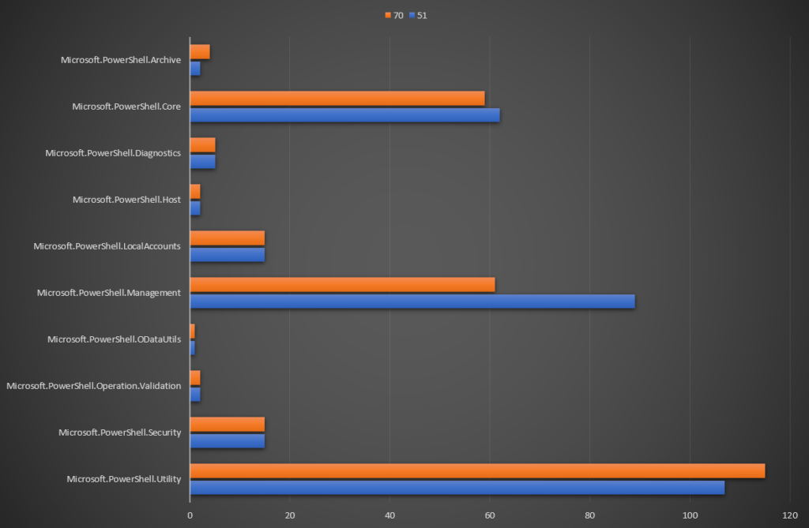
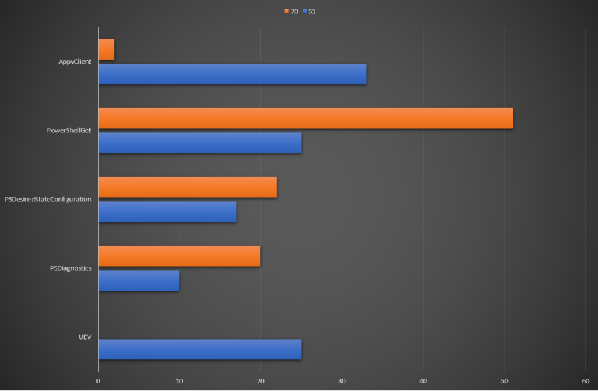
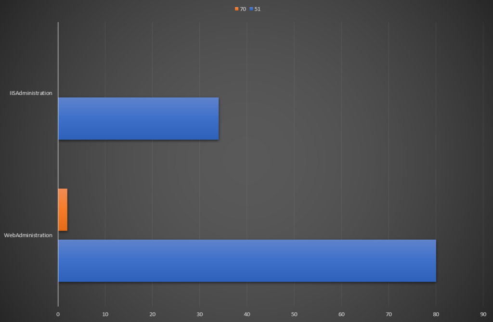
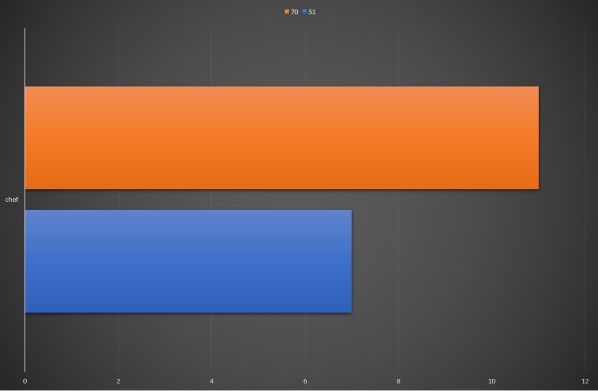

# PowerShell 7.0 – Cmdlet Compatibility

In my [first post](https://blog.jpboyce.org/2020/03/06/powershell-7-0-introduction-history-installation/) about PowerShell 7.0, I made mention of a major issue that most likely prevent adoption of PowerShell 6.x by Windows system administrators. This issue was the loss of functionality in 6.x, specifically that some cmdlets would not be available due to 6.x being built on .NET Core. The release of 7.0 is meant to help address this, which is the intent of this post.

## Cmdlet Compatibility Approach
In reviewing the compatibility for 5.1 and 7.0, I used the management server in my home lab. This is a Windows Server 2019 virtual machine, so it shares the common set of cmdlets that Windows 10 has. As a management server, it also has some additional modules/cmdlets available:

* Windows Server Role-based modules such as ActiveDirectory and DnsServer
* SQLPS from the installation of SQL Server 2014
* cmdlets associated with VMware’s PowerCLI
* cmdlets associated with ChefDK
* AWS’s PowerShell module

While not comprehensive, this does give good coverage of built-in, Microsoft-provided and third-party provided items.
<!-- more -->
## Core PowerShell Cmdlets
The first place to start would be the core cmdlets provided by PowerShell itself. These are derived from the Microsoft.PowerShell modules. A graph comparing the cmdlet counts for each module by version is shown below:

The numbers are the same for six of the modules. The higher count for Microsoft.PowerShell.Archive for version 7.0 comes from having a newer version of some cmdlets, resulting in duplication. The reason for version 5.1 Microsoft.PowerShell.Core being higher is due to some cmdlets not being available in version 7.0. These appear to be related to very old functionality (like adding/removing snapins). The Microsoft.PowerShell.Management module shows the greatest difference, with 89 cmdlets available in 5.1 compared to 61 in 7.0. Some of the missing cmdlets relate to creating System Restore Points. Others relate to WMI functionality. The increased count for version 7.0 cmdlets in the Microsoft.PowerShell.Utility module seem to be from items added, such as Join-String and Markdown-related cmdlets.

## Base Windows Cmdlets
There are about 78 modules that enable almost 1,500 cmdlets in a basic installation of Windows Server 2019. For the sake of clarity, I’ve only included those with different counts in the graph below.

As shown, there is hardly any version 7.0 functionality for the AppvClient module. The situation is worst for UEV, with no cmdlets available in version 7.0. However, there is documentation from Microsoft that suggests it does work in Windows 10 1903 or higher. The higher count for PowerShellGet is a similar situation to Microsoft.PowerShell.Archive – there are newer versions of the cmdlets. The same is also true for PSDesiredStateConfiguration and PSDiagnostics.

## Windows Server Role Cmdlets
In my home lab, most of my servers are running Windows Server Core installations to reduce overhead. My management server has the various administration roles and features installed to allow administration of the other servers. This includes Active Directory, DHCP, DNS and IIS. Most of the modules had what appeared to be equal support under version 5.1 and version 7.0. The exceptions to this related to IIS.

As shown in the graph, the IISAdministration module has no cmdlets under 7.0. The WebAdministration has only two, relating to commitment of changes to IIS.

## SQL Server 2014 cmdlets
When SQL Server 2014 is installed, two PowerShell modules are available – SQLPS and SQLASCMDLETS. It appears the same amount of cmdlets is available in PowerShell 5.1 and 7.0

## PowerCLI cmdlets
PowerCLI is VMware’s module for management of their vSphere products (generally via interacting with vCenter). It appears, like the SQL Server cmdlets, all of them are available under both versions of PowerShell.

## Chef DK cmdlets
The Chef Development Kit (DK) is a set of tools to assist in local development of cookbooks. Many of these tools relate to Test Kitchen, which is used to execute and test the cookbook code against a “dev” target system. There appears to be a few extra utility cmdlets exposed for version 7.0, giving a higher count.

## AWS PowerShell cmdlets
When I initially checked the AWS cmdlets for both versions, version 7.0 showed none at all. Upon checking the version I was running and what was available, there was a bit of a gap (v3.3.563.1 from 7 months ago vs 4.0.4.0 released a month ago). After updating, both versions showed equal numbers of cmdlets.

## Summary and Moving Forward
On the surface, cmdlet compatibility in PowerShell 7.0 seems to be strong. Earlier I mentioned documentation about support of the UEV cmdlets. Microsoft has a page detailing the compatibility of various modules. A good percentage are listed as “Natively compatible” which is a good sign. The VMware and AWS cmdlets being listed as available in 7.0 is a good sign as well.
