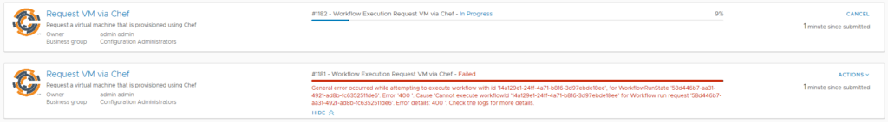
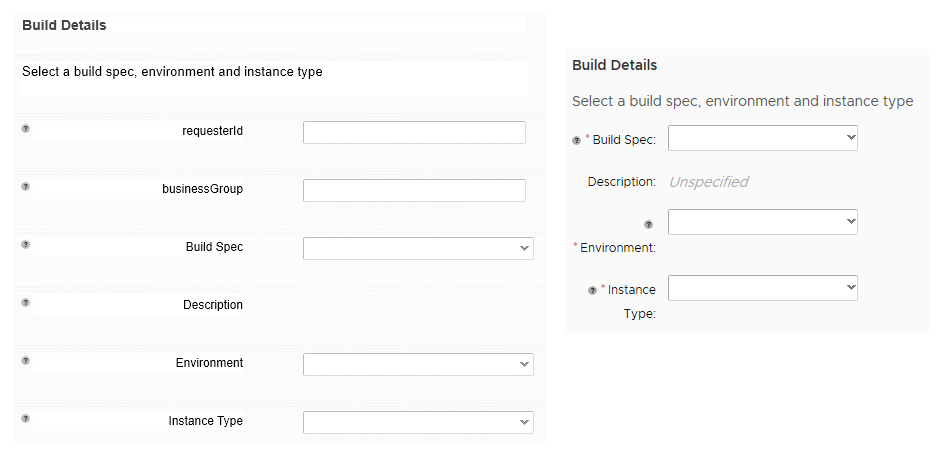
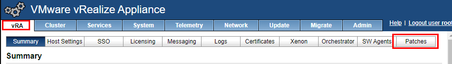
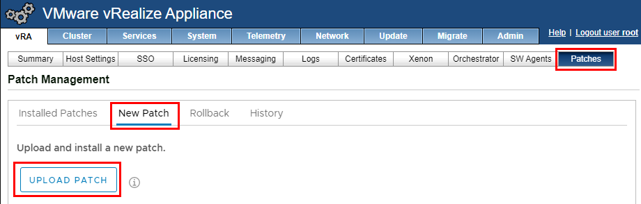
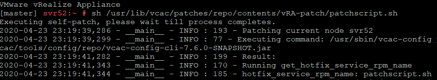
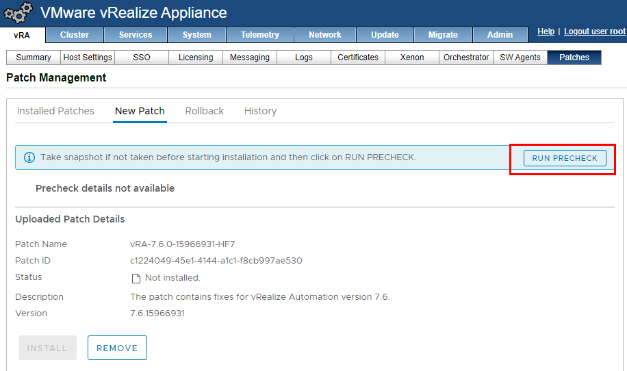
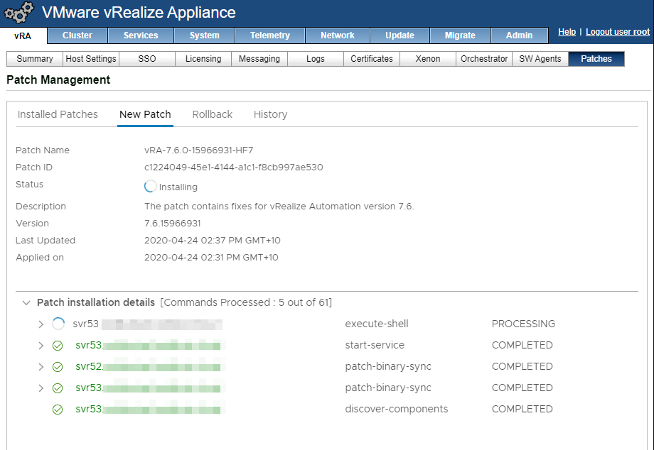
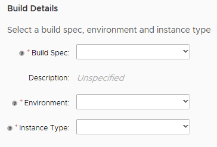

# Updating to vRealize Automation 7.6 Hotfix 7
I had been burned by updating vRealize Automation a little too quickly following a hotfix release. Chrome 75 caused some rendering issues in the deployment forms. These issues were resolved by Hotfix 1, which introduced some extra issues. The most visible one is the duplicate requests on an XAAS (Anything as a Service) blueprint. An example of this behaviour is shown below

The second issue that I’ve seen as cosmetic. It was resolved in Hotfix 2. In this issue, labels on an XAAS blueprint rendered correctly in the Designer but when requesting the blueprint via the catalog, the label text would wrap. An example of this is in the image below:

<!-- more -->
On the left is the layout in the Designer, while on the right is how it renders when making a request. Not a very good look.

A key item introduced in Hotfix 5 was support for LDAP Signing and LDAP Channel Binding. These were changes that Microsoft made to improve the security of Active Directory. Given these and other changes, it seems like a safe option to update to the latest hotfix (hotfix 7)

## Performing the Update
Unlike other updates, this one isn’t easily performed using the update function in the management interface. The process for installing this update is detailed in [KB article 70911](https://kb.vmware.com/s/article/70911). For the sake of providing some visual context, I’ve repeated the steps with screenshots. Prior to starting, I shutdown both the virtual appliance and IAAS VM, and took snapshots. I also made sure I met all the prerequisites.

I logged into the management interface of the virtual appliance and navigated to the Patches section.

From the Patch Management screen, we need to upload the hotfix patch file that was downloaded. This file was about 4.2GB for me. To do the upload, in the Patch Management screen, click on the New Patch tab, then the Upload Patch button and select the file to start the upload.

As per the documentation, I had to switch to an SSH session after the patch upload to run a command. This is because my last hotfix version was version 1.

On my instance, this patch took about 7 minutes to run. I did run into an issue where the script threw an error. Rerunning it as per the documentation didn’t seem to resolve this. On a whim, I renamed the patch file to .zip and I was able to open it with WinRar. Inside was an updated management agent installer. I installed this on my IAAS server and now the script executed successfully. Logging back into the management interface and going to Patch Management, there was now an option to run a precheck.

One issue I ran into with the Precheck is it errored out because the vRealize Business for Cloud (vRBC) appliance was powered off. So it does seem to do some checking outside of just the vRealize Automation appliance. Once I deregistered the rRBC instance, the prechecked passed. At this point, I clicked the Install button to install the Hotfix. Interestingly, the patch details had changed to HF2. On my instance, the patch took about 20 minutes to install. Following this, it did list HF2 as installed.

I again uploaded the HF7 patch in an attempt to install it. Fortunately this time it went through properly.

## Post Install
After the hotfix was applied and I restarted my browser, the XAAS request form rendered in a much more pleasant fashion.

Submitting an XAAS request yielded only one item in the Deployments area, which is the correct behaviour. So the hotfix was installed eventually.
