# vRealize Automation 8.1 New Features Walkthrough
VMware announced the [general availability of vRealize Automation 8.1](https://blogs.vmware.com/management/2020/04/announcing-general-availability-of-vmware-vrealize-automation-8-1.html) a couple of weeks ago. This update includes a wide range of new features and capabilities. Some of these items restore functionality that was lost in transitioning from 7.x to 8.x (such as Approval Policies).

## Governance and Policy
Version 8.1 adds some new items under Governance and Policy. Some of these include Approval Policy, limits on resources and view-only roles.

### Approval Policy
Approval Policies have been expanded to be more in line with the functionality of what was in 7.x. In one of my [first impressions posts about version 8.0](https://blog.jpboyce.org/2019/10/29/vrealize-automation-8-first-impressions-service-broker/), I noted there was only 2 policy types (Lease and Day 2 Actions). There is now a third option called simply Approval Policy.

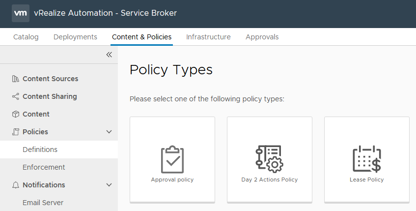
<!-- more -->
The form that’s presented when creating an Appproval Policy has a lot of content, as shown below. The initial scoping of the policy can be for the entire organisation or a particular project. It can also be further constrained in scope using the Deployment Criteria, such as a particular blueprint. The Auto Expiry Decision and Trigger are a nice touch, allowing things to keep moving if approvals haven’t been granted in a timely fashion. The Actions section defines which actions the policy applies to. This can be deployment tasks such as create or delete, or more specific like creating a snapshot. There are 73 actions available.

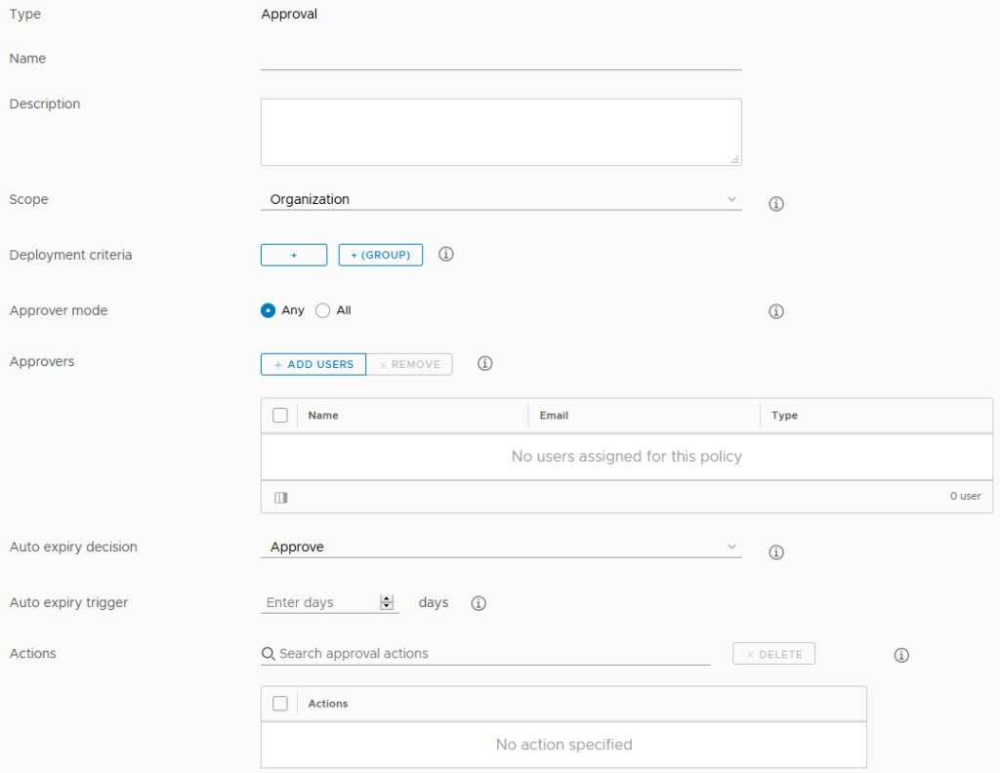

### Resource Limits
When creating a new Project in 8.1, it is now possible to apply limits on the resources it can use. This is similar to how Reservations worked in 7.x The limits apply per Cloud Zone assigned to the Project. Storage limits can be set only for vSphere Cloud Zones. The UI for this is shown below.

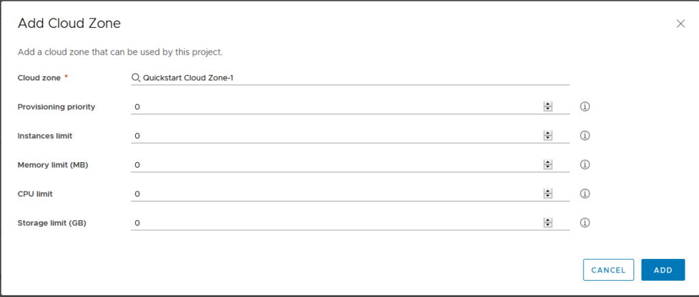
### View Only Roles
This release expands the default set of built in roles to include View-Only roles. With the exception of vRealize Orchestrator’s roles, it’s possible to assign a Viewer right to all the other services within vRA 8, including the migration assessment.

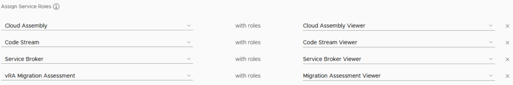
## CMP
Three items were added to CMP in this release – quick setup of vSphere endpoints, health badges and pricing for private cloud deployments.

### vSphere Endpoint Quick Setup
The main change in this area is the addition of Cloud Foundation as a Quickstart/Quick Setup option. When selecting the Quickstart, we are now presented with two options.

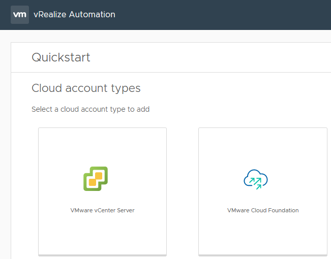

Selecting the Cloud Foundation option presents a form asking for the information relevant for that platform such as the SDDC Manager details, vCenter server and so on.

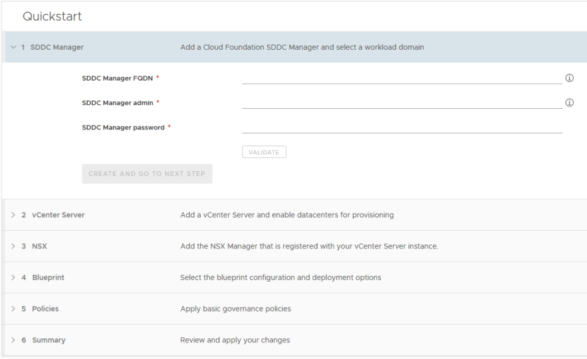
### Rate Cards
Rate or Pricing Cards allow pricing data to be associated with deployments. This concept is similar to what vRealize Automation 7.x had when integrated with vRealize Cloud for Business. In vRA 8, this functionality relies on integration with vRealize Operations. Pricing cards can be applied to Projects (the default) or Cloud Zones. The Basic Charges section overs CPU, Memory and Storage. It can be set on a “Cost” model (a percentage of a base value) or at a “Rate” model where specific values need to be provided. The Rate model UI is shown below.

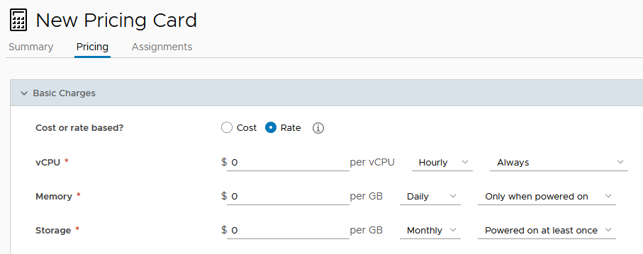

As shown, the rate can be based on an hourly, daily, weekly or monthly model and can apply based on other criteria. There can also be a charge applied for the operating system. This can be a one-off charge, a rate factor linked to resources (CPU for example) or recurring.

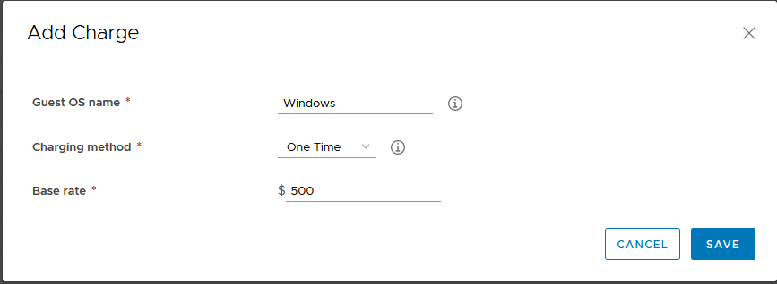

Additional charges can be applied on the basis of tags. These follow a similar model to the OS charges (one time, recurring, etc). When clicking in the Tag field to add the charge item, it will automatically look up the tags defined in your vCenter. This could be used for various purposes, like charging more for high performance storage or a higher standard of backup routine.

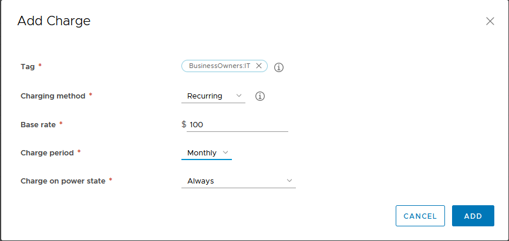

The last charge option relates to Custom Properties. These are set using a Property Name and Value pairing and have the same sort of charging options as the other settings. Finally there is an overall charge that can be applied, with options to specify a one time charge and recurring. Once cards have been created, it’s possible to calculate estimates prior to performing a deployment. A Daily Price Estimate element appears in the New Request form, with a button to calculate the rate.

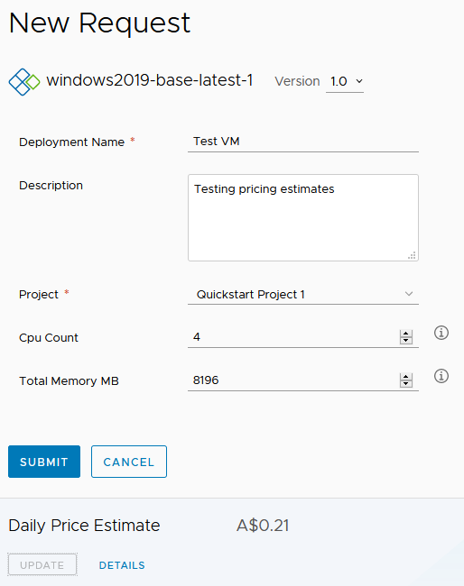

Clicking on the Details link will display a price breakdown. As shown, it’s not a comprehensive estimate because it doesn’t include some charges.

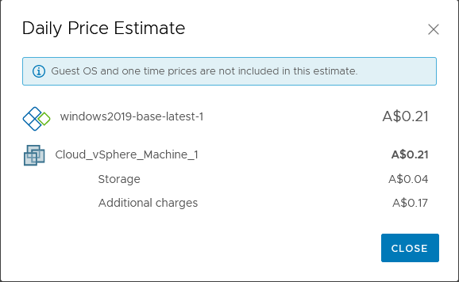

## XAAS
vRealize Automation 8.1 adds a few new features for XAAS (Anything as a Service). Most of them relate to custom resources.

### Custom Resources based on vRO Types
Custom Resources allow you to map a resource type from a vRealize Orchestrator (vRO) workflow into a vRA resource that can be used in Blueprints. The example in the vRA 8.1 documentation uses the AD:User vRO resource type. As shown below, the Custom Resource is associated with vRO workflow that will create or destroy the resource. In this case, the Create workflow is one that would create an AD user (vRO has a couple of workflows that achieve this already) and the Destroy would delete the user.

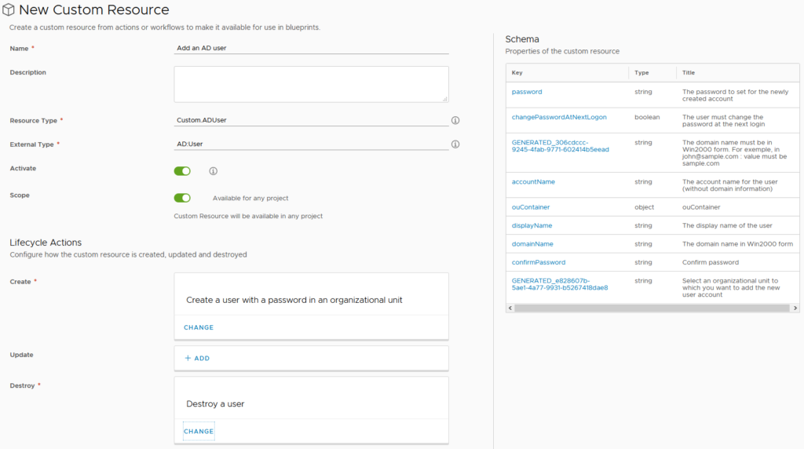
When the workflows are added, the schema box on the right will update with the properties of the resource. This gives an idea of whether you’ve picked the right workflow for what you’re trying to achieve. Further down on the form, Day 2 Operations can be defined for the Custom Resource. In the case of the AD User example, “Change password” might be a valid option here. After creating the Custom Resource, it will appear as an item in the Blueprint Designer.

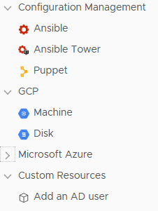

When the Blueprint is created and deployed, the appropriate inputs are displayed and we get some autocomplete functionality with the OU field.

### Custom Day 2 Operations
One of the most powerful features in vRealize Automation 7.x was the ability to make your own Day 2 Operations actions. One I’ve written about was related to managing local administrators on a Windows server. In 8.1, this functionality makes a return. The form to create a new Resource Action has a lot of similar elements to the Custom Resource form. The relationship being defined this time is the Resource Type of the things we want to run this action on, as well as the workflow to execute. Once the workflow is selected, the Property Binding box on the right will populate.

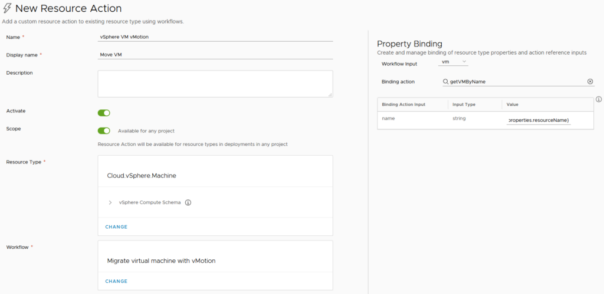

The Property Binding takes the name of the resource (in this case, a VM) and finds the vCenter object that the Migration workflow needs as an input. This is the link between the various pieces to make the Resource Action work. The look and feel of the request form can be customised at this point. Conditions can also be set on the Action, constraining what scenarios it will be available. In this case of this example, the constraints could be related to CPU or memory or the role of the VM. Once all this configuration is done, the new Resource Action should appear when you drill down to an existing deployment.

### Other Custom Form Improvements
One of the cool things that was possible in vRealize Orchestrator 7.x was to have the default value of one input field be calculated on the value of another. This behaviour would pass through to blueprints in vRA 7.x and could allow things like a basic cost calculator (ie. taking the CPU and memory values and performing some formula on it). The custom form designer in vRealize Automation 8.1 has this sort of functionality return. Like 7.x, it uses vRealize Orchestrator actions to achieve it. This is a feature I’ve used in 7.x as a way of improving the quality of request forms that are presented to consumers and I’m glad to see it make a return.

## Powershell for ABX
Action Based Extensibility (ABX) was a new form of extending vRA functionality that was introduced in 8.0. In 7.x, this extending was performed by using vRO workflows. In the 8.0 release, ABX could be written in node.js or Python. In 8.1, they can now be written in Powershell. An important cavet with this is like the 8.0 languages, this Powershell also runs on AWS Lambda and is subject to the limitations and requirements of that platform.

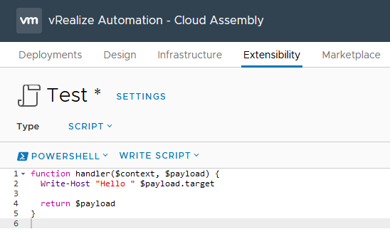

## IAAS Provisioning
IAAS Provisioning had the longest list of imrpovements added in 8.1. Some of them are support for new products (vSphere 7, NSX-T 3.0, etc). Users now have the option to perform a bulk deployment of a request. This has to be enabled first, as it defaults to a value of 1 per request. It can be set to a maximum of 10. If it is set to a value above 1, a new field is added to the request form, where the user can set an appropriate number of deployments.

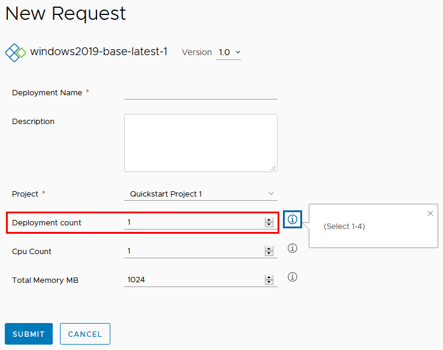

## Ecosystem
Version 8.1 adds some updates with the integrations supported. Openshift is now an integration option, although at this stage I’m not clear what functionality is granted by adding it. There is also a Terraform provider.

## Catalog Content Sources
There’s two new features in this area. First, VMware Marketplace templates can be published to the catalog. This involves adding the Marketplace as a content source

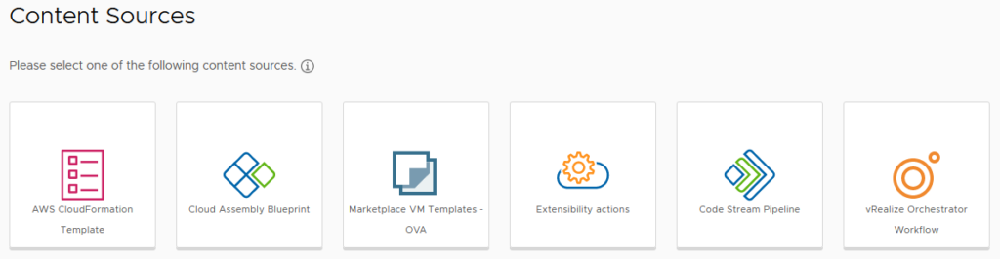
The addition of the Marketplace is easy, just requiring a name and the “source integration account” (ie. a myVMware account). After that, like any other content source, the content needs to be shared with a project, so users in that project can deploy it.

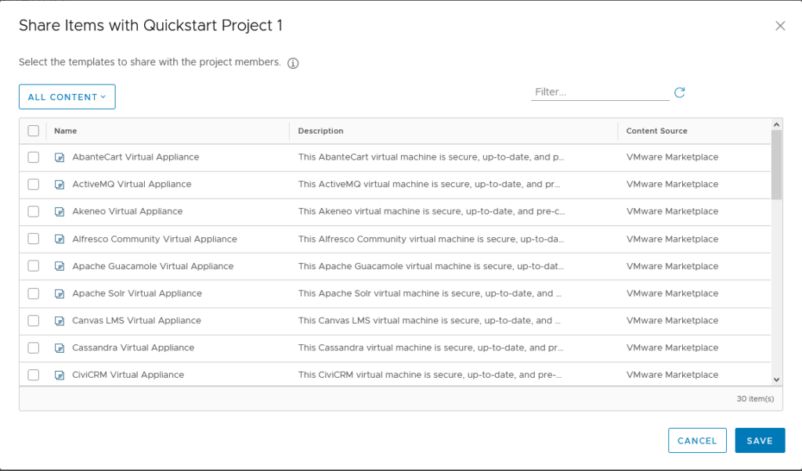
Because these are effectively OVAs being deployed, the catalog request form has the same sort of fields as you would expect. This can lead to request forms that are overly complex, but it is possible to customise the form.

The second item added in this area is the ability to publish Code Stream pipelines as catalog items. This is another good option to extending the available options to users in the catalog.

# Final Thoughts
For a .1 release, there is a lot of new and improved stuff in 8.1. Some of the items I haven’t covered. I think what I’m most pleased about is the restoration of the features that were lost in 8.0, such as approval policies and day 2 tasks. The day 2 tasks especially where a great area for an IT department to be able to extend and grow self-service options to vRA users, so it’s good to have that functionality back. With this release, vRA 8.1 does feel like a relatively mature product and it’ll be interesting what 8.2 gives us.
