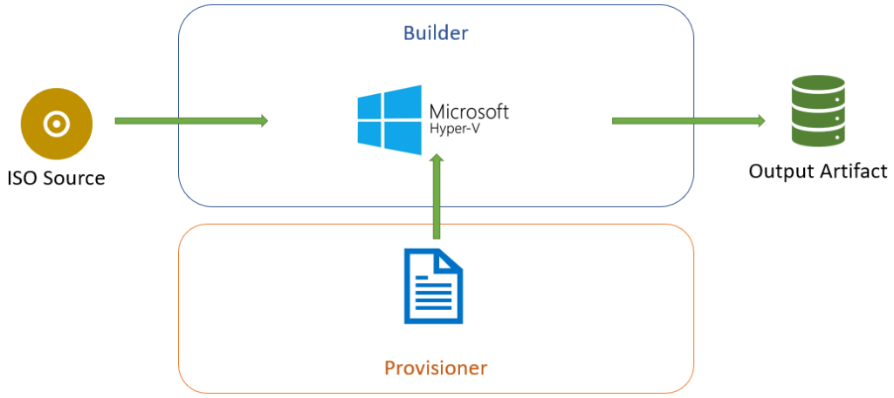

# An Introduction to Packer

Recently I had an extended discussion about Packer with a fellow IT professional and recalled some material I had previously put together about Packer. Looking back at this material, I thought an expanded version of it might be worth writing up, with Windows Sysadmins in mind (since that’s my background).

## What Problem Does It Solve?
I feel sometimes it’s best to start with what problem we are trying to solve, to help provide context for how a tool might be useful. A number of user stories can capture the problems Packer can solve.

`As an Infrastructure Engineer, I want standardised templates for multiple platforms, so that template management is easier and consistent`

This talks about a task that many infrastructure engineers and systems administrators have had to perform – regularly updating virtual machine templates on vCenter and other platforms. In some cases, this can be very onerous, so we want an easier way. In other cases, where the templates aren’t maintained, it can lead to increased deployment times (because the “Install Windows Updates” task during the SCCM task sequence takes longer and longer).

`As a Security Engineer, I want our infrastructure across multiple platforms to adhere to the same security standards, so that my organisation’s data and reputation are protected`

<!-- more -->
The Security Engineer user story is about ensuring things are the same. A server in the cloud should have the same sort of security settings as a server hosted on prem. This is really a very focused view on configuration management (focused on just security) but there’s no reason why we can’t also have a broader view on that. If our templates are always running the latest updates and configured securely (via some magical process), then our Security Engineers are happy.

`As an Infrastructure Engineer, I want infrastructure that deploys rapidly, so it is available for use by my customers`

This third user story relates to the “baked in” outputs that Packer can do. Across these three stories, the main points are consistency across platforms.

## What Is Packer?
This is answered on the [first page](https://www.packer.io/intro/) of the Packer documentation. `Packer is an open source tool for creating identical machine images for multiple platforms from a single source configuration.` Expanding from this, Packer uses configurations defined in JSON format, with distinct blocks. These files are called Templates. This makes Packer part of the ever growing suite of Infrastructure As Code (IAC) tools out there. This means you get the benefits that come with the ecosystem that typically surrounds IAC tools, such as version control and testing (via CI/CD tools).

The machine images that Packer creates can be VMware templates, VirtualBox box files, EC2 AMIs and more. The process of building these images involves taking some sort of source (sometimes an ISO, sometimes an existing machine), applying configuration to it and outputting an artifact of some sort (the image).

As a Windows systems administrator, you may already have an image building process via SCCM. But generally that build process is only available for on-prem platforms (ie. vSphere), doesn’t have the benefits of IAC tools and so on. Packer can potentially open up a range of opportunities for image creation and maintenance.

## Components of Packer
The template file that Packer uses has a number of components. These are Builders, Provisioners and Post-Processors.

### Builders
Builders are the platform the actual creation of the image takes place. This can be cloud providers like AWS or Azure. It can also be traditional hypervisors (like VMware vSphere, Virtualbox and Hyper-V). Generally the builder used will dictate what kind of output will be created.

### Provisioners
Provisioners are what performs the task of configuration management on the machine image being created. These could be something as simple as installing the latest security updates for the operating system. Configuration management tools like Ansible, Chef and Puppet can be used as a Provisioner, allowing you to leverage existing resources. What the Provisioner does can be as simple or as complex as you need.

### Post-Processors
Post-processors perform certain tasks after the build has completed. These tasks might be uploading the image to vSphere, generating Vagrant box files or importing into AWS.

## The Packer Workflow
The Packer workflow takes a defined source (usually an operating system installation media in ISO format or an existing machine), creates a machine on the builder, executes the Provisioner’s defined tasks and generates an output. Doing this on Hyper-V may look like what is shown below.



## The Template File Format
The Template File has sections that match the Packer components, plus a few others.

### Builders Section
This section is where one or more builders can be defined. So it would be possible to build an EC2 AMI and a VMware vSphere VM template using the same template file. A partial example of how this could look is shown below.
``` json
"builders": [{
  "type": "virtualbox-iso",
  "vm_name": "windos-2019",
  "output_directory": "e:/Packer/windows-2019-base-{{isotime \"20060102\"}}.{{isotime \"150405\"}}/",
  "guest_os_type": "Windows2016_64",
  "iso_url": "{{user `iso_url`}}",
  "iso_checksum": "{{user `iso_checksum`}}",
  "iso_checksum_type": "{{user `iso_checksum_type`}}",
  "disk_size": "{{user `disk_size`}}"
}]
```

In this example, the type is being defined first (in this case, a VirtualBox VM that will start with an ISO file). Some values are dependant on the Builder platform used, such as guest_os_type which will have different values for different platforms. The second half of the sessions refer to variables (as indicated by the {{user 'disk_size'}} entry for example. Variables are useful in allowing you to define values you may use multiple times or that contain sensitive data.

A key section that is defined in the Builders section is the communicator. This defines the transport that Packer will use to transfer files to the machine or execute commands. The two main options are SSH and WinRM. This section will always define the type of communicator and a username/password combination for it.

The Builder section will also define characteristics about the machine being built, and these settings will vary from platform to platform. For example, if building on a VMware server, it’s possible to set the network card to VMXNET3.

### Provisioners Section
The Provisioners section define the commands or tools that will be used to configure the machine while it is built. This section can be left empty, resulting in an image that has just the operating system installed. The Provisioner code structure is a lot more simple, in many cases, being just 2 lines – defining the type and then defining what will run. A brief example of this is shown below.
``` json
"provisioners": [{
  "type": "powershell",
  "script": "scripts/windows/install-vbox-guest-additions.ps1",
}]
```
In this example, the type is being set to PowerShell and the thing to be run is a script that installs the Virtualbox guest additions. A common set of items that might be in the Provisioners section would be to install tools like the guest additions, install security updates, reboot the machine and perform cleanup tasks.

As mentioned previously, configuration management tools like Ansible, Chef and Puppet can be used in this section, allowing you to create “baked in” images that already have applications installed and configured.

### Post Processors Section
This section defines the tasks to be performed after the image is created. In some cases, there may be nothing to put in this section. One scenario there there may be content is when the desired output is a “box” file. An example of this is below.
``` json 
"post-processors": [
  [{
    "type": "vagrant",
    "vagrantfile_template": "vagrant-templates/centos-7.template",
    "output": "./boxes/centos-7-base-{{isotime \"20060102150405\"}}.box"
  }]
]
```
Like the other sections, it follow the same general format of defining the type and then some values for it. In this case, the type is vagrant, with the options of what template file to use and what the output should be.

### Variables Section
In some of the earlier example snippets, there were placeholder values that referenced variables (designated by the {{ }} notation). The real values for these are defined in the variables section or they can be specified via the command line. An example of this is shown below.
``` json
"variables": {
  "http_directory": "kickstart/centos7",
  "kickstart": "ks.cfg",
  "iso_url": "iso/CentOS-7-x86_64-Minimal-1804.iso",
  "iso_checksum_type": "md5",
  "iso_checksum": "fabdc67ff3a1674a489953effa285dfd",
  "cpu_count": "2",
  "memory_size": "4096",
  "disk_size": "40960",
  "headless": "false",
  "skipexport": "false",
  "ssh_user": "vagrant",
  "ssh_pass": "vagrant"
}
```
In this case, some values being defined relate to the source media (iso_url for example) while others will affect the configuration of the machine being built (disk_size). If multiple Builders are defined in the template, then variables can help with maintenance of that file by keeping values like these set in one place. Towards the end, the example is doing something which is perhaps not a good practice – listing a password in the clear. One approach is to ensure this user account is deleted when provisioning a machine from the templates you build with Packer. Alternatively, you could insert the password into the build process using a more appropriate method (like retrieving it from a secrets management system).

## Packer In Action
At this point, I’ve covered the use cases for Packer and the pieces needed in a template to build an image. So the next item is what the experience of using it is like. A while ago I made a video of building a VirtualBox image for demo purposes.
[](https://www.youtube.com/watch?v=g-KDtFpwcNc)

Right at the start, the contents of the template file is being displayed. This includes some of the settings I’ve written about earlier, plus a bunch of others. Because this is a Windows 2012 OS being installed, an unattend.xml file can be fed in the help with some tasks, and this is listed under the floppy_files item. Some key timeline events are:

* At 0:16, the command to run is visible.
* At 0:33, we can see the Virtualbox VM is booting like a normal VM would. It boots off the CD-ROM
* At 0:42, Packer enters a waiting state, waiting for WinRM to be available so it can process the Provisioner commands
From about 0:56 to 1:29 we see a very normal Windows install process, automated thanks to the values in the unattend file
* At 1:41, the VM has reloaded and autologged in (as per settings in the unattend file) to run the script to enable WinRM
* At 1:53, we can see Packer progressing again because WinRM is avaialble. The first thing it does is upload the VirtualBox guest additions ISO. Meanwhile inside the VM, I’m loading Task Manager so the activity happening inside the VM is visible
* At 2:11, when switching to the Performance tab in Task Manager, under Ethernet, the VM is receiving traffic (about 10Mbps) which is the ISO transfer
* At 2:51, the transfer is finished and now Provisioners are being run. The first one is a PowerShell script to install the guest additions. In Task Manager, we can see entries for this, running under the Vagrant account
* At 3:10, the Provisioning has finished and the VM is shutting down.
* At 3:31, the shutdown is finished and Packer starts cleaning up the Virtual Machine. This includes tasks like removing the floppy drive. Following that, it begins to export the Virtual Machine (to OVF format in this case)
* At 3:39, the export is complete and Packer finishes by removing the VM from Virtualbox.
* After that, I change into the output directory to show the created files – the OVF and the VMDK

## Extending Packer
Given that Packer can perform provisioning tasks based on existing configuration management tools like Ansible, Chef and Puppet, it’s possible to create what some call “baked-in images”. I’ve used this term a couple of times earlier in this piece and it addresses the 3rd use case – getting things up and running fast. Some applications, like SQL Server, can take a long time to install. In the case of a bare OS image, the time to deploy the OS is shortened (because we’re just cloning the image, which can be very fast) but still installing the applications traditionally. If the applications are “baked-in”, then we are cloning a slightly larger image. This can be useful for developers who require a lot of tools be available in systems they’re developing and testing on. The down side is an increase in management overhead – more configuration templates to manage, more artifacts to manage.

Another option for extending Packer is making it part of a CI/CD pipeline. Firstly this allows the automation of your image building, but also allows additional steps in the process to enhance the process. These steps could be running some sort of testing or validation over the image, or transferring it to various destinations.

## Summing Up
I’ve touched on some of the basic concepts about what Packer does and how it works. It can be used to build a range of operating systems for different platforms. In one case, I used it to [build Windows images for Nutanix’s AHV platform](https://blog.jpboyce.org/2019/03/22/building-nutanix-ahv-templates-with-packer/). Once you have a set of template files established, it can help ease that task of regularly updating the virtual machine images in your organisation or home lab.
