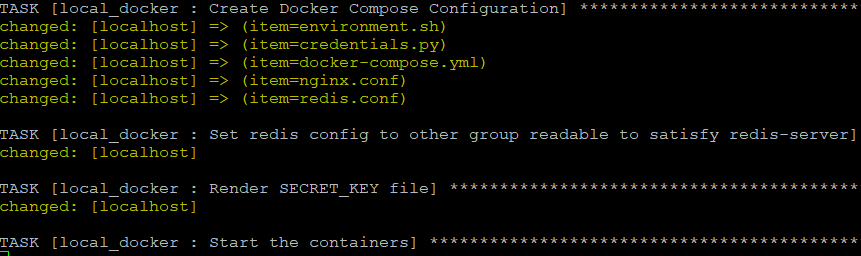
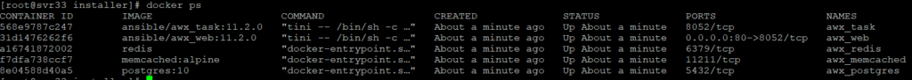
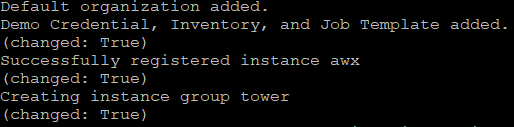

# Installing Ansible AWX on CentOS 8
AWX is a web application that sits on top of Ansible, providing a “user interface, REST API and task engine for Ansible”. Since AWX can integrate into vRealize Automation, I decided to stand up an instance of it in my home lab.

## Installing Ansible
Since I was starting with a complete fresh CentOS 8 system, the first thing I needed to do was install Ansible. Unfortunately, Ansible is not available in the default repos configured in CentOS 8, so the repo for it needs to be added first.

```
# Add EPEL repo
yum install epel-release
# Install Ansible
yum install ansible
# Confirm installation and version
ansible --version
```

<!-- more -->
## Installing Docker
AWX comes in a containerised form that can run on Docker, Kubernetes or OpenShift. If you have the latter 2 already in place, it may be easier to leverage them. Since I had nothing in place and Docker seemed to be the easiest to get up and running, I decided to use it. One issue I ran into with this part is the Docker installation seems to fail due to some version issue between the docker-ce package and the containerd package. To get around this, I installed containerd separately first as per [this issue thread](https://github.com/docker/for-linux/issues/1004) and Docker installed properly after that.
```
# Disable firewalld
systemctl disable firewalld
# Stop firewalld
systemctl stop firewalld
# Install Yum utils
yum install yum-utils
# Add the docker repo to yum
yum-config-manager --add-repo https://download.docker.com/linux/centos/docker-ce.repo
# Install containerd
yum install https://download.docker.com/linux/centos/7/x86_64/stable/Packages/containerd.io-1.2.6-3.3.el7.x86_64.rpm
# Install docker CE
yum install docker-ce docker-ce-cli
# Start docker service
systemctl start docker
# Enable service to start after reboots
systemctl enable docker
# Confirm version and operational status
docker version
# Install docker-compose python module
pip3 install docker-compose
```
Another point where I tripped up in my first run was assuming that docker would automatically be running after installation. However, it needs to be explicitly started, as noted by the step that starts the docker service.

## Other Prerequisite Items
A few utility items are also required before AWX can be installed, as shown below.
```
# Install make
yum install make
# Install git
yum install git
```

## Get and Run AWX Installer
At this point, it’s now possible to acquire the installer for AWX. This is done using git to clone the code repo and run the installer. At the time of writing, 11.2.0 is the latest release, so I used that. There’s a lot of settings that can be configured, but for a home lab deployment, it seems the defaults work well enough.
```
# git clone repo
git clone -b 11.2.0 https://github.com/ansible/awx.git
# Change into repo folder
cd awx
# Change to installer folder
cd installer
# Run installer
ansible-playbook -i inventory install.yml
```
The installer will show output like one would expect from any other Ansible playbook being run. It will sit for a while on the step for starting the containers.




During this stage, it’s possible to see an increase in CPU, disk and network activity during this period. This took about 5 minutes on my test VM. Following installation, it’s possible to confirm the containers exist using docker ps.



## Post Installation
After the playbook has finished running, the awx_task container will run various setup tasks. The web interface won’t be available until these finish. You can track the progress by viewing the logs using the command docker logs -f awx_task.

It was during this phase that I ran into issues during my first run. Firstly, I had installed postgresql normally, since the documentation mentioned it as a prerequisite. This seems to have caused some conflict with the postgres container that’s deployed since the awx_task phase would fail, with errors relating to connection.

Another issue I ran into was when I disabled the firewall, thinking that was causing issues. This seemed to cause more problems, like preventing the playbook from running when it tried to create an iptables rule. To deal with this, I’ve placed steps at the start to disable the firewall service, which seems to get around this (although not a desirable situation).

Once the default organisation and related items are created, it’s possible to login to the AWX interface.



At this point, it’s possible to login to the AWX web interface and progress with adding inventory, credentials and other items to use it for performing Ansible tasks.
