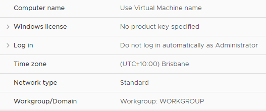
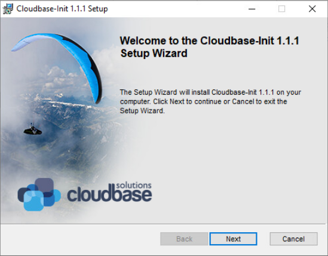
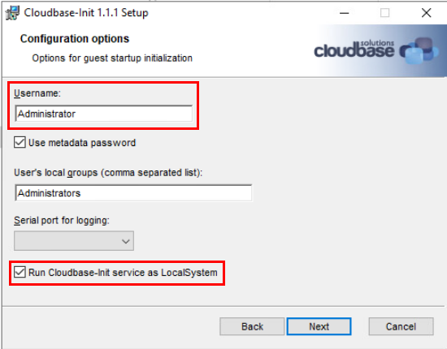
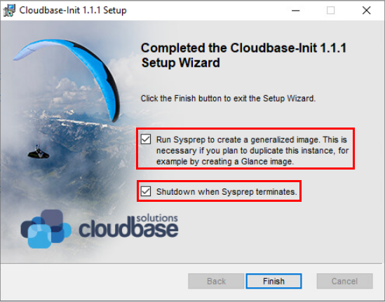
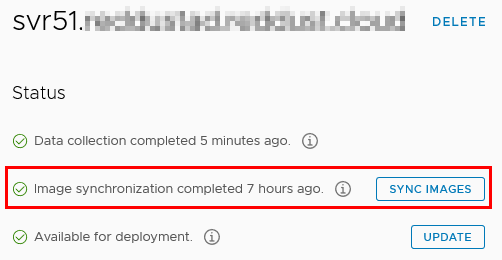
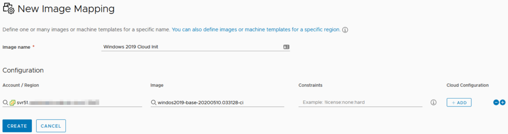
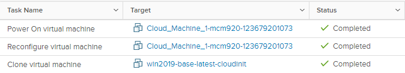
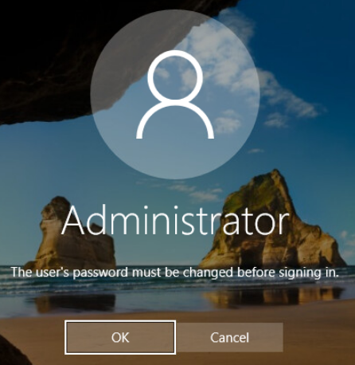

# vRealize Automation 8 – cloudConfig
With the increased focus on cloud-based services in vRealize Automation (vRA) 8, VMware have added a lot of new features. One of the key ones for Infrastructure As A Service (IAAS) provisioning is initialising a machine via “cloudConfig”.

## How We Used To Do It
Historically, when provisioning a Virtual Machine (VM) either via vRA or directly via vCenter, we would use a Customisation Specification. These were files that controlled certain settings when a VM booted for the first time, such as the administrator password.

In AWS, Userdata scripts were used to perform similar tasks. This was executed via the EC2Config service/agent that was installed on the AMI templates that were used for deploying EC2 instances. Azure has similar functionality.
<!-- more -->
## cloudConfig and Cloud-init
vRA 8 introduces a set of “cloud agnostic” Blueprint items, which can be placed in a Blueprint regardless of the ultimate target platform. To perform the same sort of boot-time configuration across different target platforms, the Blueprint has a cloudConfig section where these actions can be performed. The commands used in this section follow the [cloud-init standard(https://cloud-init.io/)]. Cloud-init was originally developed for the Ubuntu distribution of Linux on AWS, so a lot of the settings and behaviour will feel familiar to AWS users..

These commands can include tasks such as setting the host name of the system, installing software, creating/editing users or execute scripts.

## Cloud-init and Windows Support
Due to cloud-init’s origins, its support on Linux platforms is very well established. There are packages for most major Linux distributions such as Red Hat and Suse. In the case of distributions like CentOS, cloud-init is available via one of the default repositories. Fortunately a company called [CloudBase Solutions](https://cloudbase.it/) has ported cloud-init to Windows and called it [Cloudbase-init](https://cloudbase.it/cloudbase-init). Because of the nature of what cloud-init is, it can be easily integrated into your template creation process as another step.

## Creating a vSphere Template with Cloudbase-init
Creating a Windows-based template that can be used in cloud-agnostic blueprints is relatively easy. I’ve used an existing Windows 2019 template as a starting point, deploying a new Virtual Machine from it. When the Virtual Machine is up and running, download the Cloudbase-init installer. These are linked on the [Cloudbase-init Github](https://github.com/cloudbase/cloudbase-init) repository site or on the [Downloads page](https://cloudbase.it/cloudbase-init/#download). A key point about the installer: since this is a vSphere tempate, the OvfService metadata provider is used. This means the installer needs to be version 0.9.12.dev72 or later. At the time of writing, the latest “stable” release is is v1.1.1 and the latest “beta” is 1.1.2dev5. This version concern is less of an issue on cloud platforms as the metadata providers (at least in AWS’s case) are available in the stable version.

The installer can be run in standard interactive fashion or with parameters for a silent installation process. When run interactively, a standard MSI installer introduction screen is presented.

The installer can be progressed in a fashion with default values. The only area that needs changing is the Configuration options screen. The Username will default to “Admin” and needs to be changed to “Administrator”. The “Run Cloudbase-init service as LocalSystem” checkbox also needs to be ticked.

The install wizard can be continued until the point where installation actually happens. Once installation is complete, leave the installer on the final confirmation screen. The configuration files need to be edited before Virtual Machine is shutdown. The configuration files will be located in C:\Program Files\Cloudbase Solutions\Cloudbase-Init\conf. The first file to change is the cloudbase-init-unattend.conf file. The metadata_services value needs to be changed to use the OvfService value. The final content is shown below.

The other configuration file cloudbase-init.conf also needs to be edited. Firstly, the metadata_service value needs to be set, using OvfService as per the first file. Next, [first_logon_behaviour](https://cloudbase-init.readthedocs.io/en/latest/config.html#DEFAULT.first_logon_behaviour) needs to be set. Lastly, the [plugins](https://cloudbase-init.readthedocs.io/en/latest/config.html#DEFAULT.plugins) value needs to be set. The final content is below.

At this point, it’s possible to return to the Cloudbase-init installer and finalise it. Check the two available checkboxes and click Finished. This will sysprep the virtual machine and shut it down.

Once the Virtual Machine has shut down, convert it to a Template in vCenter.

## Deploying the Template
Now that the Template has been created, some preliminary tasks need to be performed to deploy it. Firstly, you may need to force an update of the template on vRA 8. By default, vRA 8 checks for images on a vCenter instance every 24 hours. This process can be manually triggered by going into the vCenter Cloud Account entry and clicking on the Sync Images button.

After this, a new Image Mapping needs to be created. Because of the manual image sync, the image should be available in the available options.

At this point, it’s possible to create a new Blueprint and add a Cloud Agnostic Machine to it. The default YAML code generated by placing the component in the Blueprint isn’t complete, so some extra values need to be added. Image and Flavor are two easy ones. Using the remoteAccess properties, a username and password can be set, which are exposed to the OvfService metadata service that was configured earlier. These values are used to create users or set the password of the specified user. After this, we can specify the cloudConfig property to perform some tasks. An example of this is shown below.

At this point, it’s possible to click Deploy to attempt to deploy the Blueprint. In vCenter, you should see tasks relating to the new Virtual Machine being created.

Once the deployment is complete, it’s time to verify what was done during the process. The first task in doing this is to login with the credentials specified in the blueprint. The Virtual Machine will accept these credentials (indicating they were successfully set) but then immediately prompt for the password to be changed. This behaviour is a reflection of the first_logon_behaviour value that was set in the Cloudbase-init configuration files.

The other items like the test file and the custom host name should also have been set as expected.
