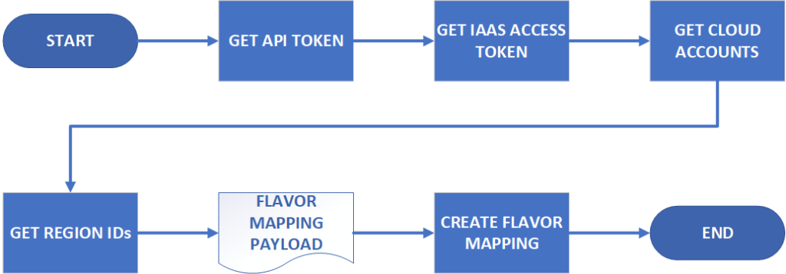
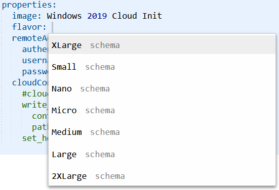

# Bulk Add Flavor Mappings Using vRA 8 REST API

One of the features added in vRealize Automation 8 (vRA 8) was Flavor Mappings. Flavor Mappings allow various instance types on different cloud providers to be associated with a platform-agnostic label. While it was possible to do something similar in vRA 7, it required a lot of scripting to handle the logic of the choice made. Like many of VMware’s newer products, vRA 8 has a REST API for executing most tasks, and this includes management of Flavor Mappings. Because adding these in bulk can be tedious, I looked at how it might be done with a bit of automation.

## Workflow Overview
The [vRealize Automation 8.1 API Programming Guide](https://code.vmware.com/docs/11453/vrealize-automation-8-1-api-programming-guide) is a good starting point for looking at automating tasks in vRA 8. It has the steps relating to getting authentication done, as well as some general administrative tasks. In the case of what I was trying to achieve, the general workflow looks like this:

<!-- more -->
The authentication steps can vary depending on the version of vRA 8 in use. In 8.0, authentication could be performed using just the Get API Token step (which involves the Identity Service API), or the two steps shown in the diagram. In subsequent versions, like 8.0.1 and 8.1, the two step process is the only method available.

Most of the steps are simply REST API calls. Constructing the Flavor Mapping payload requires some conditional logic because the format for vSphere mappings differs from other cloud providers. While other cloud providers will simply accept the named value for their instance type (i.e t2.small for AWS), vSphere mappings need to explicitly state values for CPU and memory.

## Proof of Concept Script
To test out these ideas, I wrote a script in Powershell. It’s available at https://github.com/jpboyce/powershell-library/blob/master/vra8/add-flavormappings.ps1 Most of the steps in workflow diagram have been encapsulated as functions within the script. It has three required input values – the vRA 8 server name/IP address, a username and a password.

The script references a data file, cloudInstanceTypes, which is a CSV file mapping the friendly name for the Flavor Mappings to values for vSphere, AWS, Azure and Google Cloud Platform (GCP). As shown with the sample data I’ve used, there’s explicit values for vSphere CPU and RAM, while the cloud providers use the appropriate named instance types respectively.

The result of running the script is 7 Flavor Mappings, like in the data file.

The Nano Flavor Mapping correctly has only 3 Account/Region settings because there’s no sizing entry for it on GCP. Reviewing the Mappings can validate they have the correct values.

## Functionality in Blueprints
After the Mappings have been added, I can go into a Blueprint and alter the flavor value to one of the seven available options, as shown in the screenshot below.

## Conclusion
Using this approach is a good way of doing bulk configuration tasks in vRA 8, especially if you’re supporting more than one instance. Another reason to look at this approach is API rate limiting by the cloud providers. When I first looked at vRA 8, I ran into a situation where I hit the rate limit for Azure’s API. I can’t say for certain if this was vRA’s fault or mine for causing too many lookups, but it did prevent me from progressing for a few hours. This approach should avoid that issue happening.
