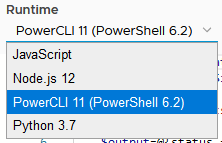
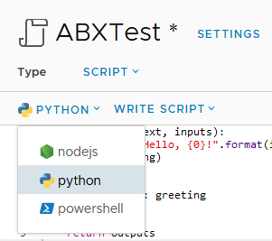
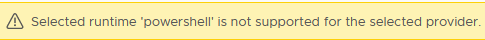

# vRA/vRO 8.1 Powershell – Peaking Under The Hood

One of the new features in vRealize Automation (vRA) and vRealize Orchestrator (vRO) 8.1 was support for PowerShell. This means there are now 4 scripting language options for Action Based Extensibility (ABX) in vRA and Workflows in vRO. In this post, I’m going to have a look at some of the technical details of the PowerShell implementation.

## Why We Should Care
There’s two items that come to mind about why we should care about the PowerShell implementation. The first relates to the history of PowerShell itself. Up until 2016, PowerShell had been based upon the full .NET framework. In that year, Microsoft announced PowerShell Core, which was based on .NET Core. This allowed PowerShell to be used on non-Windows platforms like Linux. This new “branch” of PowerShell had reduced functionality, with many modules no longer working. Eventually PowerShell Core was re-branded to a 6.x version line. In March 2020, PowerShell 7 was released. This version was an attempt to close the gap in functionality between the two branches.

The second item is how PowerShell was used in vRA/vRO 7.x. In 7.x it was possible to [add a PowerShell host](https://blog.jpboyce.org/2019/01/02/vrealize-orchestrator-powershell-hosts/). The PowerShell host was a Windows system configured to allow vRO to remote into it to execute commands. This created an incredible amount of flexibility because you could install any modules you liked on the host. On the down side, it added complexity (more moving parts to manage) and security issues (like ensuring the PowerShell Host had a network path to each target, and Kerberos double-hopping issues).

With this background in mind, it becomes relevant to figure out what implementation of PowerShell is used in vRA/vRO and other information about the implementation.
<!-- more -->
## vRealize Orchestrator Details
The first hint on what’s going on happens when adding a Scriptable Task to a vRO workflow and selecting the scripting language from a dropdown. As shown below, it lists a Powershell version of 6.2, and a reference to PowerCLI 11.


Some of the items I was curious about were things like environment variables, what commands were availble and what modules were installed.

### Environment Values
The first item I checked was the values exposed in the environment variables. On a Windows machine, this list can be quite long. In vRO, it seems to be a very short list.

A few items jump out in regards to this. The 10.244 IP range referenced a few times is not the IP range that the main vRO appliance is running on. Also, the HOSTNAME value is an exact match for the name of one of the kubernetes pods running on the appliance. When running the command to get all the services running in Kubernetes, the one running on 10.244.4.51 is a proxy service. The various paths referenced in the environment values don’t exist in the main appliance’s file system, but presumably exist inside the container.

### PSVersionTable
The variable $PSVersionTable contains information about the Powershell version that’s running, as well as the platform. The results of outputting this variable are below:

Based on the information, we can see confirmation of the exact version of Powershell in use, as well as the OS/platform it’s running on.

### Modules
With the reference to PowerCLI, I was curious as to what modules were available in the vRO Powershell implementation. Unfortunately, when using the cmdlet Get-Module -ListAvailable, it would throw an error. Using Get-Module -All would work, but only listed 2 modules.

Taking a different approach, I decided to extract the value for PSModulePath and see what was in each. While there were 4 paths defined in the variable, only 2 returned content.

|/root/.local/share/powershell/Modules	|/usr/lib/powershell/Modules|
|---|---|
|PowerNSX|Microsoft.PowerShell.Host |
|PowervRA|Microsoft.PowerShell.Management |
|VMware.DeployAutomation|Microsoft.PowerShell.Security |
|VMware.ImageBuilder|Microsoft.PowerShell.Utility |
|VMware.PowerCLI|PackageManagement |
|VMware.Vim|PowerShellGet |
|VMware.VimAutomation.Cis.Core|PSDesiredStateConfiguration |
|VMware.VimAutomation.Cloud|PSReadLine |
|VMware.VimAutomation.Common| |
|VMware.VimAutomation.Core| |
|VMware.VimAutomation.Hcx| |
|VMware.VimAutomation.HorizonView| |
|VMware.VimAutomation.License| |
|VMware.VimAutomation.Nsxt| |
|VMware.VimAutomation.Sdk| |
|VMware.VimAutomation.Security| |
|VMware.VimAutomation.Srm| |
|VMware.VimAutomation.Storage| |
|VMware.VimAutomation.StorageUtility| |
|VMware.VimAutomation.Vds| |
|VMware.VimAutomation.Vmc| |
|VMware.VimAutomation.vROps| |
|VMware.VumAutomation	| |


## vRealize Automation Details
PowerShell is exposed in vRealize Automation 8.1 as one of the language options in Active Based Extensibility (ABX).


One of the settings available in the scripting window is the “FaaS provider”. Because AWS had recently added PowerShell as an option for their Lambda service, I had assumed that PowerShell was added to vRA 8.1 for similar reasons. Upon selecting AWS or Azure as the provider, an error is displayed. Using “Auto Select” or “On Prem” doesn’t display the error.



### Environment Values
The environment values available in a PowerShell-based ABX are more in number than those in a vRO workflow.

Like vRO, ABX PowerShell runs in a Kubernetes container. These containers appear to live in the openfaas-fn name space.
```
root@svr83 [ ~ ]# kubectl -n openfaas-fn get pods
NAME                                                              READY   STATUS    RESTARTS   AGE
abx-11609d65654e7549026967a20f059e8bb48a19d6cf446b5c87b66af5pbw   1/1     Running   0          9m34s
abx-54453c405ffb2f70833f631eb1a375da5cf00b453ecc1e0bbb0b4bv5vrv   1/1     Running   0          57d
abx-563a5edfc2986031e89849dd43fbbcc3534072d481da7b176af1dbhwlp6   1/1     Running   0          63d
abx-f22a9a49ae8db57a20427d590f6da862556a744db95b23869db8bdnvc2j   1/1     Running   0          14m
```
### PSVersionTable
The PSVersionTable values exposed in a PowerShell ABX appear to be exactly the same as in a vRO workflow.

### Modules
There is also 4 module paths exposed in vRA ABX, although only 3 are accessible. The modules in those directories are shown below.

|/root/.local/share/powershell/Modules	|/usr/lib/powershell/Modules	|/function|
|---|---|---|
|PowerNSX|apply-hardening |abx_wrapper.ps1 |
|PowervRA|Backup-VCSA |client_main.psm1 |
|VMware.DeployAutomation|ContentLibrary | |
|VMware.ImageBuilder|CrossvCentervmotion | |
|VMware.PowerCLI|DatastoreFunctions | |
|VMware.Vim|Get-NewAndRemovedVMs | |
|VMware.VimAutomation.Cis.Core|Get-NICDetails | |
|VMware.VimAutomation.Cloud|Get-VMmaxIOPS | |
|VMware.VimAutomation.Common|InstantClone | |
|VMware.VimAutomation.Core|Konfig-ESXi | |
|VMware.VimAutomation.Hcx|Microsoft.PowerShell.Host | |
|VMware.VimAutomation.HorizonView|Microsoft.PowerShell.Management | |
|VMware.VimAutomation.License|Microsoft.PowerShell.Security | |
|VMware.VimAutomation.Nsxt|Microsoft.PowerShell.Utility | |
|VMware.VimAutomation.Sdk|NSXT | |
|VMware.VimAutomation.Security|PackageManagement | |
|VMware.VimAutomation.Srm|PerVMEVC | |
|VMware.VimAutomation.Storage|PowerShellGet | |
|VMware.VimAutomation.StorageUtility|ProactiveHA | |
|VMware.VimAutomation.Vds|PSDesiredStateConfiguration | |
|VMware.VimAutomation.Vmc|PSReadLine | |
|VMware.VimAutomation.vROps|PSvLIMessage | |
|VMware.VumAutomation	|rCisTag | |
| |Recommend-Sizing| |
| |Set-CBT| |
| |SRM| |
| |Start-UNMAP| |
| |Validate-ESXiPackages| |
| |VAMI| |
| |vCenter.Alarms| |
| |vCenterCEIP| |
| |vCenterManualMigration| |
| |VCHA| |
| |Vi-Module| |
| |VMCPFunctions| |
| |VMFSIncrease| |
| |VMToolsManagement| |
| |VMware-vCD-Module| |
| |VMware-vCD-TenantReport| |
| |VMware.Community.CISTag| |
| |VMware.CSP| |
| |VMware.DRaaS| |
| |VMware.HCX| |
| |VMware.Hosted| |
| |VMware.Hv.Helper| |
| |VMware.VCGChecker| |
| |VMware.VMC| |
| |VMware.VMC.NSXT| |
| |VMware.VMEncryption| |
| |VMware.VsanEncryption| |
| |vSphere_Hardening_Assess_VM_v1a	| |

While the first folder seems to have the same modules as in vRO, the second folder has a greatly expanded set of modules available.

## Final Thoughts
As shown by the information about the PowerShell implementation, VMware didn’t use the latest major release of PowerShell. We do get the PowerCLI modules out of the box, which is a plus. One thing I would like to investigate in the future is importing extra modules.

One thing I did notice is it seems every time a PowerShell ABX is run, the associated kubernetes pod is restarted or re-initiated. This seems to give the feel of these executing slower than a vRO Workflow. Depending on what the ABX is doing, this may or not not be an important thing.

Depending on what task you’re trying to achieve, the ability to use PowerShell directly in vRA or vRO may allow you to avoid the complexity and trouble involved in setting up and maintaining a separate PowerShell Host system. This resulting reduction in complexity means your overall systems doing these tasks would be more reliable, which is a good outcome.
