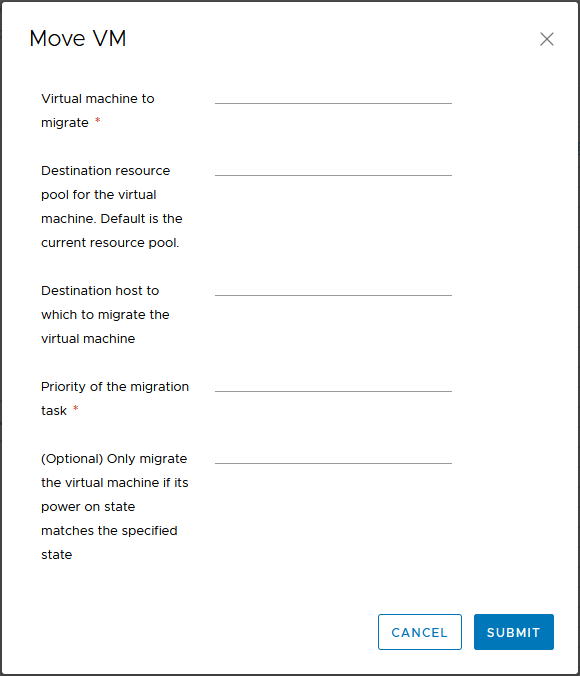

# vRealize Automation 8.2 Released

VMware have released the 8.2 update for their vRealize Automation product. As the release notes start, this update brings the 8.x product closer to the capabilities we had in 7.x and adds some new things. The major changes include:

* A new version of the REST API
* Blueprints are now called “Cloud Templates
* More Terraform functionality
* Multi-tenancy support
* Custom Roles Based Access Control (RBAC)
* More XAAS Functionality
* More NSX feature support

In this post, I’ll have a look at some of these updates that are relevant to my background and prior use of vRealize Automation.
<!-- more -->
## VMware Cloud Templates
The first item is the change from Blueprints to “Cloud Templates”. VMware have a [blog post](https://blogs.vmware.com/management/2020/08/vmware-cloud-templates.html) that talks about this change. At this stage, it appears to be simply a label change, as there’s no other real changes I could see in terms of functionality. However it may indicate a shift in direction going forward.

## XAAS Custom Day 2 Changes
In 8.2, it’s now possible to have three types of binding for Day 2 actions. Originally there was only one binding type, “in request”. The other two options are “with binding action” and “direct”. “With binding action” is available when inputs types are of a certain sort, such as VC:VirtualMachine. Direct is available for input properties that are primitive data types.

What this can result in is a much simplified request form that is presented to the user when performing the action. The screenshot below shows the inputs for a vMotion action, using the “in request” bindings. This effectively simulates the 8.1 behaviour. The first field is obviously redundant because the action should know what Virtual Machine is being migrated.

When the binding is updated to “with binding action”, the first field. Behind the scenes, the mapping between the Cloud_vSphere_Machine object in vRA and the vCenter VM object is happening. This is a nice change that could help clean up the look of these Day 2 actions.

## Approval Policies
Approval Policies has seen an increased set of functionality in 8.2 They can be applied to all catalog items including vRealize Orchestrator workflows and ABX actions. Since these are typically used for Day 2 Actions, you can now put appropriate approvals in place for these Actions.

The list of criteria for applying an Approval Policy has been expanded and can be applied to pre-provisioning of blueprints. This could allow the creation of policies that act as safeguards to requests that may be out of normal scope.

Lastly, approvers will see all the input data of the request, when reviewing the approval. This will allow them to make a more informed decision when reviewing approval requests.

## Summary
Overall this seems like a good release from VMware. Two areas of the 7.x product that I always liked was the Day 2 Actions and the XAAS functionality. Both of these went hand in hand to extend the product beyond “Day 1 provision” tasks and just doing things with Virtual Machines. It meant that many things could be automated and presented as a catalog item (some of which I’ve previously written about). In 8.0, we lost a lot of that capability, but we’re getting it back.

Similarly, Approval Policies is something that had been brought up in a few organisations I’ve worked in. The limited functionality of the policies in 8.0 meant that those organisations couldn’t really consider that version of vRA. With 8.2, I think Approval Policies are at a point where those organisations could consider it again.  
