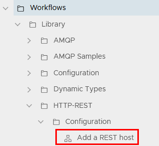
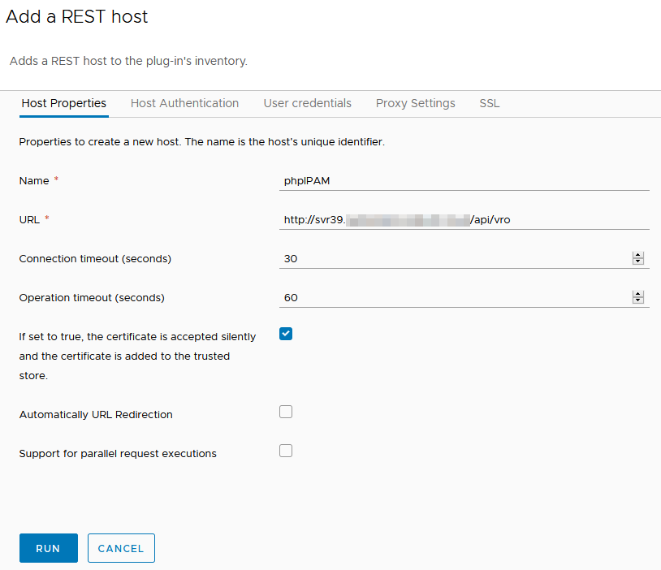
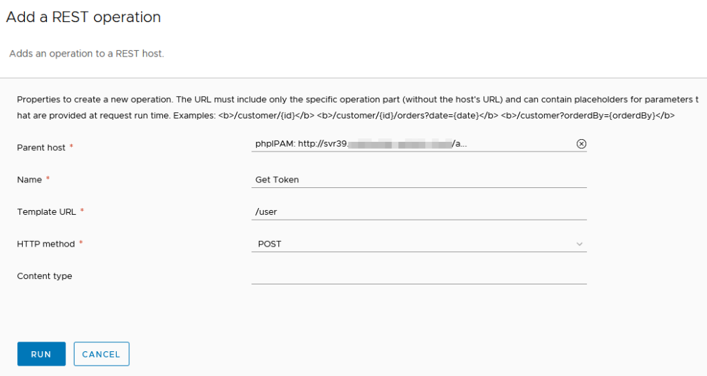
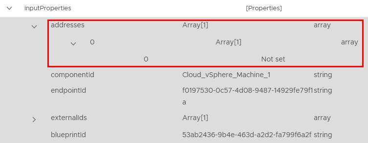

# vRA 8 and phpIPAM
IP address management (IPAM) is one of those areas that suddenly becomes important when infrastructure automation is implemented. In the past, an IT team may have used an Excel spreadsheet for manually tracking address assignments. When the number of servers being provisioned increases due to automation, this manual approach isn’t viable anymore. An alternative could be to just allow dynamic addressing using DHCP but that raises its own issues (for example, some server-based applications insist on a static address).

There’s a lot of products out there that do IPAM. I’ve previously used the product from SolarWinds, in my home lab I use phpIPAM. In both situations, the use of the IPAM product was similar – a vRealize Orchestrator (vRO) Workflow would request an IP address during the provisioning of a virtual machine. A matching Workflow would execute when the virtual machine was decommissioned, signalling the IPAM system to release the IP address for reuse.

As part of the process in moving my home lab setup from vRA 7.x to 8.x, this is one of the functions I’d like to carry across.
<!-- more -->
## Setup a REST Host
In my vRA 7.x implementation, I leveraged the REST API functionality in phpIPAM. My plan is to do the same for version 8. The first step in this is to add a REST host entry in vRealize Orchestrator. Under Inventory, you will find the different type of hosts that vRO can use in Workflows and Actions. To add the REST Host, we need to run the Workflow under Workflows > Library > HTTP-REST > Configuration.

Select the Workflow and click on “Run” to start it. The Workflow will ask for some details about the host, like a URL and login details. Since I am already using the REST API in phpIPAM, I already have an account I can use for this.

Once all the details are entered, click on the Run button. Assuming everything is successful, the Workflow will finish with a Completed status and an entry for it will appear under the Inventory.

My preferred approach for using REST APIs in vRO is to use Operations, which sit under the Host object. This allows me to keep my code minimal and control what values can be submitted to the API. Effectively only two Operations are needed – one to get the next available IP address and one to release an IP address in use. Depending on how the REST API of your IPAM system works, you may also need a Workflow or Action for handling authentication/getting a token. The Workflow for this is under the same area as the one to add the host and is called “Add a REST Operation”.

Once all the Workflows are done, I’ve created an entry for the API username and password in Configurations so I can refer to them in Workflows without having to hardcode these values or expose the password.

## Creating The Workflows
The next task is to create the Workflows and Actions. phpIPAM uses a token-based approach, so the first item to setup will be that, since the others rely on it. In my old vRA 7.x setup, I made this an Action. The Action uses the “Login” REST Operation, username and password as Inputs and returns the token as a String. Once that is working, I can move over the other Workflows, such as the reservation and release Workflows. A high level view of how these workflows link together is shown below.

When the Workflows for the IP management side of things are done, I need Workflows relating to the Lifecycle of the Virtual Machine managed by vRA. In vRA 7.x, I had a Workflow that ran during the BuildingMachine part of the Lifecycle, which updated the properties of the Virtual Machine with the new address. In vRA 8, there are more Lifecycles.

The ability to set the IP address relies on an Extensibility Subscription existing, which creates the link between what vRO Workflow should be run and under what conditions (ie. at a particular lifecycle stage). This link also facilitates the passing of information (a payload) about the deployment to the vRO Workflow that can be leveraged. This data is in a defined format called a schema and I already know the schema in vRA 8 is different from 7. So the first thing is to create a generic “payload parsing” Workflow that simply outputs the payload. As shown below, it seems one of the fields is an obvious choice, called “addresses”.

In vRA/vRO 7, a Properties object would be outputted at the end of the Workflow, which could contain a number of values relating to the payload. In vRA/vRO 8, it appears that we use outputs relating to the items under the payload. So to set the IP address, we would have to have an output called “addresses” of the appropriate data type.

An additional consideration is not all the fields can be altered, nor are the fields consistent across Lifecycle Event Topics. For example, the Compute Provision event has the field for IP addresses, but it’s read-only. The Network Configure event also has a field for IP Addresses, but it can be altered. However it’s missing the ResourceNames field, which could be useful. What all this means is it may not be a simple task of lift-and-shift for our existing vRA 7.x Workflows into vRA 8.

If I want the entry in phpIPAM to include the hostname of the Virtual Machine being provisioned, I need to split the operation into two steps at different Lifecycle stages. Fortunately, the release workflow is much easier to get working.

## Challenges, Acknowledgements and Summary
As suggested above, the Lifecycle phases in vRA 8 aren’t a one for one mapping to vRA 7 and have different value behaviours depending on the phase. This means one can’t simply pull Workflows into vRA 8 that are linked to Lifecycles. There needs to be an aspect of review and potentially rewriting the Workflows.

I also had some self inflicted problems. I was originally using a template with cloud-init in it and this seemed to interfere with the IP address assignment. Once I created a new template that didn’t include that, the address assignment worked.

I also ran into issues where the documentation wasn’t very clear on how to actually update values. Fortunately I was able to figure it out with some of these resources:

* [vRealize Automation - Customizing IP Assignments with vRO by vNuggets](https://vnuggets.com/2020/01/24/vrealize-automation-customizing-ip-assignments-with-vro/) – This was my starting point in getting all this working
* [Updating Custom Properties in a vRealize Automation 8 Deployment with a vRealize Orchestrator Workflow by VMwarebits](https://www.vmwarebits.com/content/updating-custom-properties-vrealize-automation-8-deployment-vrealize-orchestrator-workflow) – Although I didn’t use it this time, it has a good reference on how to update custom properties in a vRA 8 deployment
* [vRA with Cloud-init and Static Networking by vNuggets](https://vnuggets.com/2020/01/29/vra-with-cloud-init-and-static-networking/) – This was the article that made me relase Cloud-init might be causing problems for me and helped me get around that issue
* [vRA 8 – My First Extensibility Workflow – vRO Edition by vBombarded](https://vbombarded.wordpress.com/2019/11/14/my-first-vrealize-automation-8-extensibility-workflow-vrealize-orchestrator-edition/) – This post had some good general information of Extensibility workflows
* Lastly, the [vRA 8 Extensibility Samples](https://github.com/vmwarecode/vRealize-Automation-8.x-Extensibility-Migration-Guide-Samples---Preview) has a good template workflow that outputs all the values available during a Lifecycle phase. This can help figure out what values are available and can be updated

I plan on continuing to work on these Workflows and refining them, hopefully to a point where I’m comfortable releasing them.
