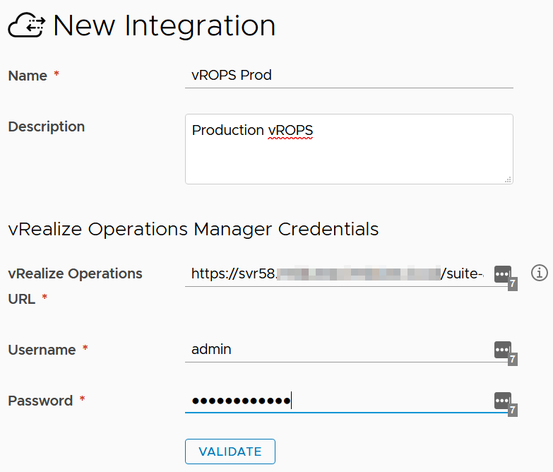
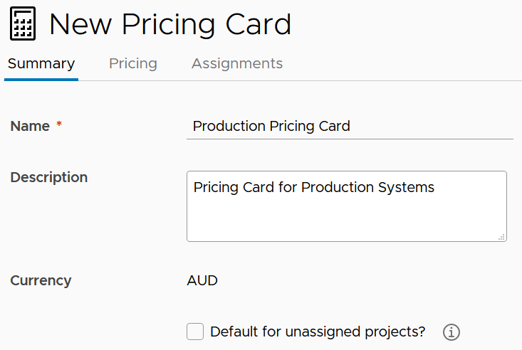
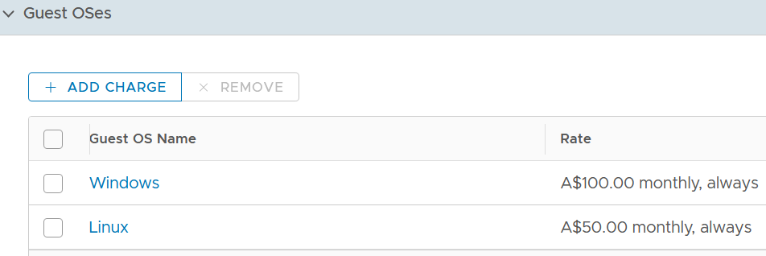
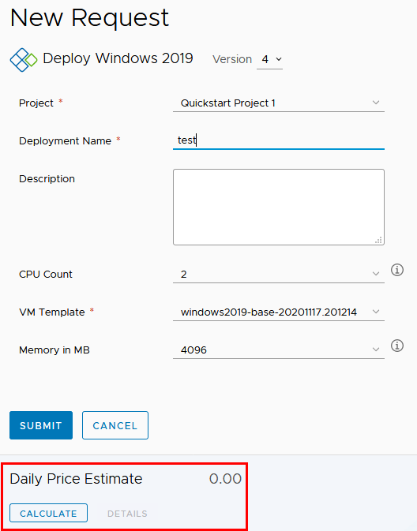
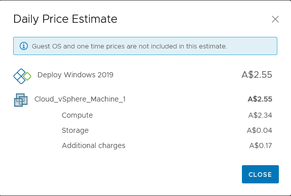

# vRealize Automation 8 Pricing Cards
Pricing cards allows your vRA consumers make informed decisions on the costs of infrastructure they provision. The functionality is similar to what was available when vRealize Cloud for Business was integrated with vRA 7.

Enabling Pricing Cards
To enable Pricing Cards, a few prerequisites need to be undertaken. Firstly, the vRealize Operations appliance needs to be configured to use the same time zone as the vRealize Automation appliance. By default, both appliances will use UTC as their timezone setting. So as long as you haven’t changed anything on either, this is just a verification step. You also need to configure a currency in vROPS.
<!-- more -->
The next step is to add a vROPS endpoint. To do this, login to vRA 8 and go to Infrastructure > Connections > Integrations > Add Integration. From the list of Integration Types presented, select vRealize Operations Manager. Fill in the form with the appropriate details and click Validate.

You will be prompted to accept the certificate. Review and click Accept if it’s ok. The lower half of the form should update with details of vCenter servers being managed by the vROPS server. If all is good, click the Add button.

## Creating a Pricing Card
To create a Pricing Card, navigate to Infrastructure > Configure > Pricing Cards. By adding the vROPS endpoint, there should be a default card already created. Click on the New Pricing Card button. In the form that loads, start filling out details, like the name and description. As shown in the screenshot below, the currency has defaulted to Australian dollars, which is the currency that is configured in my vROPS instance.

To get more granular control over the pricing details, click on the Pricing tab. In this area, the Basic Charges can be switched between a cost ratio or a set of flat rates. Flat rates have a lot of flexibility on when to charge. For example, since memory is only consumed when a VM is on, you might set it to only charge for that when the VM is on. The Guest OSes section allows you to add a charge per OS, to cover licensing or support. In the example below are ongoing monthly charges for maintaining the OS.

Charges for individual tags can be applied. There’s a number of use cases for this and is limited by the effort you wish to put into your pricing model. Custom Properties is another way of doing bespoke style charges, based on properties of a virtual machine. Lastly are overall charges, with one time costs and recurring. Once all the details have been specified, Assignments button and assign to the appropriate projects. Lastly, click on the Create button.

## Using Pricing Cards
The functionality of Pricing Cards is exposed in a few places. Firstly, when requesting a new deployment, a new area will appear in the request form relating to a Daily Pricing Estimate.

Clicking on the Calculate button will cause the system to think a bit while it works out the costs. Once done, it will update the Daily Estimate and the Details link will become active. Clicking on that link will give a breakdown of where the costs are coming from.

As noted in the screenshot, Guest OS and one time prices aren’t included and I think this is a bad thing. These cost items can often be significant items that need to be paid up front (like OS or software licensing). This creates a lack of visibility at provisioning time.

Another area where pricing card functionality is exposed is after a deployment has been running for a period of time.

## Conclusion
The inclusion of Pricing Cards is a useful feature, especially if you intend to broaden your base of consumers of vRA services. Many organisations that I’ve worked at that would have vRA in place also already have vROPS, so the pairing of them to give this functionality removes the need for additional systems.
