# VMware Horizon 8/2012 – Install Walkthrough & First Impressions
This month VMware announced the latest release of their desktop virtualisation product, Horizon. It’s been a while since I’ve gotten really into this product so I decided to have a look at what’s changed.
<!-- more -->
## Major Changes & Architecture
The most prominent change that I saw from the release notes was the retirement of the View Composer component. The Composer was a system that managed linked clones. The Connection Server remains and unfortunately it’s still a Windows server. Hopefully at some point, a virtual appliance option becomes available.

A number of recent Linux releases have been added as supported operating systems including RHEL/CentOS 8.3 and Ubuntu 20.04. In the content of when I last used Horizon what’s changed, the architectural diagram for v8 is a good starting point.
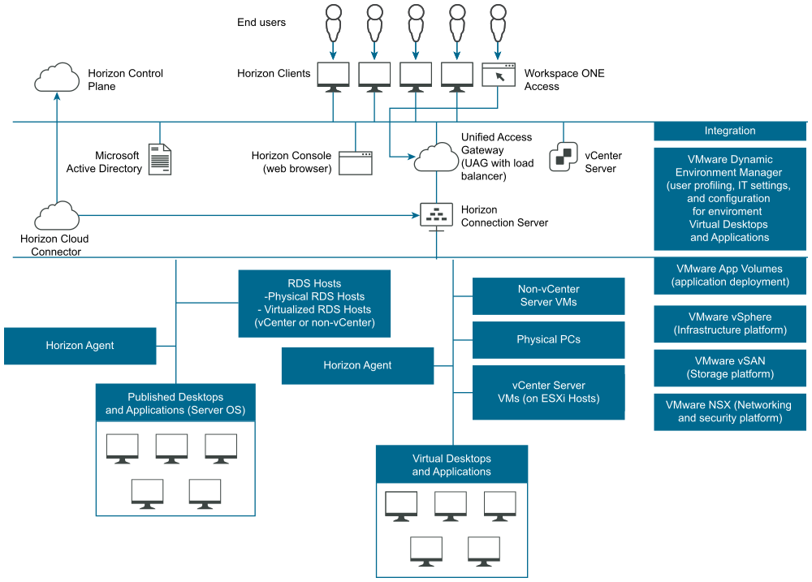

When I last used Horizon, it was only really available to manage virtual desktops on VMware platforms, with some support for RDS. Like some of VMware’s other products (vRealize Automation being a good example), Horizon has branched out to support technologies both on-prem and in the cloud, as well as those by other vendors.

## Setup of Horizon 8
Due to the simplified architecture, the setup process is a bit easier than in the past. First are some pre-requisite tasks in Active Directory. One task is creating an Organisational Unit (OU) for the remote desktops, and a group for the users. Next is two service accounts, one for accessing vCenter and another for handling the instant clone operations.

The vCenter service account’s specific rights depend on whether you want to use instant clones or not. In my setup, I decided to try out instant clones and have the account setup with the permissions to do so. The account for instant clone operations needs rights on the container that will hold the instant clone computer accounts.

With those items done, the installer can be run on the server. The first choice to make during the installation is what type of instance to install. Because I want to do a standard installation and it’s the first server, I picked the Standard Server option and left the other values at their defaults.

Next we are prompted for a data recovery password. The next screen prompts to automatically configure the Windows firewall to allow the required ports.

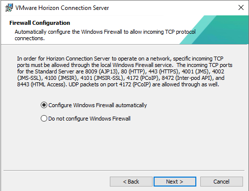
The next screen will prompt you for the initial Horizon administrators. In my case, it defaulted to the user acount I was logged in as. I changed this to a group.

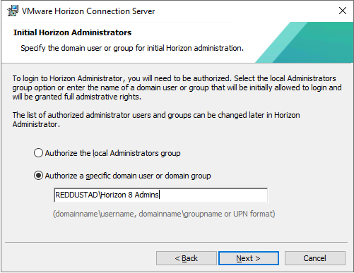

Next, we are prompted to join the Customer Experience Improvement Program. Lastly we are prompted to select where the Connection Server is being deployed to. As shown in the screenshot, there’s a number of cloud options.

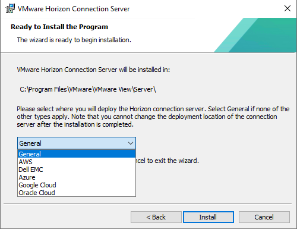
Once the installation is complete, we can see a number of new services have appeared.

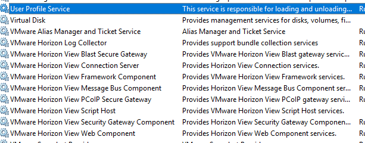
Like many systems today, Horizon uses certificates as part of its activities and there’s a section on configuring it with properly issued certificates. For my home lab, I’ve decided to skip it. This means the next step is configuration.

## Configuration of Horizon 8
The Horizon Console is the web-based interface for managing Horizon and is used to perform the first time configuration.

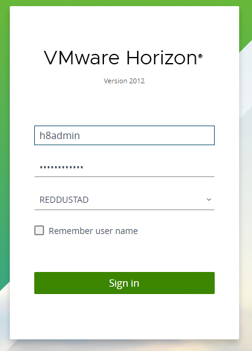
The first item we are prompted to deal with is adding a license key.

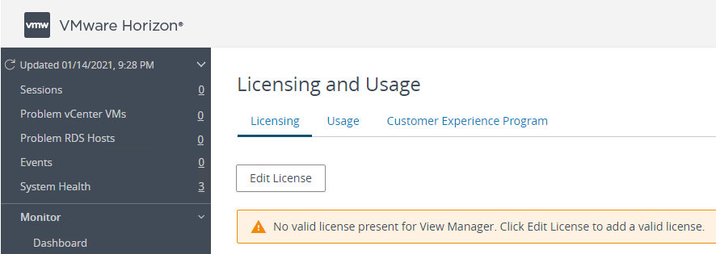
Once the license has been successfully applied, the next step is to add a vCenter server. The vCenter Information page of the Add Server wizard has the sort of values we would expect, such as the server address, user account, etc.

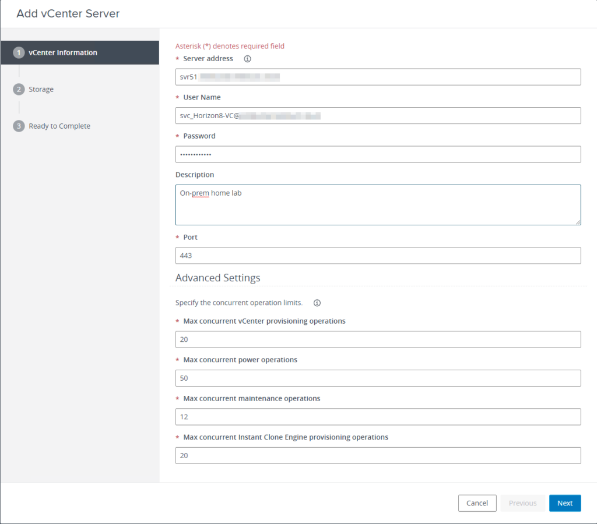
The next section has Storage settings. I left these values at their defaults and continued.

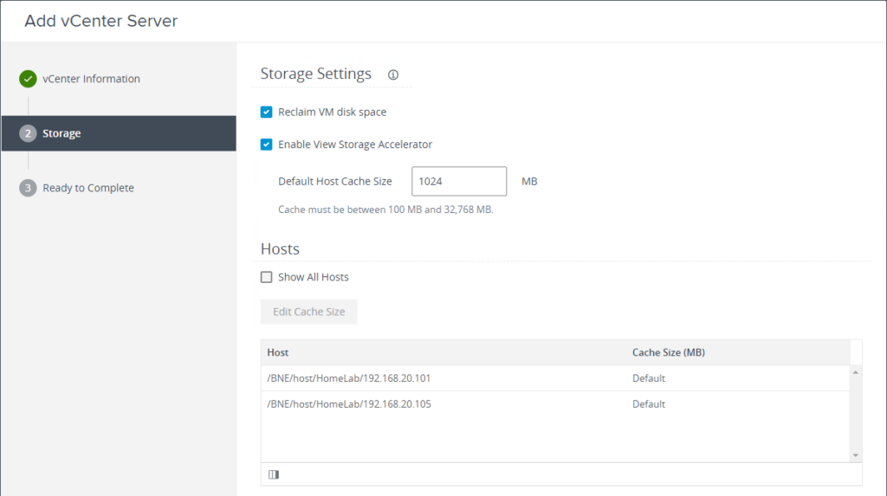
After this, we need to add the Instant Clone operations account that was created earlier. Following this, the settings for the Connection Server should be reviewed. By default, the PCoIP Secure Gateway option isn’t enabled. Additionally, SAML isn’t configured out of the box, so if your environment requires it, this is where you would configure it. Like past versions of Horizon, there is an Event Database that can be configured. Both SQL Server and Oracle are supported. You can also pick the option of sending syslog data to a syslog server.

## Creating a Desktop Pool
At this point, we can start considering the creation of a Desktop Pool. The first step for this is creating a “template” Virtual Machine that will serve as the basis for the machines in the pool. In general, you want to configure this template to run lean, which means disabling or turning down aspects of the operating system that may impact performance. VMware have a detailed guide on how to create an optimised image at https://techzone.vmware.com/creating-optimized-windows-image-vmware-horizon-virtual-desktop

As mentioned in the guide, one of the steps is to install the Horizon Agent on the template VM. The Agent installer will prompt for things like the network protocol (IPv4 or v6). The features that are installed may need some consideration, depending on your use case. A number of redirection components are not enabled by default.

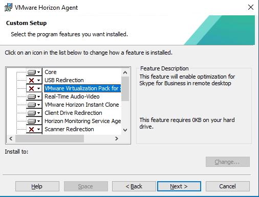
Once the installation is completed, the Virtual Machine will need to be rebooted. There are some optional components that can be done. The final step in preparing the template involves running the VMware OS Optimisation Tool on it. This tool automates the process to applying settings to the operating system, to help optimise it. The process of using the tool involves performing an analysis of the system with one of the defined templates. If you’re happy with what will be changed, you can then apply the settings defined in the template.

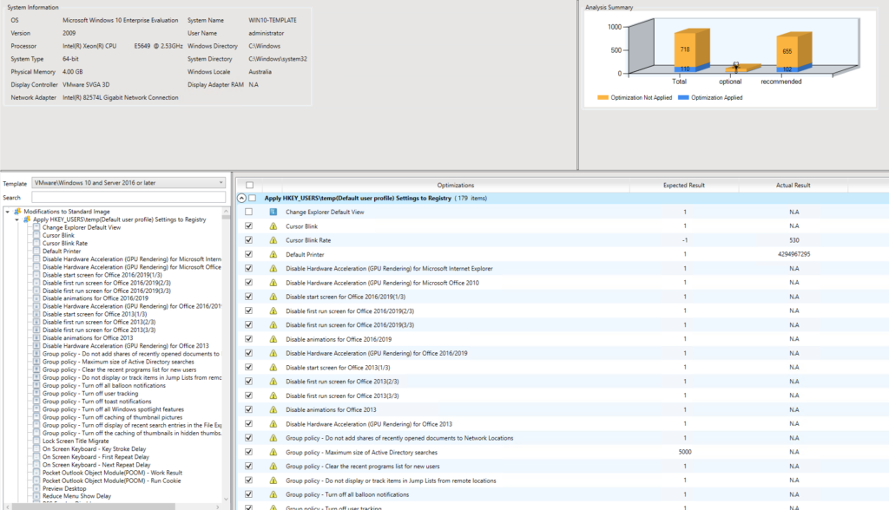
After optimising the OS, the Optimisation Tool can also be used to finalise the OS. After some more settings on the VM itself and a snapshot, we can move on to creating the desktop pool inside Horizon. This is done via a wizard style interface which asks a lot of the same questions as prior versions did. At the end, we get a nice summary screen.

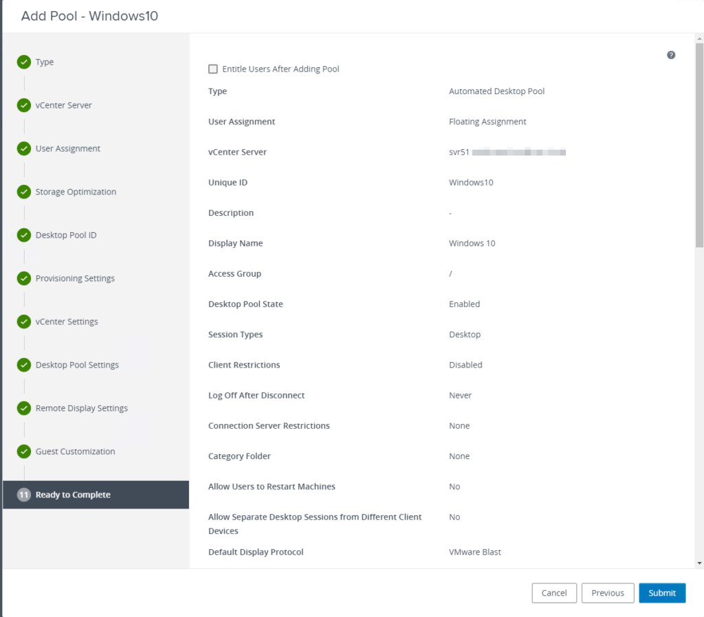
Once the pool is created, Horizon will start provisioning VMs (if you configured it to do so). Progress can be reviewed in the Pool details.

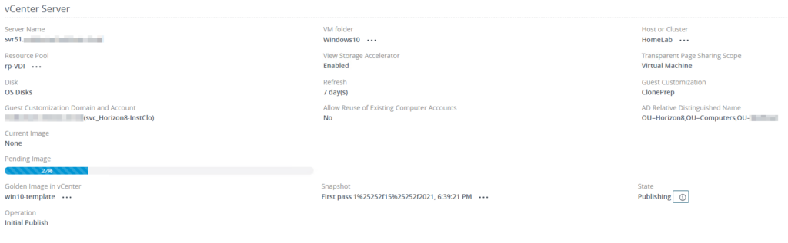
Unfortunately for me, the storage in my home lab isn’t that fast, so the Instant Clones weren’t very instant. It took about 20 minutes to provision a pool of 2 VDI instances.

## Horizon Client Experience
Horizon 8 has a slick HTML 5 interface, which is access via a landing page. This landing page also presents an option to download the Horizon Client.

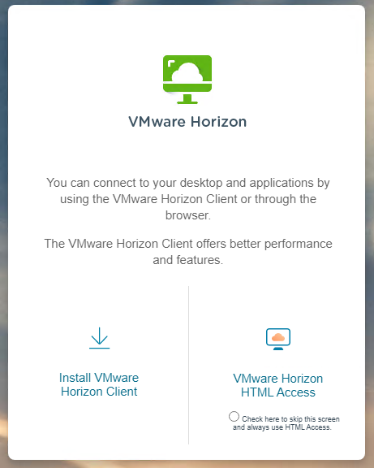
Upon selecting the HTML option, a logon prompt appears, asking for a username and password. Upon logging in, the user sees all the items they’re entitled to. In my case, it’s just the singular Windows 10 Desktop Pool. There’s some UI options available, such as being able to “favorite” an item and filter to show just those ones.

The actual login experience was very quick, much faster than I’d previously experienced with Horizon. Upon logging in I was presented with a standard Windows 10 system, with the token applications I had installed.

## Creating an Application Pool
The “other half” of Horizon’s functioning is publishing applications. This is done by creating an Application Pool. Before the Application Pool can be created, a Desktop Pool with a session of “Applications” or “Desktop and Applications” needs to exist. When starting the wizard to create the Application Pool, you will select the correct Desktop Pool. After a few moments, all the applications on that Desktop Pool will be listed and you can select which ones to publish.

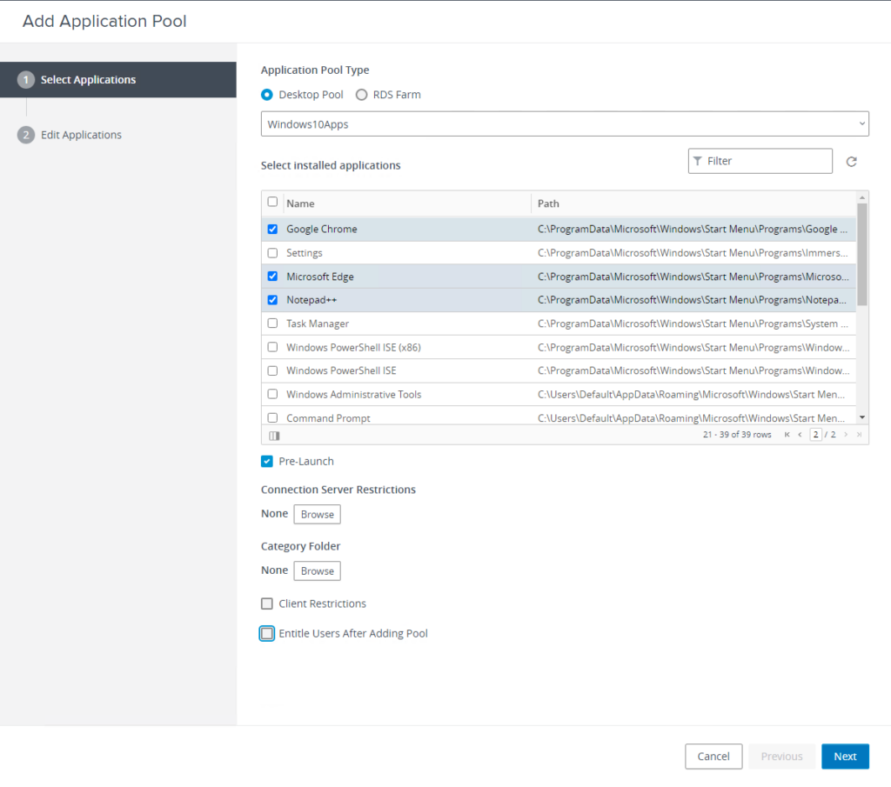
Once the Application Pool is created, Entitlements can be applied to grant access. One nice feature in the settings is “Anti-affinity”. This allows you to define a pattern to keep applications on separate RDS hosts, effectively a form of load balancing. If you have an application that’s known to have a heavy performance impact, this setting could be useful. Upon logging in, an Entitled user will see a batch of new icons for the applications they can run.

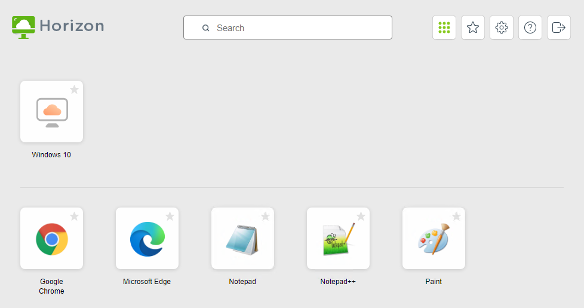

## Other Features and Items of Note
One thing I did like seeing referenced in the documentation numerous times was “silent installation”. In my past experience, the process of creating or updating a golden image for Horizon was a mostly manual task. The inclusion of silent installation options allows some scope for automation.

Security also seems to be taken seriously with this release. Out of the box, this version of Horizon supports TLS 1.1 and 1.2. Older protocols and security cyphers are disabled, which is very helpful if you’re working in an environment with security-related compliance.

Horizon has a plugin for vRealize Orchestrator, which enables Orchestrator workflows for common Horizon tasks. These workflows can then be published to vRealize Automation for broader consumption.

## Summary
Horizon has clearly matured and improved a lot over the years. The simplified architecture via the removal of the Composer is good, but I had hoped for an appliance version of the Connection server. The management overhead for an appliance is less than a Windows-based server.

Part of me also wants to see Horizon move into a similar direction that vRealize Automation has – in its latest iteration, vRA is almost a cloud broker of sorts, allowing you to provision on all major cloud platforms. Being able to do the same thing with Horizon (ie. provision/manage on AWS Workspaces or Azure’s Windows Virtual Desktops) would make for a very interesting product.
