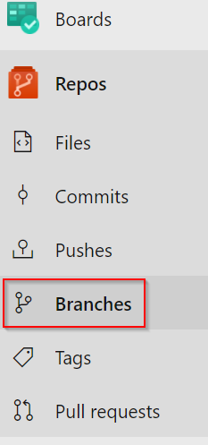
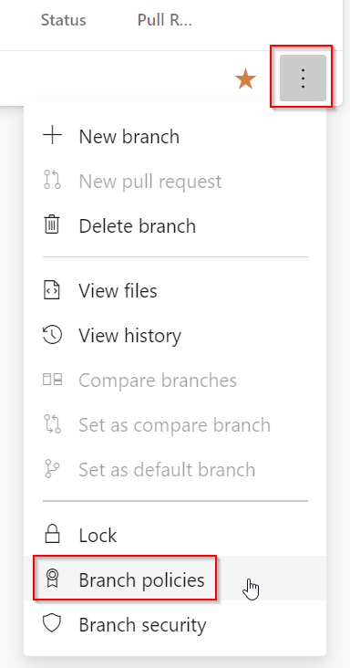
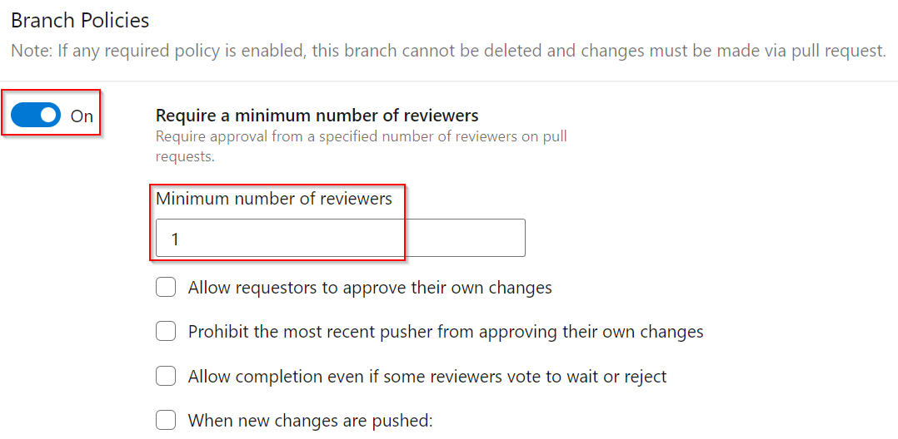
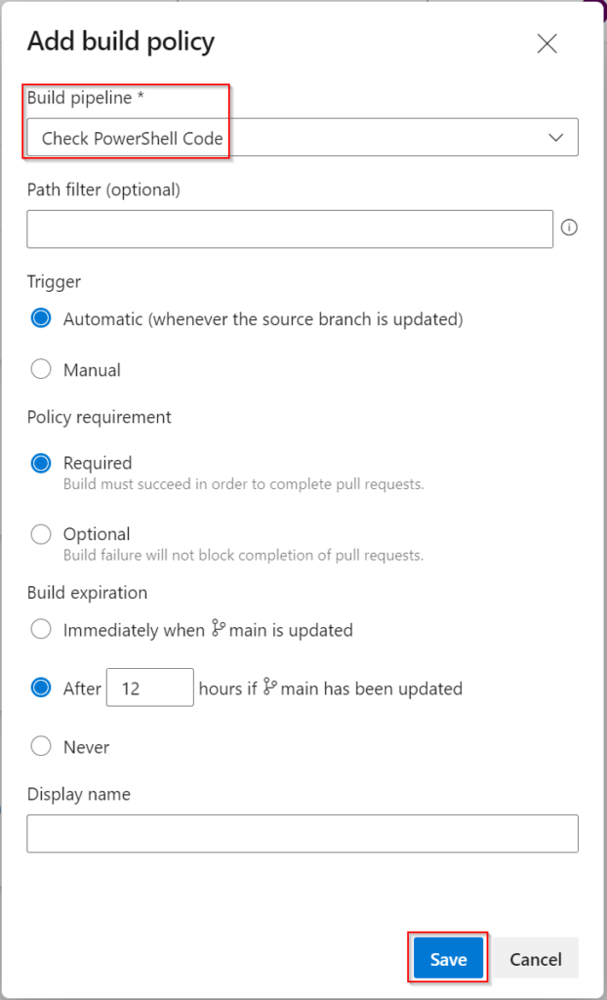
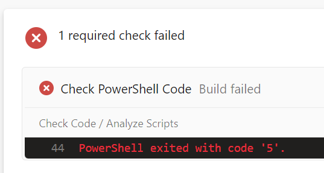
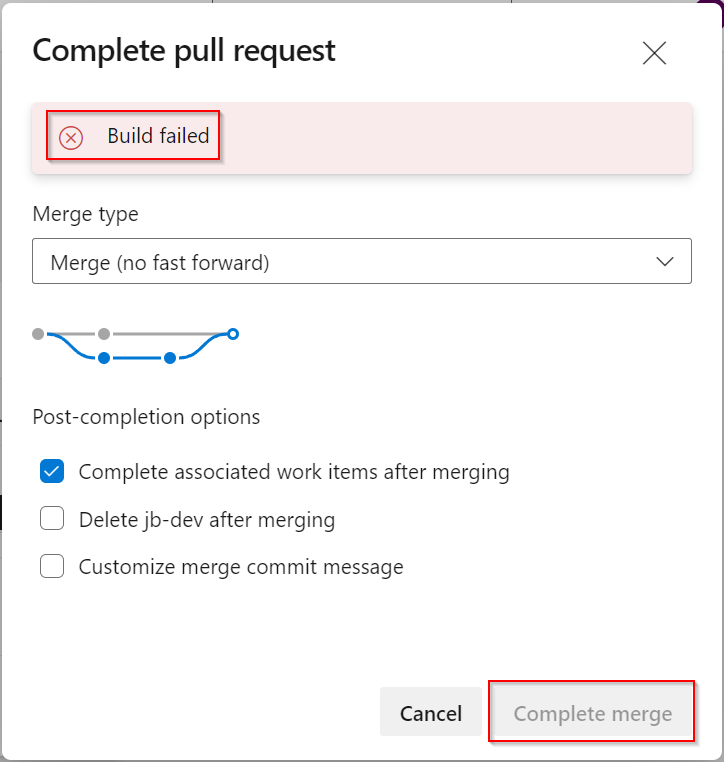
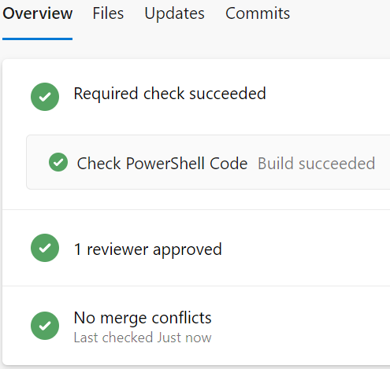

# PowerShell Quality of Life Improvements – Code Testing
PowerShell has been around for 15 years now. One of the changes that has happened in the IT industry in that time is the rise of DevOps, and the associated tools and technology with it. If we consider the process of creating and consuming PowerShell scripts, it can be applied to the major stages of software development – test, build, release. By using the methods associated with this, we can look at improving the quality of PowerShell code we deliver.

## Why Do Code Testing?
Code testing can cover a broad spectrum of activities. At the most basic end is syntax checking or a “linter” to perform static code checking. At the complex end, there’s things like unit tests. For the sake of this example, I’ll be using a “linter”, the PS Script Analyzer. By using such a tool on our code, we can establish whether it meets minimum quality requirements. PS Script Analyzer comes with an array of built-in rules and can be extended with your own rules.

## Creating The Code Test Pipeline
The first step is to create a pipeline that will perform the code testing activities. In my case, I’m using Azure DevOps, but a similar approach can be used with Github. The pipeline itself is relatively simple, with two tasks. One will install the PS Script Analyzer module, as it’s not installed by default on Azure DevOps agents. The second task will execute the analysis process. The pipeline code is shown below:
<!-- more -->
``` yaml
name: 'Check PowerShell Code'

trigger:
  none

jobs:
  - job: 'CheckCode'
    displayName: 'Check Code'
    pool:
      vmImage: 'ubuntu-latest'
    steps:
      - task: PowerShell@2
        displayName: 'Install Script Analyzer'
        inputs:
          targetType: inline
          pwsh: true
          script: |
            Install-Module -Name 'PSScriptAnalyzer' -Scope 'CurrentUser' -Force
      - task: PowerShell@2
        displayName: 'Analyze Scripts'
        inputs:
          targetType: inline
          pwsh: true
          script: |
            Invoke-ScriptAnalyzer -Path $(Build.Repository.LocalPath) -Recurse -EnableExit
```            

The `Invoke-ScriptAnalyzer` command will use the checked out repository path as the starting point. The `-Recurse` switch will ensure it looks in all subdirectories for scripts. The `-EnableExit` which will return a numeric value based on the number of code errors found. This will cause the pipeline to register a positive outcome if no errors are found (an exit code of 0) and a negative outcome if one or more errors are found. Once the pipeline has been created, it can be used in a branch policy.

## Configuring The Branch Policy
You may already have a branch policy in place with some of the settings mentioned here. It’s common to have a branch policy on the main/master branch that requires peer review of code. This policy will add an extra tollgate that uses the pipeline created earlier. If you’re starting from scratch, the follow process is below:

|Step	|Screenshot/Script|
|---|---|
|Navigate to the Branches area of the Respository containing the PowerShell code| |
|Click on the 3 dots on the right side for the main change and select Branch Policies| |
|If you want peer review as part of the process, turn on the Require a minimum number of reviewers option and set an appropriate number of reviewers (1-2 is usually standard). Adjust the other settings as needed.| |
|Under the Build Validation heading, click the Plus button| |
|The Add Build Policy window will appear. Select the pipeline that was created earlier. The other options can be left as default. Click Save.| |

At this point, the Branch Policy will be enforced and the settings within will apply whenever you try to do a pull request. The code checking pipeline will automatically run as part of this process. The screenshot below is an example of the output from code with errors:



If the pipeline was set as a required item in the policy, it’s impossible to complete the pull request if there are errors, even if the peer review is passed. As shown in the screenshot below, the “Complete merge” button is greyed out.



If the code has no errors detected by the PS Script Analyzer, then everything will be green and the merge can be completed as per normal.



## Summary
By adding a pipeline and branch policy, we can easily start enforcing a minimum level of quality on PowerShell code. PS Script Analyzer is also avaiable within VS Code, so it can be leveraged while writing the code. It has a set of good default rules, including some related to security. The rules can be extended, as well as the pipeline to suit your needs.
