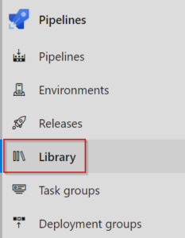
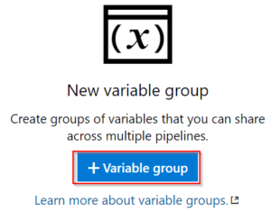
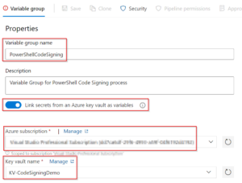
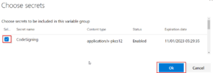
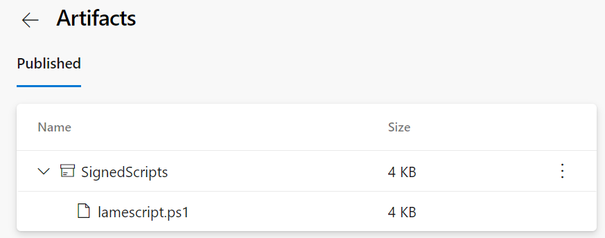

# PowerShell Quality of Life Improvements – Code Signing

PowerShell uses Execution Policies to control whether a script can be run or not. Some of these policies rely on scripts being digitally signed by a trusted publisher. By signing your scripts, you can look at implementing a more restrictive Execution Policy that increases security. The first step in this process is getting a certificate.

## Code Signing Certificate
To sign your scripts, you need a special type of certificate, one for code signing. If your scripts will be for internal use only and your organisation has an internal PKI, then using a code signing certificate from that PKI will be enough. If you are writing scripts or modules for consumption by a broader audience, then you’ll need a code signing certificate from a 3rd party Certificate Authority.
<!-- more -->
Once you have the certificate, you’ll want to get it into a secrets management system that your DevOps system can access securely. In my case, since I’m using Azure DevOps, that secrets sytem is Azure Key Vault. Once it’s in Key Vault, we can head back to DevOps to access it.
|Step|Screenshot/Script|
|---|---|
|Navigate to Azure Devops, then Pipelines > Library	| |
|Click on the button to create a new variable group	| |
|Give the group a name. Set the “Link secrets from an Azure key vault as variables” to enabled. Then enter the detauls of the key vault. You may need to authorise access for DevOps to the Azure Subscription and Key Vault. | |
|Under Variables, click the Add button. The certificate that was added to the Key Vault should be listed as an available secret. Select it and click the OK button.	| |
|Click the Save button to save the settings.| |

## Code Signing Pipeline
The Code Signing pipeline will perform 3 tasks – import the certificate into the key vault of the pipeline agent, sign Powershell scripts in the current folder and then publish the signed scripts. The pipeline code is below:

In this pipeline, a trigger has been configured on the main branch. Once a change has happened in main branch (such as a merge from a successful pull request), the code will be signed.

The pipeline gets all files named *.ps1 and checks subfolders as well. If your repository contains other PowerShell related assets like modules, then you’d have to include them in the filter too.

The result of the pipeline running is that artifacts are associated with the run and can be viewed.

## Summary
The code signing process is effectively the “build” process in the larger process for our scripts. We now have artifacts that are signed by a trusted authority. They are now ready to be deployed and used.
