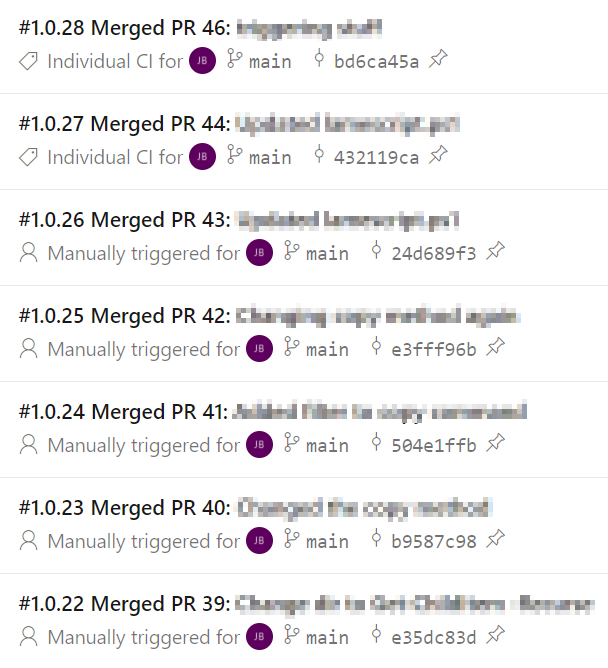

# PowerShell Quality of Life Improvements – Automatic Versioning
Once we start doing processes like putting PowerShell code into git repositories, signing it and effectively creating new versions of it, it becomes useful to be able to automatically manage the versioning of our scripts and modules. The version number acts as an easy visual indicator of whether the script is the latest or not.

## Introducing Token Replacement
Since the version number will change with each “build”, we will want to put in some sort of place holder value – a token. In my sample module, I change the version value to reference this token:

``` powershell
# Version number of this module.
ModuleVersion = '#{fullVersion}#'
```
<!-- more -->
In some environments, token replacement occurs quite late in the process (during the release). In the case of our PowerShell scripts and module, doing it this way would alter those files after they’ve been signed, invalidating them. To get around this, the token replacement needs to happen before the code signing. In my case, I added it as a step in the Code Signing Pipeline, right before the actual code signing:

Two new variables are declared at the start – the major and minor version. These are used to construct a semantic versioning format (major.minor.patch) and assigned to the variable fullVersion. The patch number will be incremented by one each time the pipeline is run. The computer version number is used to update the build number (line 23). The image below shows the resulting names when the pipeline is run:


The task on line 26 uses [Replace Tokens task by Guillaume Rouchon](https://marketplace.visualstudio.com/items?itemName=qetza.replacetokens&targetId=3485416f-c1bf-4a40-ae5a-e80377eb4049&utm_source=vstsproduct&utm_medium=ExtHubManageList). While DevOps has a built-in token replacement task, it’s limited and Guillaume’s task has a lot more functionality. There are options for target files, token types and others. Since the token format used in the script is the “default” type, it doens’t need to be specified. The only file type we’re interested in targeting in this case are Module Manifest files (.psd1).

## Results
When the pipeline is run, we can see the indications of the token replacement being performed:


The artifacts generated by the pipeline will include the correct version. The computed build number can be leveraged later on for the release process.
