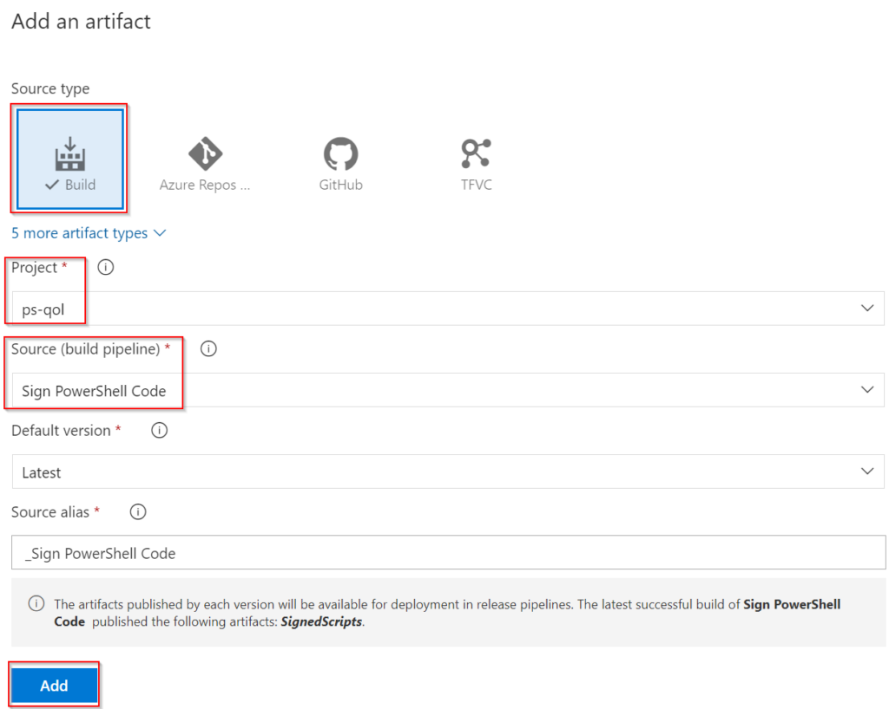

# PowerShell Quality of Life Improvements – Release

Releasing a build is typically the final step in the process of developing code. For PowerShell, this takes the form of getting our signed scripts and modules onto target servers to be available for use. This can be easily achieved in Azure DevOps.

## Deployment Groups/Targets
The deployment tasks will run on the targets will recieve the scripts. Before that, a Deployment Group needs to be created. This is done by navigating to Pipelines > Deplyment Groups and clicking “Add new deployment group”. The group needs to be given a name.

<!-- more -->
Once created, a PowerShell script will be displayed. This script needs to be run on the targets to register them as members of the group. Once it’s run, the targets will appear:

## Creating The Release Pipeline
Once the Deployment Group and Targets have been setup, the Release Pipeline can be created. Navigate to Pipelines > Releases and click on the New Pipeline button. From the template options, select “Start with an empty job”. The first option to set in the release is the Artifacts it will use. Click on the Add button in the Artifacts area. Then Build as the source type and the build pipeline as the source:

This will cause the Release pipeline to pick up the latest artifacts from the Code Signing pipeline. The next step is to define the actual tasks to be performed. Under the Stage 1 task, click on the “1 job, 0 task item”. By default, the job in there will be an Agent job. Since this deployment will run on the targets, we need to remove that and add a Deployment Group Job instead.

Once the Deployment Group Job has been added, create a “Copy Files” task under it. The Source folder needs to be defined as well as the Target:

There are some Advanced options in the Copy Files task that should be reviewed, such as the ability to Overwrite existing files or to completely clean the Target Folder. In my test scenario, I enabled both of these. Once saved, the pipeline is ready to use.

## Creating A Release
Once the Release Pipeline has been created, a Release can be created that uses its settings and tasks. The creation of a release can either be a manual task or triggers can be enabled to create it automatically. In my test scenario, I enabled an automatic trigger to ensure the deployment targets got the latest files as soon as possible. To do this, we need to edit the Pipeline again. The Artifact section has a lightning bolt icon which opens the trigger configuration:

To satisfy my deployment needs, I configured a Build-based trigger that used the build pipeline’s default branch (ie. “main”). To trigger a Release, we need to ensure the build pipeline (the Code Signing one) is executed. The result is the Release showing the trigger text as “Continuous Deployment” rather than “Manually Triggered”

While this approach allows easy, automatic deployment of PowerShell assets to target systems, it does lack protections and tollgates. An option that could act as an intermediatory step is to deploy modules to a PowerShell respository server and constrain which versions target systems deploy.
