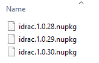

# PowerShell Quality of Life Improvements – PS Repository

In the last post, we were able to create a Release Pipeline that takes checked and signed Powershell code and deploys it to target servers. In some situations, it may not be desirable or viable to have every server configured as a deployment target. Or there may be a need to have an additional amount of control of the modules that a server gets. To deal with these issues, we can look at setting up a PowerShell Respoistory as an intermediatory step.

## Setting Up The Respository
The Respository can be as simple as a file share on a server. At the higher end of complexity, it can be a website running NuGet Gallery. For this case, I’ve gone simple. By using a file share, we negate the need for setting up API keys and the like that a NuGet Gallery would need.

Once the PowerShell Respoistory is created, it needs to be registered on the relevant targets. This is achieved using the Register-PSRepository cmdlet, as shown below:

`Register-PSRepository -Name psqol -SourceLocation "\\svr14\psrepo\" -PublishLocation "\\svr14\psrepo\" -InstallationPolicy Trusted`
If the InstallationPolicy value is set to “Untrusted”, then there will be a user prompt when attempting to install modules from the Repository.
<!-- more -->
## Deploying To The Repository
Using the prior Release Pipeline as a starting point, I cloned it to a new Release Pipeline. Because PowerShell Repositories are registered on a per-user basis, the Release Pipeline code needs to perform this registration and cleanup as well. The code in the pipeline I setup is below:

By running the Find-Module cmdlet, we get some logging output to verify that the current version was published as well as prior versions. When looking at the file share that is used for the Repository, we can see all the published versions in Nuget package format.

## Leveraging the Repository
One of the benefits of this approach is that modules will now be installed on target systems using the Install-Module cmdlet. This cmdlet has the ability to control what version gets installed, via the use of requiredVersion, minimumVersion or maximumVersion parameters. In theory, this could allow a more controlled rollout and testing of new versions of code.
