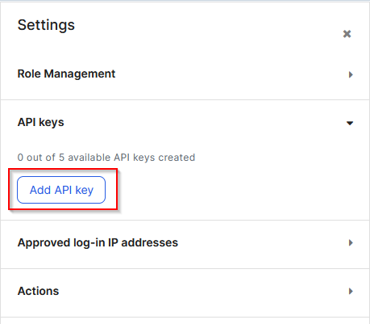
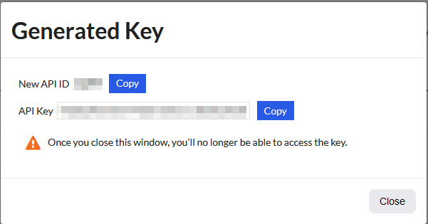

# Clearing Imperva Cloud WAF Cache using Powershell

Imperva’s cloud-based Web Application Firewall (WAF), previously known as Incapsula, provides protection capabilities as well as caching of website content. In some situations, it may be necessary to clear the cache. This can be easily achieved by using Powershell to interact with Imperva’s REST API.
<!-- more -->
## Setting Up Credentials
At the time of writing, Imperva’s REST API uses an API ID and key to authenticate – essentially a username and password. The IDs are generated from already existing users in your Imperva account. To generate an ID and key, navigate to the User Management area of the Imperva management portal. Select the user you want to generate an ID for. Expand the API keys area and click “Add API key”.

Enter a name for the new key and the other settings. Click Save. At this point, a window will appear with the newly generated API ID and key. It would be a good idea to save this to your secrets management system at this point.

## Using Imperva’s REST API
At the time of writing, Imperva is in a state of transition with their REST APIs. They have an established “version 1” of it and are moving to a “version 2”. The API calls for the process of clearing the cache use the version 1 API.

Performing authentication takes the form of including the API ID and Key as part of the body posted to the API URL. Most API activities that relate to things associated with a “site” entry (such as clearing the cache) require that site’s ID as a parameter.

With that in mind, it’s useful to have an initial script that can look up the site ID. To achieve this, we use the API endpoint that will list all the sites, as shown below:

The returned content will be in JSON format, which can be converted and manipulated to extract the item where the “display_name” field matches the name of the site we want. The Site ID can then be extracted from that item.

The cache clearing API endpoint expects a similar body to the last item. This time it also needs the site ID.

There’s not much returned by this API call. As long as you get a status code of 200, it can be reasonably assumed that the request was successful.

## Building Upon The Basics
At this point, you can consider some polish and enhancements to the basic workflow. In the implementation I made, I wrapped an Azure Devops Pipeline around the Powershell scripts I wrote. The current list of sites are defined as a list of values in the pipeline, prompting the user to select one. This allows easy execution of the workflow, as well as logging of what happened for each run.

Another possible improvement could be sending some sort of notification, such as an email or a message to Teams or Slack. The notification would give wider visibility that the cache has been cleared. Lastly, it may be an option to include this workflow at the end of release pipelines. This would ensure that consumers of your site aren’t loading stale website assets.
