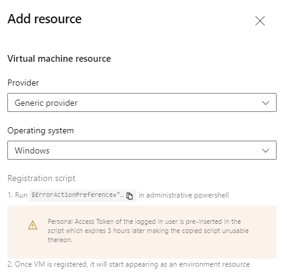
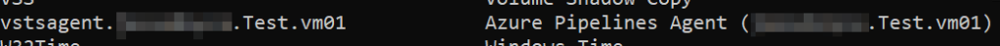

# Registering a VM with Multiple Azure DevOps Environments

Azure DevOps has the concept of Environments, a collection of resources which can be used during a pipeline. At the time of writing the only types of resources that can be used are Virtual Machines and Kubernetes resources. The [official documentation](https://docs.microsoft.com/en-au/azure/devops/pipelines/process/environments-virtual-machines?view=azure-devops) on registering a VM resource doesn’t explicitly mention there being any issues with using the same resource across multiple environments, apart from “providing a unique name for the agent”. There’s an important consideration with how the registration process works relating to this.
<!-- more -->
## The Registration Process
Registering a VM resource for an environment involves navigating to that environment and running through the short “Add Resource” wizard. The wizard will generate a Powershell script to run on the Virtual Machine.

In short, the script downloads the agent software the VM will run and installs it. The key part that affects multiple registrations is the generated name of the service that is installed. The name is computed using your DevOps Organisation Name, the name of the Environment and the name of the VM.

## How It Can Break
The problem with this name format is it uses values that aren’t totally unique. For example, you can have multiple environments in different projects that have the same name. Or Virtual Machines with the same name in different resource groups. So what happens if you try to register the VM again, with another project that has the same Environment name? In the experience I had, not only did the registration process fail to install a 2nd service, it errored out and damaged the existing service so it no longer worked with the first environment.

This resulted in me having to delete the resource from the first environment and start the process from scratch.

## How to Avoid Issues
I think the key point is the line I mentioned from the documentation, about ensuring the Agent has a unique name. While it may be tempting to mess with the registration script (especially to change the --agent $env:COMPUTERNAME part) I think the best option is to ensure that your Environment names are unique across your DevOps Organisation. This could be something as simple as including the Project Name in it, as Project Names must be unique within an Organisation.
