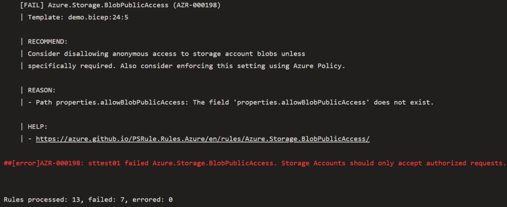

# Developing a Bicep Validation Pipeline

Azure’s Bicep is Microsoft’s newer format for defining Azure resources as code. In terms of look and feel, it’s very similar to Terraform.. If one considers Bicep files as code, then it would be a natural step to ensure that code meets a certain level of quality. In addition to that level of quality, because Bicep is deploying infrastructure, we would want to ensure that infrastructure is well designed and has a chance of successfully deploying.

When Bicep started to be adopted by the team I was working in, I became involved in designing a process to meet those quality goals as well as reduce the number of deployment issues.
<!-- more -->
## The Building Blocks
The main building blocks of the process have a lot in common with general code validation processes. In the end, the main stages of the process were:

* Linting – Does the Bicep code meet style and syntax requirements and recommendations
* Infrastructure Design – Does the Bicep code deploy infrastructure that is architecturally well designed and secure
* Test Deployment – Will the infrastructure actually deploy based on the Bicep code supplied

## Linting
The Azure Bicep extension for Visual Studio Code already has excellent support for validating the syntax of Bicep code. However, many syntax issues are flagged only as warnings and don’t prevent code from being committed to a repository. This means the first step in the validation process is to do this linting check. As mentioned in the Bicep documentation, [the linting can be performed using the CLI](https://docs.microsoft.com/en-us/azure/azure-resource-manager/bicep/linter#use-in-bicep-cli). If there are linting issues with the file, it will cause the pipeline to fail. An example of how this could look in a YAML pipeline is below:

``` yaml
– task: AzureCLI@2
  displayName: 'Linter Test'
  inputs:
    azureSubscription: $(azureServiceConnection)
    scriptType: pscore
    scriptLocation: inlineScript
    inlineScript: |
      az bicep build -f main.bicep
```

The build command causes an ARM template file to be generated. Depending on your situation, it may be useful to publish this as an artefact.

## Infrastructure Design
The next check makes sure the Bicep code will deploy infrastructure that well designed and well architected. Microsoft has a lot of documentation on how things in Azure should be designed. Fortunately, the PSRule module codifies these and provides an easy mechanism to perform checks. An example task for running PSRule is below:
``` yaml
– task: ps-rule-assert@1
  displayName: 'PSRules Test'
  inputs:
    inputType: inputPath
    inputPath: 'main.bicep'
    modules: 'PSRule.Rules.Azure'
    outputFormat: NUnit3
    outputPath: reports/ps-rule-results.xml
```
It’s worth noting that to use PSRule in this fashion, you need to install the [PSRule extension](https://marketplace.visualstudio.com/items?itemName=bewhite.ps-rule) into your Azure DevOps organisation. The modules input allows us to specify what rules will be used. This means you can include your own rules in your own module, but for the sake of this example, I’m using the Azure rules. PSRule can output its results in a number of different formats. NUnit is a standardised format, so if we output in that format we can do things with the results. One follow-up task might be to publish the test results using the PublishTestResults task. By doing this, the data from the tests will be embedded in the UI of the pipeline run, allowing visibility of the results.

To get PSRule working properly, a bit of extra work is required. By default, PSRule will only process .JSON files, ARM templates. To tell it to properly process Bicep files, we need to create a configuration file called ps-rule.yaml in the repository with the appropriate configuration.
``` yaml
configuration:
  # Enable automatic expansion of bicep source files.
  AZURE_BICEP_FILE_EXPANSION: true
  # Enable automatic expansion of param files
  AZURE_PARAMETER_FILE_EXPANSION: true
```
It’s also possible to specify other settings in file, such as excluding certain tests.

When PSRule runs, it will perform a number of checks against each resource defined in the Bicep file. If a check fails, it will cause the pipeline to fail. The output from the failed check will include a description and a link on how to resolve the failed check. The example below is of a PSRule task run against a Bicep file that defines a Storage Account with the minimum required settings.


In this example, the bare minimum Storage Account resource in Bicep fails half the tests that PSRule runs.

## Test Deployment
The final step performs a test deployment of the Bicep file. In the pipeline I built, this has several tasks:

* Create a Resource Group with a unique name (to prevent name collision issues)
* Run a What-if deployment as a sanity check
* Perform the actual deployment using a parameters file
* Remove the resources and the Resource Group at the end

The reason for doing this step is because I’ve had some situations where a Bicep template would pass the earlier checks, but would then error out when deployed. Doing a test deploy can hopefully catch these sort of issues before the real deployments to production and other environments.

## Conclusion
With this sort of pipeline, the final Bicep code achieves a number of goals:

* The Bicep code has correct syntax because it’s passed a linting check
* The Bicep code will deploy infrastructure that is well designed because it’s passed the PSRule checks
* The frequency of errors on deployment should be reduced because of the prior 2 points and because we’re doing a test deployment

The pipeline can be implemented in a few different ways depending on the needs of one’s situation. In my case, it was implemented as a Build Validation pipeline on the main branch. This means it would be executed when a pull request was created and could act as part of the pull request process.
