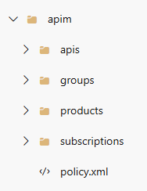
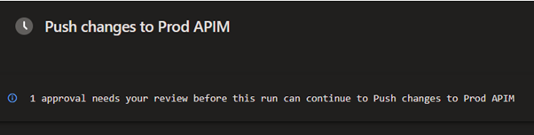

# Managing Azure API Management with APIOPS

Azure's API Management (APIM) resource is one of the most complex in the Azure ecosystem.  It has several configuration pieces such as API endpoints, policy objects and secrets, with relationships between these objects.  This complexity carries into Infrastructure as Code (IaC).  When exporting an APIM instance with a few configuration items, the resulting ARM template can easily be over 15,000 lines line.  Even using Bicep, where we can experience a 4:1 reduction in line count, we would be dealing with a very large file.

This leads to a conclusion that managing an APIM instance solely using Bicep or Terraform would be difficult.  Fortunately, Microsoft have provided a toolset called "[API Ops](https://github.com/Azure/apiops)" which allows easy importing and exporting of APIM configuration.
<!-- more -->
## API Ops Overview
As the API Ops website states: "APIOPS places the Azure API Management infrastructure under version control...Rather than making changes directly in the portal, most operations happen through code changes that can be reviewed and audited".  For organisations that use IaC or have some level of material, these points will meet similar objectives they're trying to achieve (namely, that the APIM configuration is version controlled and can be audited).

The toolset uses two programs, an Extractor and a Publisher.  The Extractor exports the configuration to a series of text files, while the Publisher applies a defined configuration to an instance.  Both tools can be run in pipelines.  When used in pipelines, there is the ability to use standard pull request code review practices.

The Publisher tool can also use over-ride files.  This is useful in the case of promoting changes to different environments where certain values, such as resource names or secrets, may change.

## Example Implementation
In my initial investigation of API Ops, I did an example implementation with two APIM instances: a dev instance where developers would do initial development work on APIs and a production instance.

The Extractor pipeline has two Stages - the first performs the export task, where it performs an export, a linting check and publishes an artifact for consumption.  The second Stage picks up the artifact and creates a branch from it.  An example of the folder structure the export creates is show below:

The pipeline will automatically create a pull request which can be reviewed and approved.

The Publisher pipeline is triggered by pull requests that are merged to the main branch.  By using Azure DevOps environments and associated approvals, it's possible to put in approval gates for higher environments such as Production, as shown below:

Since each Environment can have its own approval settings, it's possible to have a specific list for each.  For example, Production may have a more restrictive set of approvers compared to a Test or UAT environment.

## Technical Issues and Considerations

During the example implementation I did, I ran into a few items that need consideration and thought in how to handle:

* Pipeline Permissions - Because the Extractor pipeline is doing tasks such as branch creation and pull requests, it needs additional permissions in Azure DevOps
* Multiple Subscriptions - Both pipelines assume the APIM instances are in the same subscription and the pipeline identity has access to them.  If this is not the case, then the subscription IDs need to be set an environment variable
* "Subscription limit reached" error - This error is due to the default subscriptions that are created when an APIM instance is made.  This can be resolved by deleting those default subscriptions
* Handling sensitive values - A Named Value can be configured as a type - "Plain", "Secret" or "Key Vault".  When configured as "Plain", it will extract the value as plain text.  This could be an issue if the value is considered a secret or sensitive because it will be committed to the repository.  If the value is configured as a "Secret", the Extractor will export an empty value, meaning nothing will be imported.  If it's defined as a Key Vault reference, then the reference will be exported, allowing it to be imported.  
* Managed Identity must be configured if using Key Vault references - APIM instances use Managed Identity to access Key Vault secrets.  During the Publish pipeline, if Key Vault references are present and the target APIM instance doesn't have Managed Identity enabled, the pipeline will error out
* Key Vault references must exist - When Key Vault references are made in APIM, such as when using override files, those secrets must exist for the Publisher pipeline to work
